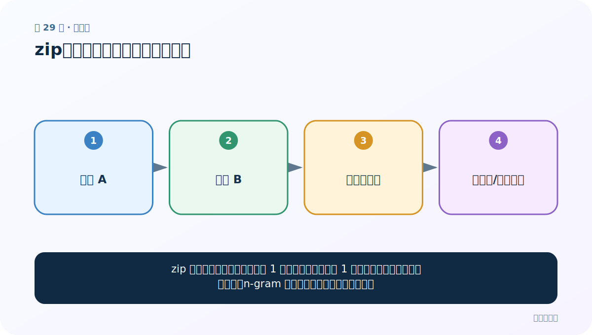
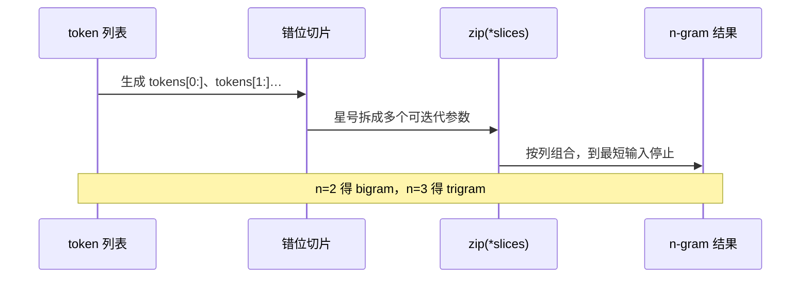

# 第 29 节：zip：把多个等长位置对齐成元组

> 笔记编号 29/33 · 对应原视频 P33 · [打开这一集](https://www.bilibili.com/video/BV14mdfBDE4Q?p=33)

[← 上一节：28 形容词词云：先按词性筛选，再按频率画图](./28-adjective-wordcloud.md) · [返回总目录](./README.md) · [下一节：30 n-gram：保留连续局部顺序的文本特征 →](./30-n-gram.md)

## 这节解决什么问题

zip 像拉拉链：第一个序列的第 1 项和第二个序列的第 1 项合在一起，然后继续下一位置。n-gram 的简洁写法正利用了这种对齐。



图要从左向右读。每个方框都是数据的一次变化，不是四个互不相关的名词。

## 辅助流程图


### zip 解包与 n-gram 滑窗



## 老师原声整理稿（按讲解顺序）

### 0:00–2:54　文本特征处理包含两件事

老师进入文本特征处理：一是加入 n-gram，让模型看到相邻词组；二是把序列截断或补齐到统一长度。

n-gram 是连续 n 个词或字组成的特征。unigram 保留单词，bigram 再加入相邻两词，trigram 再加入相邻三词。n 越大并不必然越好：组合空间迅速膨胀，短句甚至没有足够长度，因此实践中常用 1–3，课程重点掌握 bigram。

### 2:54–6:49　给组合分配独立特征

老师用“水 / 敲动 / 我心”等词和整数 ID 说明：相邻两词组合后应当被视为新的特征，也需要自己的唯一编号，不能把两个 ID 直接写在一起当十进制数。

加入 bigram 后，原 unigram 通常仍保留：

```text = [w1, w2, w3, w4, w5]
bigram = [(w1,w2), (w2,w3), (w3,w4), (w4,w5)]
features = text + bigram
```

这样既保留单词身份，又增加局部语序。代价是特征数更多、低频组合更稀疏。

### 6:49–9:46　先补 zip：按位置组合多个迭代对象

老师先用两个不等长列表演示 zip。它返回惰性 zip 对象，转成 list 后得到元组；输出长度等于最短输入，较长列表尾部会被丢弃。

```python
list(zip([1,2,3,4,5,6], [2,3,4]))
# [(1,2), (2,3), (3,4)]
```

### 9:46–14:13　zip(*nested) 的星号是解包

若直接 `zip(nested)`，zip 只收到一个参数，于是每行会成为单元素元组；`zip(*nested)` 会把内层列表拆成多个位置参数，再按列组合。

```python
rows = [[1,2,3], [3,4,5]]
list(zip(rows))   # [([1,2,3],), ([3,4,5],)]
list(zip(*rows))  # [(1,3), (2,4), (3,5)]
```

老师反复用“整体”和“拆出里面每个元素”解释星号。这个概念将在下一节用滑动切片生成 n-gram。

## 完整原声逐段记录

[查看本节按时间戳整理的完整音轨转写](./transcripts/p033.md)

这份记录用于核查老师讲过的内容是否遗漏；正文会纠正口误与语音识别中的技术术语。

## 零基础先记住

- zip(a, b) 返回惰性迭代器
- 默认在最短输入结束处停止
- 解包 zip(*pairs) 可把成对数据重新拆列

## 最小可运行代码

在项目根目录运行下面代码。课程原理的标准库版本集中在 [text_preprocessing_from_scratch](../../text_preprocessing_from_scratch/README.md)；需要 jieba、PyTorch、FastText 等的示例，请先按代码注释安装依赖。

```python
words = ["我", "爱", "NLP"]
labels = ["代词", "动词"]
pairs = zip(words, labels)
print(list(pairs))
```

### 输入和输出怎么看

只输出两对，第三个词被静默忽略，因为 labels 更短。

## 最容易踩的坑

长度不等时 zip 不报错，容易悄悄丢数据。Python 3.10+ 可用 zip(a, b, strict=True) 让不等长时报错。

## 本节知识链

`序列 A → 序列 B → 同位置拉链 → 元组流/最短截止`

如果中间任意一个箭头说不清楚，就回到图上，用代码中的一个具体值手算一遍；能预测输出，才算真正理解。

## 自测

**问题：zip([1,2,3], ['a']) 会产生几项？**

<details>
<summary>点开核对答案</summary>

1 项：(1, 'a')；默认由最短序列决定长度。

</details>

## 学完检查

- [ ] 我能不用术语，用自己的话解释“这节解决什么问题”
- [ ] 我能在运行前大致猜出代码输出
- [ ] 我知道本节方法不适用或容易出错的情况
- [ ] 我能回答自测题，而不只是记住答案

[← 上一节：28 形容词词云：先按词性筛选，再按频率画图](./28-adjective-wordcloud.md) · [返回总目录](./README.md) · [下一节：30 n-gram：保留连续局部顺序的文本特征 →](./30-n-gram.md)
