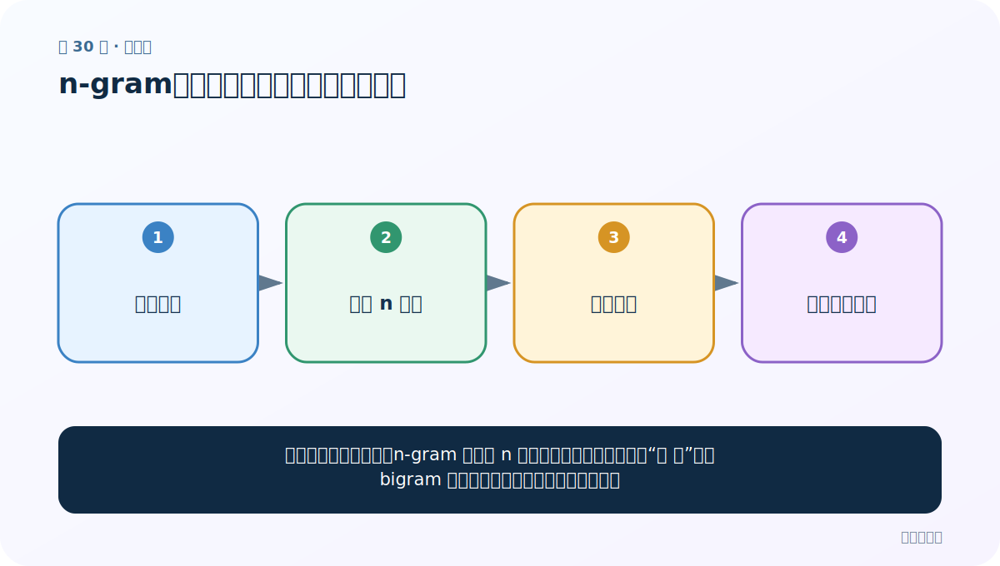
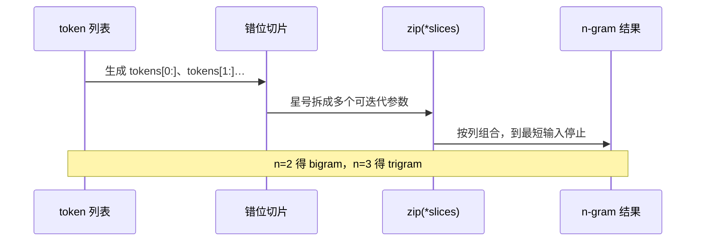

# 第 30 节：n-gram：保留连续局部顺序的文本特征

> 笔记编号 30/33 · 对应原视频 P34 · [打开这一集](https://www.bilibili.com/video/BV14mdfBDE4Q?p=34)

[← 上一节：29 zip：把多个等长位置对齐成元组](./29-zip-function.md) · [返回总目录](./README.md) · [下一节：31 文本相似度：先对齐特征，再比较方向或集合 →](./31-text-similarity.md)

## 这节解决什么问题

只数单词会丢掉顺序；n-gram 把连续 n 个词或字符绑成一个特征。“不 好”作为 bigram 能比两个孤立词更清楚地表达否定。



图要从左向右读。每个方框都是数据的一次变化，不是四个互不相关的名词。

## 辅助流程图


### zip 解包与 n-gram 滑窗



## 老师原声整理稿（按讲解顺序）

### 0:00–2:59　先把 n-gram 写成可复用函数

老师新建脚本，先写定义：连续 n 个字或词构成小词组特征，帮助计算机观察局部文本规律。unigram、bigram、trigram 分别是连续 1、2、3 个 token；实践里 n 常设为 2 或 3。

函数接收一个 token 列表，课程示例用 `n = 2`，随后准备测试输入。

### 2:59–6:52　滑动切片产生错位的列表

核心是生成 n 份错位切片。bigram 时：

```python
tokens = [1, 3, 2, 1, 5, 3]
slices = [tokens[i:] for i in range(2)]
# [1,3,2,1,5,3]
# [3,2,1,5,3]
```

第一行从位置 0 开始，第二行从位置 1 开始。两行纵向对齐的位置，就是所有相邻二元组。

### 6:52–8:50　zip(*slices) 完成滑动窗口组合

```python
grams = list(zip(*slices))
# [(1,3), (3,2), (2,1), (1,5), (5,3)]
```

星号把切片列表拆成多个 zip 参数；zip 自动在最短切片结束，因此不会产生越界窗口。若 n 改成 3，就会生成三份错位切片并组合成三元组。

### 8:50–10:01　去重是否正确取决于任务

课堂最后用 set 返回无重复 n-gram，并说明集合显示顺序可能变化：

```python
def create_ngrams(tokens, n):
    return set(zip(*(tokens[i:] for i in range(n))))
```

若只建“有哪些特征”的词表，set 合理；若要统计 n-gram 频率、保留出现顺序或训练语言模型，就应返回 list 或 Counter，不能提前去重。

## 完整原声逐段记录

[查看本节按时间戳整理的完整音轨转写](./transcripts/p034.md)

这份记录用于核查老师讲过的内容是否遗漏；正文会纠正口误与语音识别中的技术术语。

## 零基础先记住

- unigram=1 个单位，bigram=2 个，trigram=3 个
- 滑动窗口每次向右移动一格，不能跳词
- 词 n-gram 与字 n-gram 是不同粒度，需按任务选择

## 最小可运行代码

在项目根目录运行下面代码。课程原理的标准库版本集中在 [text_preprocessing_from_scratch](../../text_preprocessing_from_scratch/README.md)；需要 jieba、PyTorch、FastText 等的示例，请先按代码注释安装依赖。

```python
from text_preprocessing_from_scratch.core import ngrams
tokens = ["这个", "电影", "不", "好看"]
print("bigram:", ngrams(tokens, 2))
print("1~2 gram:", ngrams(tokens, 2, include_lower_orders=True))
```

### 输入和输出怎么看

bigram 有 3 个连续词对；include_lower_orders=True 会同时保留 4 个 unigram。

## 最容易踩的坑

课程示例若用 set 去重，会丢失出现次数和原顺序。做计数特征时通常应保留列表，再交给 Counter。

## 本节知识链

`词元序列 → 长度 n 窗口 → 逐格右移 → 局部顺序特征`

如果中间任意一个箭头说不清楚，就回到图上，用代码中的一个具体值手算一遍；能预测输出，才算真正理解。

## 自测

**问题：长度为 L 的序列有多少个连续 n-gram（L≥n）？**

<details>
<summary>点开核对答案</summary>

L-n+1 个，因为窗口起点可从 0 移到 L-n。

</details>

## 学完检查

- [ ] 我能不用术语，用自己的话解释“这节解决什么问题”
- [ ] 我能在运行前大致猜出代码输出
- [ ] 我知道本节方法不适用或容易出错的情况
- [ ] 我能回答自测题，而不只是记住答案

[← 上一节：29 zip：把多个等长位置对齐成元组](./29-zip-function.md) · [返回总目录](./README.md) · [下一节：31 文本相似度：先对齐特征，再比较方向或集合 →](./31-text-similarity.md)
