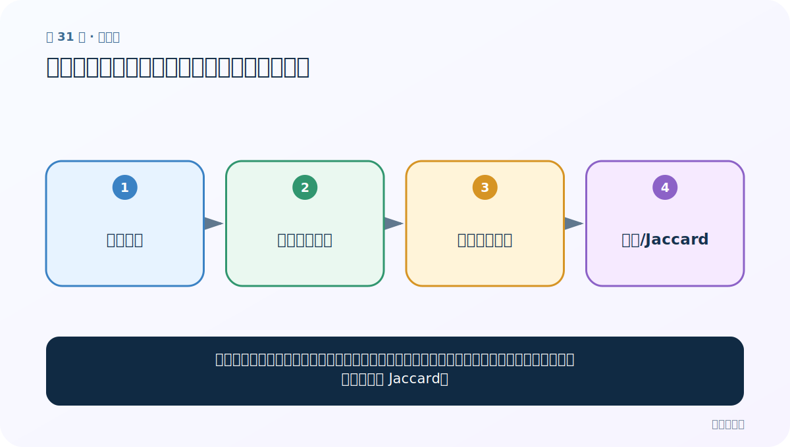
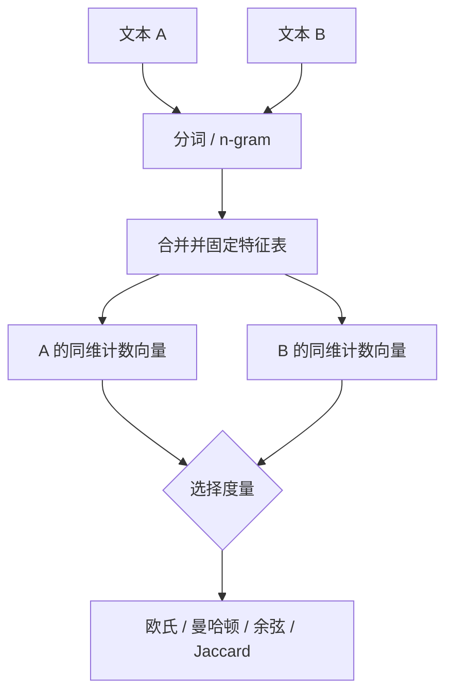

# 第 31 节：文本相似度：先对齐特征，再比较方向或集合

> 笔记编号 31/33 · 对应原视频 P35 · [打开这一集](https://www.bilibili.com/video/BV14mdfBDE4Q?p=35)

[← 上一节：30 n-gram：保留连续局部顺序的文本特征](./30-n-gram.md) · [返回总目录](./README.md) · [下一节：32 长度规范化：截断与补齐组成统一批次 →](./32-length-normalization.md)

## 这节解决什么问题

两段文字先要放进同一个特征空间，再计算相似程度。词频向量常用余弦相似度；只关心共有特征时也可用 Jaccard。



图要从左向右读。每个方框都是数据的一次变化，不是四个互不相关的名词。

## 辅助流程图


### 文本相似度的共同特征空间



## 老师原声整理稿（按讲解顺序）

### 0:00–0:59　面试题：两段文本怎样比较相似

老师在长度规范前插入一个扩展问题。第一步一定是分词；例如“今天天气很好，适合旅游”和“今天天气不太好，下雨适合睡觉”，只有变成统一特征空间中的数字向量后，才能计算距离或相似度。

### 0:59–3:54　先合并词表，再把句子变成计数向量

课堂简化例子：

- 文本一分词：我、是、黑马、人、我；
- 文本二分词：你、是、黑马。

把两句词去重合并，固定词表顺序 `[我, 你, 是, 黑马, 人]`。文本一得到 `[2,0,1,1,1]`，文本二得到 `[0,1,1,1,0]`。关键是两向量的每一列必须代表同一个词，不能各自建词表。

### 3:54–5:52　欧氏距离是“差值平方和开根”

```text
distance = sqrt((2-0)² + (0-1)² + (1-1)² + (1-1)² + (1-0)²)
         = sqrt(6)
```

距离越小表示越接近；它不是百分比式“相似度”。老师还提到曼哈顿距离，每种度量都有自己的计算规则。

### 5:52–6:50　加入 bigram 后重新对齐

若加入 bigram，文本一增加“我是、是黑马、黑马人、人我”，文本二增加“你是、是黑马”。把 unigram 与 bigram 一起建立总特征表，再分别计数，最后仍可算欧氏距离。

n-gram 能区分一部分局部语序，但维度会变大。两个向量的距离数值也会随特征尺度变化，所以不能把加入前后的绝对距离直接当作同一标尺比较。

### 6:50–8:33　常见相似度与距离

老师总结通用步骤：分词→合并去重词表→统计频次向量→计算度量，并扩展：

- 欧氏距离：直线距离，越小越近；
- 曼哈顿距离：各维绝对差之和；
- Jaccard 相似度：集合交集大小 / 并集大小；
- 余弦相似度：比较向量方向，越接近 1 越相似。

真实文本常用 TF-IDF 或预训练句向量，而不是裸词频。无论用哪种表示，先保证同一特征空间，再选择与任务匹配的度量。

## 完整原声逐段记录

[查看本节按时间戳整理的完整音轨转写](./transcripts/p035.md)

这份记录用于核查老师讲过的内容是否遗漏；正文会纠正口误与语音识别中的技术术语。

## 零基础先记住

- 词表取两段文本特征的并集，向量各列含义才一致
- 余弦比较方向，对不同长度文本通常比原始欧氏距离稳健
- Jaccard=交集大小/并集大小，忽略频次时很直观

## 最小可运行代码

在项目根目录运行下面代码。课程原理的标准库版本集中在 [text_preprocessing_from_scratch](../../text_preprocessing_from_scratch/README.md)；需要 jieba、PyTorch、FastText 等的示例，请先按代码注释安装依赖。

```python
from text_preprocessing_from_scratch.core import cosine_similarity
# 同一词表：[机器, 学习, 很, 有趣]
a = [1, 1, 1, 1]
b = [1, 1, 0, 0]
print(round(cosine_similarity(a, b), 3))
```

### 输入和输出怎么看

输出约 0.707。1 表示方向完全相同，0 表示正交；词频向量非负时通常在 0 到 1。

## 最容易踩的坑

绝不能分别给两句话独立编号后直接比较。例如两边第 0 列若代表不同词，算出的距离毫无意义。

## 本节知识链

`两段文本 → 共同特征词表 → 两个同维向量 → 余弦/Jaccard`

如果中间任意一个箭头说不清楚，就回到图上，用代码中的一个具体值手算一遍；能预测输出，才算真正理解。

## 自测

**问题：为什么长度差异很大时，余弦常比欧氏距离合适？**

<details>
<summary>点开核对答案</summary>

余弦更关注特征比例方向，整体词频规模变大对它影响较小。

</details>

## 学完检查

- [ ] 我能不用术语，用自己的话解释“这节解决什么问题”
- [ ] 我能在运行前大致猜出代码输出
- [ ] 我知道本节方法不适用或容易出错的情况
- [ ] 我能回答自测题，而不只是记住答案

[← 上一节：30 n-gram：保留连续局部顺序的文本特征](./30-n-gram.md) · [返回总目录](./README.md) · [下一节：32 长度规范化：截断与补齐组成统一批次 →](./32-length-normalization.md)
