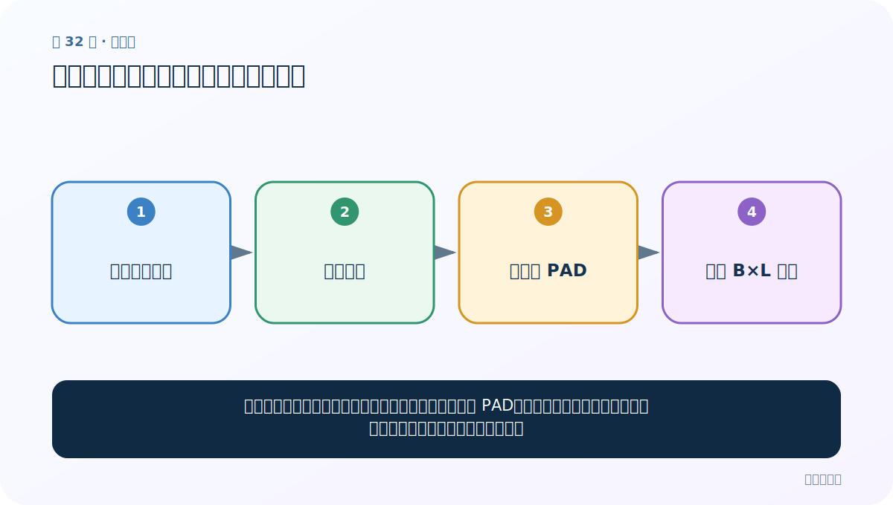
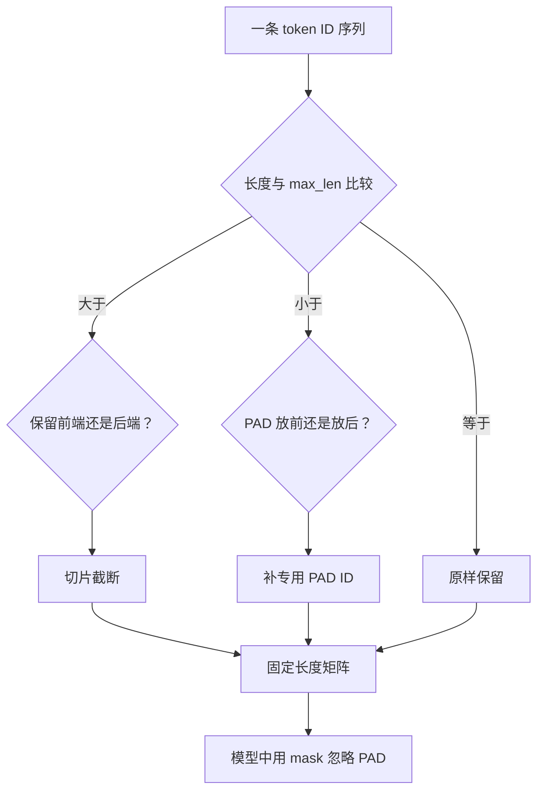

# 第 32 节：长度规范化：截断与补齐组成统一批次

> 笔记编号 32/33 · 对应原视频 P36 · [打开这一集](https://www.bilibili.com/video/BV14mdfBDE4Q?p=36)

[← 上一节：31 文本相似度：先对齐特征，再比较方向或集合](./31-text-similarity.md) · [返回总目录](./README.md) · [下一节：33 回译数据增强：换一种说法，尽量保持标签 →](./33-back-translation.md)

## 这节解决什么问题

一个批次要堆成规则张量，句子长度必须相同。短句补 PAD，长句截断；从左还是从右操作，取决于关键信息通常出现在哪里。



图要从左向右读。每个方框都是数据的一次变化，不是四个互不相关的名词。

## 辅助流程图


### 定长处理决策流程



## 零基础精讲：把这一节慢下来

### 先看一个具体场景

GPU 要把多句话堆成一个规则长方体。短句像短木板，要补 PAD；长句像超长木板，要截掉一端，才能统一成相同长度。

### 数据究竟怎样一步步变化

1. 从长度分布选择目标 L
2. 超过 L 的序列按任务决定截哪端
3. 不足 L 的序列补独立 PAD ID
4. 模型用 mask 忽略补齐位置

把上面四步和流程图对照起来：

> 长短不一序列 → 长句截断 → 短句补 PAD → 统一 B×L 张量

这里的箭头表示“左边的数据经过一次处理，变成右边的数据”，不是四个需要孤立背诵的名词。

### 第一次读代码，只盯住这一件事

第一行短序列右侧补三个 0；第二行从左截掉 1。先在纸上写齐目标长度再运行。

运行前先在纸上写出你预计的结果；即使猜错，也要指出自己是在哪个箭头上理解错了。这样比复制代码后看到“能运行”更接近真正学会。

### 本节暂时不要误会

只补 PAD 不做 mask，会让模型把“空位置”当成真实语言学习。

用一句话过关：**一个批次要堆成规则张量，句子长度必须相同。短句补 PAD，长句截断；从左还是从右操作，取决于关键信息通常出现在哪里。**

## 老师原声整理稿（按讲解顺序）

### 0:00–2:54　为什么一个 batch 必须统一长度

老师举同一批 8 个句子：长度分别为 10、13、9、11 时，不能直接堆成规则矩阵。设目标长度 `max_len=10` 后，长序列截断，短序列用 0 补齐。

目标长度不能随手写。应先看前面得到的句长分布和分位数，再平衡信息保留、显存和速度。

### 2:54–5:49　两种实现路线

课堂准备两个版本：

1. 使用 TensorFlow/Keras 的 `pad_sequences`；
2. 只用 Python 切片和列表拼接手写。

第三方 API 简洁，手写版帮助真正理解截断与补齐发生在哪里。

### 5:49–8:48　pre/post 是处理前端还是后端

```python
pad_sequences(
    sequences,
    maxlen=10,
    truncating="pre",
    padding="pre",
)
```

`truncating="pre"` 删除序列前端，保留最后 10 个；`padding="pre"` 在前端补 0。`post` 则在后端截或补。老师反复强调 pre 对应“前面”，post 对应“后面”。

### 8:48–14:43　运行比较默认值与显式参数

老师准备一条超长序列和一条短序列，先显式写 pre，再把参数删掉验证默认行为相同；随后改成 post，观察长句保留开头、短句在末尾补零。

这里最容易误解的是“从前端截断”：意思是删掉前面的元素，不是保留前面的元素。选择哪一端不能机械决定；情感关键词若常在句尾，删尾可能更危险，反之亦然。

### 14:43–18:41　纯 Python：先处理超长序列

```python
def normalize(sequences, max_len=10):
    result = []
    for sequence in sequences:
        if len(sequence) > max_len:
            result.append(sequence[:max_len])  # 保留前端
        else:
            ...
    return result
```

老师选择保留前 `max_len` 个，用 `sequence[:max_len]` 截断；如果要保留后端，可用 `sequence[-max_len:]`。

### 18:41–22:36　短序列需要补多少个零

进入 else 说明长度小于或等于目标值。补齐数量是：

```python
missing = max_len - len(sequence)
result.append(sequence + [0] * missing)
```

等长序列的 missing 为 0，不会增加元素；短 3、目标 10 时补 7 个。课堂通过提问让同学写出“原序列 + 若干个零”。

### 22:36–23:36　验证输出并回扣 zip

老师运行手写函数，检查长序列恰好截到指定位置、短序列补到相同长度，最后用 `zip([1,2,3],[4,5,6])` 回顾按位置组合会得到 `[(1,4),(2,5),(3,6)]`。

补充工程要点：PAD 最好使用专门 ID，并在模型中设置 mask；否则大量 0 也会被当成普通 token 参与注意力或循环计算。

## 完整原声逐段记录

[查看本节按时间戳整理的完整音轨转写](./transcripts/p036.md)

这份记录用于核查老师讲过的内容是否遗漏；正文会纠正口误与语音识别中的技术术语。

## 零基础先记住

- padding='pre/post' 决定 PAD 加在前还是后
- truncating='pre/post' 决定长文本丢前部还是后部
- 目标长度应来自长度分布和验证集效果

## 最小可运行代码

在项目根目录运行下面代码。课程原理的标准库版本集中在 [text_preprocessing_from_scratch](../../text_preprocessing_from_scratch/README.md)；需要 jieba、PyTorch、FastText 等的示例，请先按代码注释安装依赖。

```python
from text_preprocessing_from_scratch.core import normalize_length
print(normalize_length([4, 8], 5, 0, padding="right"))
print(normalize_length([1, 2, 3, 4], 3, 0, truncation="left"))
```

### 输入和输出怎么看

第一行得到 [4,8,0,0,0]；第二行从左截掉 1，保留 [2,3,4]。

## 最容易踩的坑

PAD 必须有独立 ID，并在注意力或损失中被 mask；否则模型会把大量补齐位置当真实内容学习。

## 本节知识链

`长短不一序列 → 长句截断 → 短句补 PAD → 统一 B×L 张量`

如果中间任意一个箭头说不清楚，就回到图上，用代码中的一个具体值手算一遍；能预测输出，才算真正理解。

## 自测

**问题：评论结论常在末尾时，长文本更适合丢前面还是丢后面？**

<details>
<summary>点开核对答案</summary>

通常更倾向丢前面（pre truncation），但应通过样本检查和验证集确认。

</details>

## 学完检查

- [ ] 我能不用术语，用自己的话解释“这节解决什么问题”
- [ ] 我能在运行前大致猜出代码输出
- [ ] 我知道本节方法不适用或容易出错的情况
- [ ] 我能回答自测题，而不只是记住答案

[← 上一节：31 文本相似度：先对齐特征，再比较方向或集合](./31-text-similarity.md) · [返回总目录](./README.md) · [下一节：33 回译数据增强：换一种说法，尽量保持标签 →](./33-back-translation.md)
