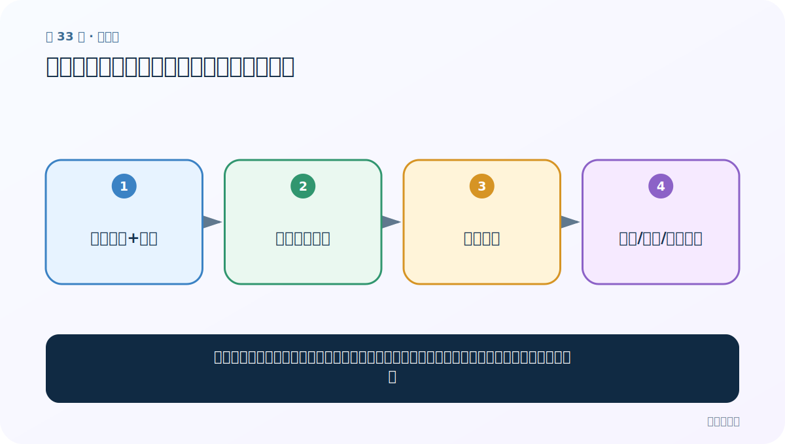
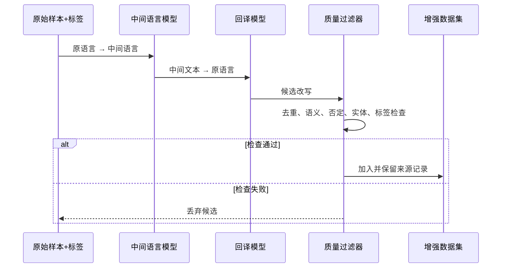

# 第 33 节：回译数据增强：换一种说法，尽量保持标签

> 笔记编号 33/33 · 对应原视频 P37 · [打开这一集](https://www.bilibili.com/video/BV14mdfBDE4Q?p=37)

[← 上一节：32 长度规范化：截断与补齐组成统一批次](./32-length-normalization.md) · [返回总目录](./README.md) · 已是最后一节 →

## 这节解决什么问题

把中文译成另一种语言再译回中文，常能得到措辞不同但语义相近的新句子，用来扩充训练数据。



图要从左向右读。每个方框都是数据的一次变化，不是四个互不相关的名词。

## 辅助流程图


### 回译增强时序与质量闸门



## 零基础精讲：把这一节慢下来

### 先看一个具体场景

“这家店服务很好”先译成英文再译回中文，可能变成“这家商店的服务非常棒”。表达变化了，正面标签大致没变，于是多出一条训练样本。

### 数据究竟怎样一步步变化

1. 保留原文和原标签
2. 翻到中间语言
3. 再翻回原语言得到候选改写
4. 检查去重、实体、否定和标签后才加入数据

把上面四步和流程图对照起来：

> 原始样本+标签 → 译到中间语言 → 译回中文 → 去重/语义/标签过滤

这里的箭头表示“左边的数据经过一次处理，变成右边的数据”，不是四个需要孤立背诵的名词。

### 第一次读代码，只盯住这一件事

示例代码没有调用翻译服务，它只展示合格输入输出的样子。真实系统还要记录来源、费用和失败重试。

运行前先在纸上写出你预计的结果；即使猜错，也要指出自己是在哪个箭头上理解错了。这样比复制代码后看到“能运行”更接近真正学会。

### 本节暂时不要误会

回译可能改变否定范围、数字、人名或立场；不经质量过滤就沿用旧标签会制造脏数据。

用一句话过关：**把中文译成另一种语言再译回中文，常能得到措辞不同但语义相近的新句子，用来扩充训练数据。**

## 老师原声整理稿（按讲解顺序）

### 0:00–2:58　回译用于扩充少量文本数据

老师把回译定义为文本数据增强：原句译到另一语言，再译回原语言，得到“意思接近、措辞不同”的新样本并加入训练集。课程原来使用的公共翻译接口已经停用，因此不继续跑旧代码；可以使用正规翻译平台、本地模型或大模型接口。

课堂建议中间语言可选择资源相对少的语言，希望增加表述变化。技术上没有“小语种一定更好”的保证，应该用语义保持率、标签一致率和多样性实测。

### 2:58–4:55　优点、短文本重复与语义失真

优点是流程简单，新句通常可读；缺点是短句如“我爱你”往往原样返回，不能有效扩大特征空间。可串联少量语言增加变化，但老师提醒中间翻译通常不要超过约三次：链太长会降低效率并像传话游戏一样累积语义失真。

### 4:55–6:52　旧接口代码只保留思路

旧示例先指定源语言和目标语言，把中文译成英文，再把英文译回中文。接口失效时不应寻找来历不明的密钥或把 API Key 写进代码库；应使用仍受支持的服务、环境变量与费用上限。

### 6:52–10:44　用提示词要求多轮改写

老师现场让大模型把“你今天真好看”依次翻到多种语言后回到中文，并要求结果不能与原句完全相同、核心含义不变。示例得到“你今天的模样也太惊艳了吧”等表达。

随后老师进一步要求扩写为十句话，展示提示词约束会显著影响结果；并借此解释提示词工程的价值。需要校正的是：直接让模型生成十条中文改写，属于释义生成，不一定真的执行了可验证的多语言回译，但同样可作为数据增强候选。

### 10:44–11:40　增强结果不能未经检查就入库

一条原始语料可产生多条变体，但数量多不等于有效。应检查：

- 与原文是否重复或过度相似；
- 否定、数字、实体和情感标签是否改变；
- 多条生成结果是否彼此重复；
- 是否引入不自然、冒犯或事实错误内容。

高风险样本可用人工审核；普通样本也应抽检并做自动相似度、规则和去重过滤。

### 11:40–13:30　全章收束

老师回顾三项内容：n-gram 把连续若干词作为整体特征；长度规范把序列截断或补齐到统一长度；回译通过表达变化增加语料。

最后再次强调回译的边界：短文本容易重复，多次翻译容易失真；如果原始数据已经足够，不必为了“做了增强”而强行制造低质量样本。是否使用增强，应由验证集对照实验决定。

## 完整原声逐段记录

[查看本节按时间戳整理的完整音轨转写](./transcripts/p037.md)

这份记录用于核查老师讲过的内容是否遗漏；正文会纠正口误与语音识别中的技术术语。

## 零基础先记住

- 原文→中间语言→原语言；可使用一个或少量中间语言
- 增强后要去重、检查语义漂移，并确认分类标签仍成立
- 短句容易原样返回，过多翻译链会累积错误、延迟和费用

## 最小可运行代码

在项目根目录运行下面代码。课程原理的标准库版本集中在 [text_preprocessing_from_scratch](../../text_preprocessing_from_scratch/README.md)；需要 jieba、PyTorch、FastText 等的示例，请先按代码注释安装依赖。

```python
pairs = [
    ("这家店服务很好", "这家商店的服务非常棒"),
    ("完全不好用", "使用体验并不理想"),
]
for original, augmented in pairs:
    print("原文：", original)
    print("增强：", augmented)
```

### 输入和输出怎么看

示例展示“标签大致不变、表达方式改变”。真实回译需调用合规翻译服务或本地模型。

## 最容易踩的坑

课程中的旧公共翻译接口可能已失效。不要硬编码密钥；还要考虑隐私、费用和服务条款。回译结果必须抽检。

## 本节知识链

`原始样本+标签 → 译到中间语言 → 译回中文 → 去重/语义/标签过滤`

如果中间任意一个箭头说不清楚，就回到图上，用代码中的一个具体值手算一遍；能预测输出，才算真正理解。

## 自测

**问题：负面句“这个产品并非不好”回译后最危险的变化是什么？**

<details>
<summary>点开核对答案</summary>

否定范围被改坏，变成明确负面或正面，导致原标签不再成立。

</details>

## 学完检查

- [ ] 我能不用术语，用自己的话解释“这节解决什么问题”
- [ ] 我能在运行前大致猜出代码输出
- [ ] 我知道本节方法不适用或容易出错的情况
- [ ] 我能回答自测题，而不只是记住答案

[← 上一节：32 长度规范化：截断与补齐组成统一批次](./32-length-normalization.md) · [返回总目录](./README.md) · 已是最后一节 →
