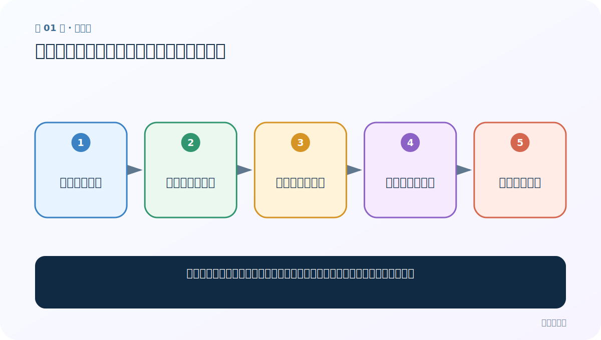
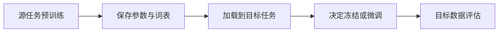
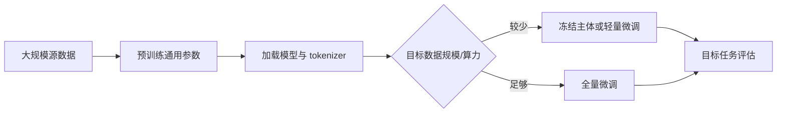

# 第 1 节：迁移学习：把别人学会的能力搬到相关任务

> 笔记编号 1/29 · 对应原视频 P155 · [打开这一集](https://www.bilibili.com/video/BV14mdfBDE4Q?p=155)

← 已是第一节 · [返回总目录](./README.md) · [下一节：2 常见预训练 NLP 模型：Encoder、Decoder 与 Encoder-Decoder →](./02-pretrained-model-families.md)

## 这节解决什么问题

为什么不从随机参数训练，而要加载别人已经训练几天、几周甚至更久的模型？



图从左向右读。先跟着数据或推理过程走一遍，再学习下面的术语。

## 辅助流程图



### 迁移学习从源任务到目标任务



## 老师原声整理稿（按讲解顺序）

### 0:00–4:51　大白话定义与几种迁移对象

老师把迁移学习概括为“拿别人训练好的模型来干活”。更严谨地说，是把源任务学到的表示、参数或知识用于相关目标任务。迁移对象可以是词向量和特征抽取器，也可以是完整网络主体；例如文本生成和机器翻译都需要条件生成能力，底层表示可复用。

### 4:51–10:48　模型大小、部署和算力

课堂用本地几个 GB 的模型与更大的参数模型对比，说明参数越多，磁盘、内存/显存、加载时间和推理时延通常越高。能在服务器训练不代表能在普通电脑或边缘设备部署，因此压缩、量化、蒸馏也是迁移后的工程问题。网络传言和夸张收益案例只作课堂调节，不应当作技术证据。

### 10:48–16:42　四种常见使用方式

老师依次解释：冻结预训练主体，只训练新任务头；解冻全部参数进行微调；先冻结再逐层解冻；针对相似目标任务继续预训练后再微调。初学者可把它理解成“保留通用知识的程度”从高到低。数据少、算力小先尝试冻结或轻量微调；数据充分且任务差异大再考虑全量微调。

### 16:42–20:42　收益、风险与选择原则

迁移学习能减少目标标注数据和训练时间，通常比随机初始化更稳；但源领域与目标领域差别太大可能负迁移。还要保证 tokenizer、词表和模型权重属于同一检查点。老师最后预告三类模型与 Transformers 三种调用方式，后续会用同样六个任务反复比较接口层次。

## 完整原声逐段记录

[查看本节按时间戳整理的完整音轨转写](./transcripts/p155.md)

逐段记录用于核查老师讲解是否遗漏；正文会进一步纠正口误和语音识别中的技术术语。

## 零基础先记住

- 迁移的是参数、表示或知识，不只是复制文件
- 源任务和目标任务越相关，迁移通常越有效
- tokenizer 与模型必须配套

## 最小可运行代码

下面代码是帮助理解本节概念的最小示例，默认从项目根目录运行。

```python
from transformers import AutoTokenizer, AutoModel
name_or_path = "your-local-or-hub-checkpoint"
tokenizer = AutoTokenizer.from_pretrained(name_or_path)
model = AutoModel.from_pretrained(name_or_path)
print(model.config.model_type)
```

### 输入和输出怎么看

加载同一检查点的 tokenizer 和模型主体，并打印架构类型。

## 最容易踩的坑

模型用 A 检查点，tokenizer 却来自 B；token ID 语义可能完全错位。

## 本节知识链

`源任务预训练 → 保存参数与词表 → 加载到目标任务 → 决定冻结或微调 → 目标数据评估`

## 自测

**问题：什么是负迁移？**

<details>
<summary>点开核对答案</summary>

源任务学到的偏好与目标任务不匹配，迁移后反而比合适初始化或从头训练更差。

</details>

## 学完检查

- [ ] 我能用自己的话复述老师的讲解顺序
- [ ] 我能在运行前预测关键输出或张量形状
- [ ] 我知道这节方法最容易用错的地方
- [ ] 我能独立回答自测题

← 已是第一节 · [返回总目录](./README.md) · [下一节：2 常见预训练 NLP 模型：Encoder、Decoder 与 Encoder-Decoder →](./02-pretrained-model-families.md)
