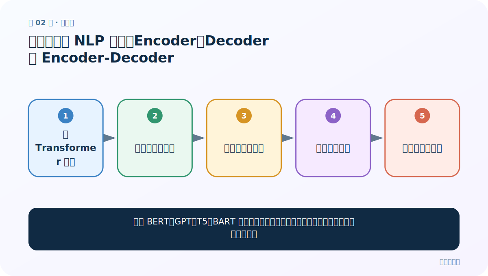
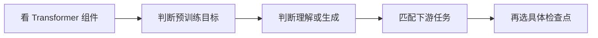
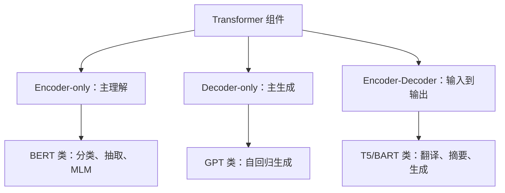
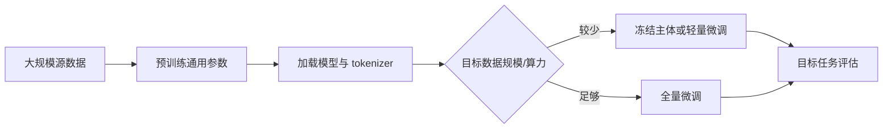

# 第 2 节：常见预训练 NLP 模型：Encoder、Decoder 与 Encoder-Decoder

> 笔记编号 2/29 · 对应原视频 P156 · [打开这一集](https://www.bilibili.com/video/BV14mdfBDE4Q?p=156)

[← 上一节：1 迁移学习：把别人学会的能力搬到相关任务](./01-transfer-learning-introduction.md) · [返回总目录](./README.md) · [下一节：3 Transformers 库与环境：模型仓库、缓存和三种调用方式 →](./03-transformers-library-setup.md)

## 这节解决什么问题

面对 BERT、GPT、T5、BART 等名字，怎样先按结构和训练目标归类，而不是死背模型表？



图从左向右读。先跟着数据或推理过程走一遍，再学习下面的术语。

## 辅助流程图



### 预训练模型三大家族



### 迁移学习从源任务到目标任务



## 老师原声整理稿（按讲解顺序）

### 0:00–5:57　三类结构先搭骨架

老师把模型分成三类：自回归 AR 多用 Decoder-only，依据左侧上下文预测下一个 token，代表 GPT；自编码 AE 多用 Encoder-only，通过双向上下文学习理解表示，代表 BERT；Encoder-Decoder 同时使用编码器和解码器，把输入序列变为输出序列，代表 T5、BART。课堂说“AR 只能单向”是指其因果注意力训练方式，不表示模型永远不能看到任何前置信息。

### 5:57–16:56　代表模型与预训练任务

BERT 类常用 Masked Language Modeling（MLM），适合分类、NER、抽取式问答等理解任务；GPT 类用 next-token prediction，适合续写和生成；T5/BART 类把任务统一成文本到文本或去噪生成，适合翻译、摘要。老师逐个展示若干变体，如 RoBERTa、ALBERT、DistilBERT、XLNet 等；小白不必一次背全，应抓住“结构—目标—任务”三连线。

### 16:56–25:50　模型名字中的线索

常见名称会包含语言、大小、是否区分大小写、训练语料或任务，例如 `base/large`、`cased/uncased`、`chinese`、`finetuned-...`。这些不是装饰：hidden size、层数和参数规模决定资源，语言与 tokenizer 决定输入覆盖，finetuned 后缀说明任务头是否已经训练。

### 25:50–32:58　如何选择而不是追最热门

老师复盘模型家族和用途。实际选择要看任务类型、语言、许可证、最大长度、模型卡评测、资源预算和部署目标。课程后面六个任务会用适配检查点演示；不能拿一个仅预训练、没有目标任务头的 Base 模型，期待 pipeline 直接给出可靠业务标签。

## 完整原声逐段记录

[查看本节按时间戳整理的完整音轨转写](./transcripts/p156.md)

逐段记录用于核查老师讲解是否遗漏；正文会进一步纠正口误和语音识别中的技术术语。

## 零基础先记住

- Encoder-only 主理解，Decoder-only 主生成
- Encoder-Decoder 擅长有输入条件的生成
- 检查点是否为目标任务微调过非常关键

## 最小可运行代码

下面代码是帮助理解本节概念的最小示例，默认从项目根目录运行。

```python
from transformers import AutoConfig
config = AutoConfig.from_pretrained("your-checkpoint")
print("type:", config.model_type)
print("encoder-decoder:", getattr(config, "is_encoder_decoder", False))
```

### 输入和输出怎么看

查看模型类型以及是否为 Encoder-Decoder 架构。

## 最容易踩的坑

仅凭模型名字“大”就认定更适合；资源、语言和任务头不匹配时，大模型也可能不可用。

## 本节知识链

`看 Transformer 组件 → 判断预训练目标 → 判断理解或生成 → 匹配下游任务 → 再选具体检查点`

## 自测

**问题：做抽取式中文问答时，为什么通常先找 BERT 类问答检查点？**

<details>
<summary>点开核对答案</summary>

任务需要双向理解上下文并预测答案起止位置，Encoder-only 加问答头与目标直接匹配。

</details>

## 学完检查

- [ ] 我能用自己的话复述老师的讲解顺序
- [ ] 我能在运行前预测关键输出或张量形状
- [ ] 我知道这节方法最容易用错的地方
- [ ] 我能独立回答自测题

[← 上一节：1 迁移学习：把别人学会的能力搬到相关任务](./01-transfer-learning-introduction.md) · [返回总目录](./README.md) · [下一节：3 Transformers 库与环境：模型仓库、缓存和三种调用方式 →](./03-transformers-library-setup.md)
