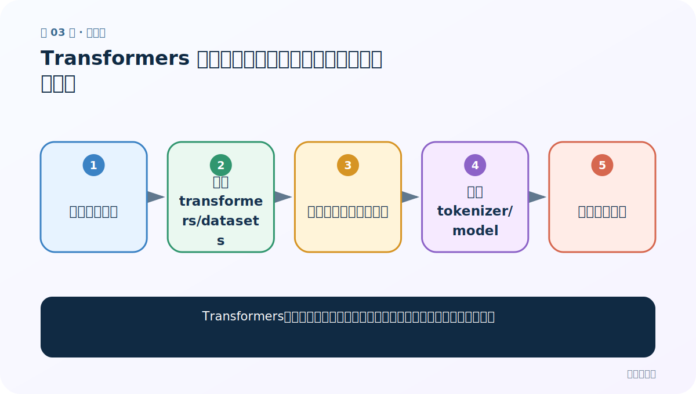
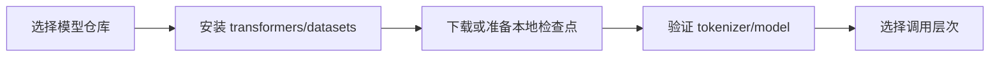
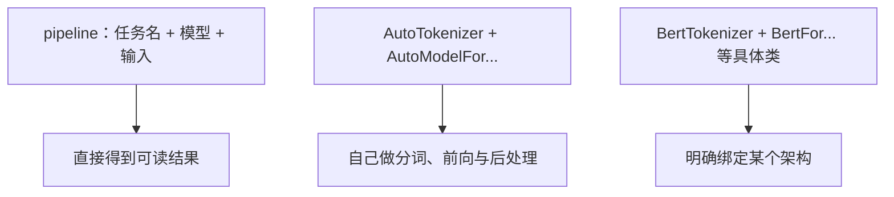
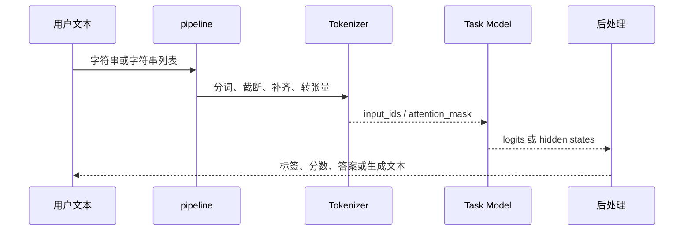
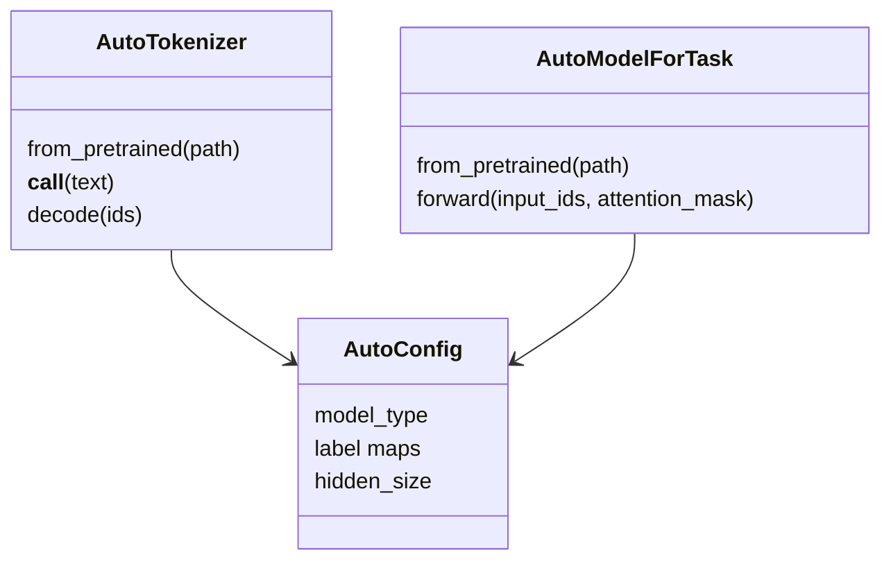

# 第 3 节：Transformers 库与环境：模型仓库、缓存和三种调用方式

> 笔记编号 3/29 · 对应原视频 P157 · [打开这一集](https://www.bilibili.com/video/BV14mdfBDE4Q?p=157)

[← 上一节：2 常见预训练 NLP 模型：Encoder、Decoder 与 Encoder-Decoder](./02-pretrained-model-families.md) · [返回总目录](./README.md) · [下一节：4 Pipeline 文本分类：三行代码背后的标签与概率 →](./04-pipeline-text-classification.md)

## 这节解决什么问题

Transformers、模型仓库和预训练权重分别是什么，离线环境又该怎样准备？



图从左向右读。先跟着数据或推理过程走一遍，再学习下面的术语。

## 辅助流程图



### Transformers 三种调用层次



### pipeline 内部调用时序



### Auto 类对象关系



## 老师原声整理稿（按讲解顺序）

### 0:00–1:47　先复盘模型三分法

老师用题目复盘：AR/Decoder-only 主生成，AE/Encoder-only 主理解，Seq2Seq 混合编码和解码。随后转入“怎样把模型真正加载进代码”。

### 1:48–5:32　模型仓库与 Transformers 的关系

Hugging Face Hub 用来托管模型、tokenizer、配置和模型卡；`transformers` Python 库负责下载/读取这些文件并提供推理与训练类。音轨多次把 Hugging Face 识别成了其他词，正文统一纠正。仓库里也可能有不安全、不适配或许可证受限的第三方模型，所以需要阅读模型卡。

### 5:32–10:09　网络受限与本地模型

课堂展示访问海外仓库不稳定，并介绍国内镜像/社区与事先下好的本地目录。无论在线还是离线，本质上都需要一组完整文件：配置、tokenizer 资源和权重。路径要指向检查点目录，不是随便一个 `.bin` 文件；离线部署还要记录库版本和校验文件是否齐全。

### 10:09–15:51　三种接口层次

第一层 `pipeline` 封装分词、模型、后处理，适合快速验证；第二层 Auto 类自动读取 config 选择具体 tokenizer 和任务模型，适合项目代码；第三层直接使用 `BertTokenizer`、`BertFor...` 等具体类，绑定架构更明确。三种方式底层不是三套不同模型，而是抽象程度不同。课程先做 pipeline 的六个任务，再用 Auto 重写六个，最后用具体类演示一个。

## 完整原声逐段记录

[查看本节按时间戳整理的完整音轨转写](./transcripts/p157.md)

逐段记录用于核查老师讲解是否遗漏；正文会进一步纠正口误和语音识别中的技术术语。

## 零基础先记住

- Hub 是文件仓库，Transformers 是加载与运行库
- 本地检查点也必须含配置、词表和权重
- pipeline、Auto、具体类只是抽象层级不同

## 最小可运行代码

下面代码是帮助理解本节概念的最小示例，默认从项目根目录运行。

```python
from transformers import AutoTokenizer, AutoModel
path = "your-checkpoint"
tok = AutoTokenizer.from_pretrained(path, local_files_only=True)
model = AutoModel.from_pretrained(path, local_files_only=True)
print(tok.__class__.__name__, model.__class__.__name__)
```

### 输入和输出怎么看

在离线模式从本地目录加载，并打印自动选择的具体类。

## 最容易踩的坑

课程旧环境的安装版本和 API 直接照抄到新环境；应锁定项目版本并先做最小加载测试。

## 本节知识链

`选择模型仓库 → 安装 transformers/datasets → 下载或准备本地检查点 → 验证 tokenizer/model → 选择调用层次`

## 自测

**问题：pipeline 和 AutoModel 的核心差别是什么？**

<details>
<summary>点开核对答案</summary>

pipeline 还封装了任务后处理并直接返回可读结果；AutoModel 通常返回张量，需要自己处理。

</details>

## 学完检查

- [ ] 我能用自己的话复述老师的讲解顺序
- [ ] 我能在运行前预测关键输出或张量形状
- [ ] 我知道这节方法最容易用错的地方
- [ ] 我能独立回答自测题

[← 上一节：2 常见预训练 NLP 模型：Encoder、Decoder 与 Encoder-Decoder](./02-pretrained-model-families.md) · [返回总目录](./README.md) · [下一节：4 Pipeline 文本分类：三行代码背后的标签与概率 →](./04-pipeline-text-classification.md)
