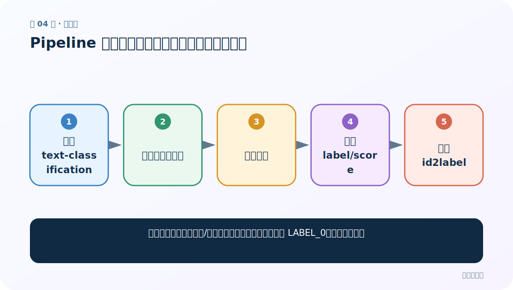
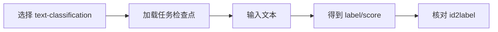
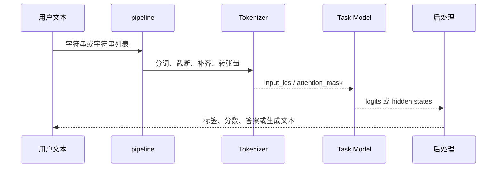
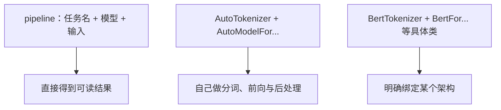

# 第 4 节：Pipeline 文本分类：三行代码背后的标签与概率

> 笔记编号 4/29 · 对应原视频 P158 · [打开这一集](https://www.bilibili.com/video/BV14mdfBDE4Q?p=158)

[← 上一节：3 Transformers 库与环境：模型仓库、缓存和三种调用方式](./03-transformers-library-setup.md) · [返回总目录](./README.md) · [下一节：5 Pipeline 特征提取：没有任务头的“半成品”怎样读形状 →](./05-pipeline-feature-extraction.md)

## 这节解决什么问题

怎样快速验证一个情感/文本分类检查点，同时避免误读 LABEL_0、星级和分数？



图从左向右读。先跟着数据或推理过程走一遍，再学习下面的术语。

## 辅助流程图



### pipeline 内部调用时序



### Transformers 三种调用层次



## 老师原声整理稿（按讲解顺序）

### 0:00–3:49　环境与 pipeline 参数

老师先安装 Transformers 和 datasets，再解释 `pipeline(task, model=...)`。第一个参数是任务名，第二个是检查点路径或仓库名。课堂使用本地模型避免重复下载；只写任务不写模型时库可能选默认模型，但这会带来版本和语言不确定性，学习项目最好显式指定。

### 3:49–8:35　如何在模型仓库筛选

先按 Text Classification 任务筛选，再按 Chinese、情感或领域搜索，阅读模型卡、标签说明和示例。网页在线试玩可快速排除不符合预期的模型，但最终仍要在自己的验证集测试。老师强调不要下载很久后才发现任务或语言不匹配。

### 8:37–16:34　运行与读结果

把中文文本交给 classifier，返回形如 `{'label': '5 stars', 'score': 0.91}` 的结果。`score` 是模型在当前标签空间内的置信分数，不是“模型整体准确率”；`label` 的业务含义由 config 的 `id2label` 决定。若返回 `LABEL_0`，必须查模型卡或映射，不能自行猜正负。

### 16:36–22:36　批量输入、设备与警告

pipeline 可接收字符串列表做批量推理，并可指定 CPU/GPU 设备。课堂展示模型加载与运行日志；很多 warning 不是报错，例如当前使用 CPU 或某些权重未使用，但必须读清具体内容。验证正确后再进入特征提取。

## 完整原声逐段记录

[查看本节按时间戳整理的完整音轨转写](./transcripts/p158.md)

逐段记录用于核查老师讲解是否遗漏；正文会进一步纠正口误和语音识别中的技术术语。

## 零基础先记住

- 显式指定任务与检查点
- score 是单次预测置信，不是测试集准确率
- LABEL_0 的含义必须查 id2label

## 最小可运行代码

下面代码是帮助理解本节概念的最小示例，默认从项目根目录运行。

```python
from transformers import pipeline

pipe = pipeline("text-classification", model="your-classification-checkpoint")
result = pipe("这家店服务很好，菜也很新鲜。")
print(result)
```

### 输入和输出怎么看

得到标签和分数的字典列表，具体标签名取决于检查点配置。

## 最容易踩的坑

把 `score=0.95` 说成模型准确率 95%；整体准确率必须在有真值的评估集上计算。

## 本节知识链

`选择 text-classification → 加载任务检查点 → 输入文本 → 得到 label/score → 核对 id2label`

## 自测

**问题：模型返回 LABEL_1 时能直接解释为正面吗？**

<details>
<summary>点开核对答案</summary>

不能。要查看模型 config 的 id2label 或模型卡，LABEL_1 在不同模型中可能含义不同。

</details>

## 学完检查

- [ ] 我能用自己的话复述老师的讲解顺序
- [ ] 我能在运行前预测关键输出或张量形状
- [ ] 我知道这节方法最容易用错的地方
- [ ] 我能独立回答自测题

[← 上一节：3 Transformers 库与环境：模型仓库、缓存和三种调用方式](./03-transformers-library-setup.md) · [返回总目录](./README.md) · [下一节：5 Pipeline 特征提取：没有任务头的“半成品”怎样读形状 →](./05-pipeline-feature-extraction.md)
