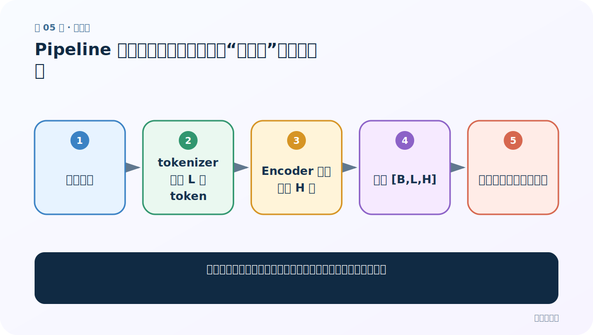
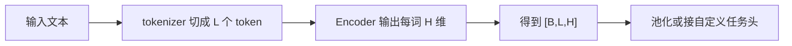
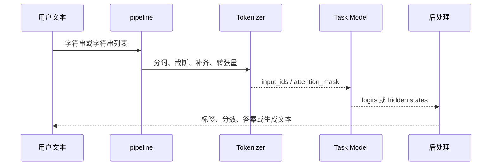
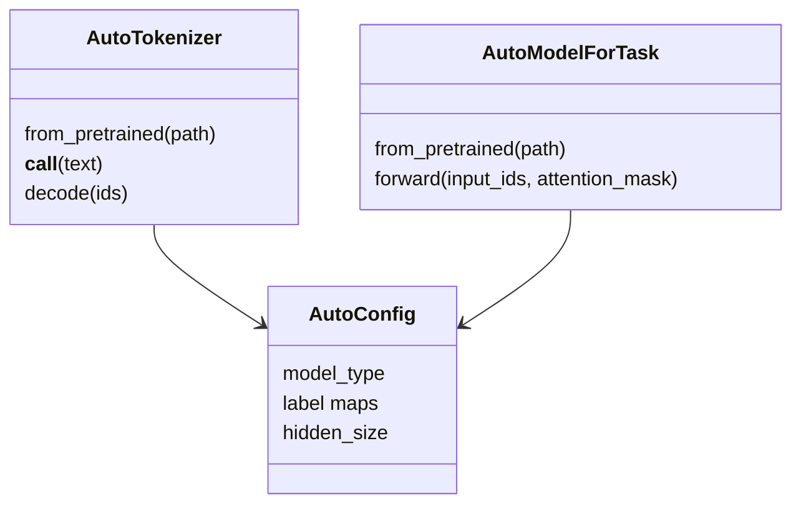

# 第 5 节：Pipeline 特征提取：没有任务头的“半成品”怎样读形状

> 笔记编号 5/29 · 对应原视频 P159 · [打开这一集](https://www.bilibili.com/video/BV14mdfBDE4Q?p=159)

[← 上一节：4 Pipeline 文本分类：三行代码背后的标签与概率](./04-pipeline-text-classification.md) · [返回总目录](./README.md) · [下一节：6 Pipeline 完形填空：`[MASK]`、候选概率与多个空位 →](./06-pipeline-fill-mask.md)

## 这节解决什么问题

特征提取为什么不直接返回类别，而会得到一大块三维浮点数？



图从左向右读。先跟着数据或推理过程走一遍，再学习下面的术语。

## 辅助流程图



### pipeline 内部调用时序



### Auto 类对象关系



## 老师原声整理稿（按讲解顺序）

### 0:00–4:54　带任务头与不带任务头

老师把特征提取比作买手机零件：模型只给通用特征，还需要自己组装分类、聚类或检索模块；文本分类像直接买成品手机，任务头已把特征变成标签。这个类比对应 `AutoModel` 与 `AutoModelForSequenceClassification` 的差别。

### 4:54–10:49　创建 feature-extraction pipeline

任务名是 `feature-extraction`，检查点应是可输出隐藏状态的基础模型。输入一句话后得到嵌套列表。设批量 B=1、分词后 L=12、隐藏维 H=768，则形状 `[1,12,768] = 1 条文本 × 12 个 token × 每个 token 768 个特征`。它不是“12 个词”这么绝对，因为 tokenizer 还会加入特殊 token，并可能把一个词拆成多个子词。

### 10:49–15:46　怎样变成句向量

若下游需要一句一个向量，可取 `[CLS]` 位置、对非 padding token 做 masked mean pooling，或使用专门训练的句向量模型。直接把三维数组扔给传统分类器通常形状不匹配。老师强调特征提取是预训练范畴的中间结果，后面 AutoModel 版本会手工查看 `last_hidden_state`。

## 完整原声逐段记录

[查看本节按时间戳整理的完整音轨转写](./transcripts/p159.md)

逐段记录用于核查老师讲解是否遗漏；正文会进一步纠正口误和语音识别中的技术术语。

## 零基础先记住

- 特征提取输出的是 token 级通用表示
- `[B,L,H]` 的 L 含特殊 token/子词
- 句向量需要明确池化规则

## 最小可运行代码

下面代码是帮助理解本节概念的最小示例，默认从项目根目录运行。

```python
from transformers import pipeline

pipe = pipeline("feature-extraction", model="your-base-checkpoint")
result = pipe("迁移学习可以复用知识")
print(result)
```

### 输入和输出怎么看

返回三维嵌套列表，常见语义是 `[批量, token 数, 隐藏维度]`。

## 最容易踩的坑

把第一个 token 当句向量却不知道模型是否专门训练过该用法。

## 本节知识链

`输入文本 → tokenizer 切成 L 个 token → Encoder 输出每词 H 维 → 得到 [B,L,H] → 池化或接自定义任务头`

## 自测

**问题：`[2,16,768]` 分别表示什么？**

<details>
<summary>点开核对答案</summary>

2 条文本；每条补齐/截断到 16 个 token；每个 token 有 768 维隐藏特征。

</details>

## 学完检查

- [ ] 我能用自己的话复述老师的讲解顺序
- [ ] 我能在运行前预测关键输出或张量形状
- [ ] 我知道这节方法最容易用错的地方
- [ ] 我能独立回答自测题

[← 上一节：4 Pipeline 文本分类：三行代码背后的标签与概率](./04-pipeline-text-classification.md) · [返回总目录](./README.md) · [下一节：6 Pipeline 完形填空：`[MASK]`、候选概率与多个空位 →](./06-pipeline-fill-mask.md)
