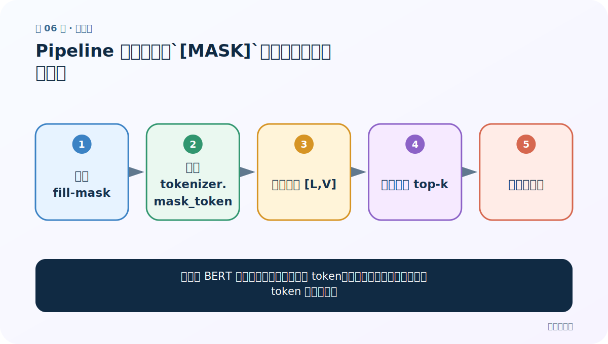
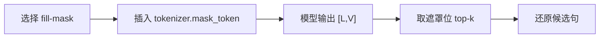
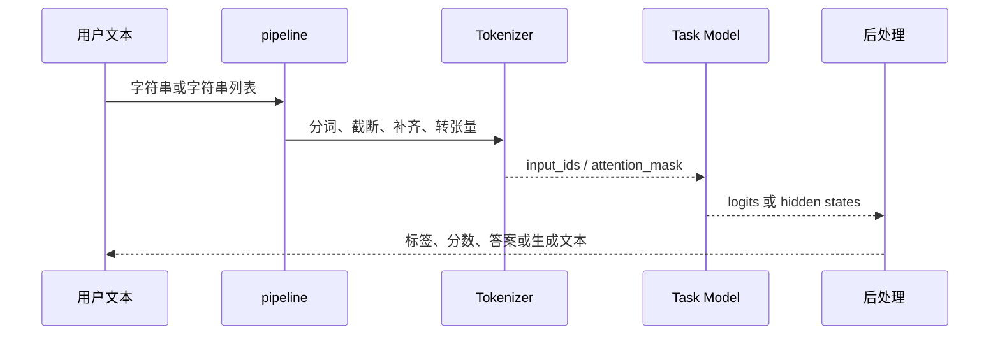
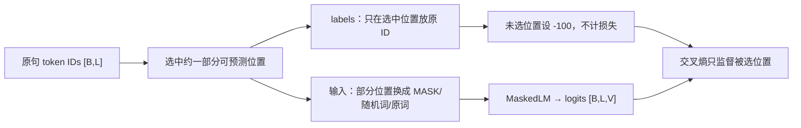

# 第 6 节：Pipeline 完形填空：`[MASK]`、候选概率与多个空位

> 笔记编号 6/29 · 对应原视频 P160 · [打开这一集](https://www.bilibili.com/video/BV14mdfBDE4Q?p=160)

[← 上一节：5 Pipeline 特征提取：没有任务头的“半成品”怎样读形状](./05-pipeline-feature-extraction.md) · [返回总目录](./README.md) · [下一节：7 Pipeline 阅读理解：从 context 中预测答案起止位置 →](./07-pipeline-question-answering.md)

## 这节解决什么问题

怎样让 BERT 根据左右文预测被遮住的 token，并正确理解它一次预测的是 token 而非汉字？



图从左向右读。先跟着数据或推理过程走一遍，再学习下面的术语。

## 辅助流程图



### pipeline 内部调用时序



### MLM 数据与标签



## 老师原声整理稿（按讲解顺序）

### 0:00–2:54　任务与模型匹配

完形填空对应 Masked Language Modeling，pipeline 任务名 `fill-mask`。必须选择带 MLM 头、且 tokenizer 语言匹配的检查点。老师展示在模型仓库按任务筛选；使用不同社区的库时，导入和接口也会不同，不能把代码混用。

### 2:54–5:55　MASK 是一个 token 槽位

输入要使用该 tokenizer 的 `mask_token`，BERT 常见为 `[MASK]`。一次遮罩位置预测的是一个词表 token，不等于固定一个汉字：中文词表常一字一 token，但也可能有整词或子词。老师说 pipeline 示例一次只处理一个 MASK；多个 MASK 若独立一次性预测会缺少彼此条件，可循环填入上一步候选，或使用支持多空联合策略的代码。

### 5:55–11:57　返回值和设备提示

结果通常包含 `score`、`token`、`token_str` 和 `sequence`，默认给若干 top-k 候选。分数是该遮罩位置的词表概率。课堂日志提示模型在 CPU 运行，这不是错误；若要 GPU，需要确保框架识别设备并正确指定 pipeline device。最后要检查候选句是否语义、语法都合理，而不只看最高分。

## 完整原声逐段记录

[查看本节按时间戳整理的完整音轨转写](./transcripts/p160.md)

逐段记录用于核查老师讲解是否遗漏；正文会进一步纠正口误和语音识别中的技术术语。

## 零基础先记住

- 输入应使用 tokenizer.mask_token
- 一个 MASK 预测一个 token，不必然是一个字
- 多个 MASK 需要明确顺序或联合策略

## 最小可运行代码

下面代码是帮助理解本节概念的最小示例，默认从项目根目录运行。

```python
from transformers import pipeline
fill = pipeline("fill-mask", model="your-chinese-mlm-checkpoint")
mask = fill.tokenizer.mask_token
print(fill(f"我明天去{mask}家吃饭", top_k=5))
```

### 输入和输出怎么看

返回遮罩位置的 5 个候选 token、分数与替换后的完整序列。

## 最容易踩的坑

手写 `<mask>` 或 `[MASK]` 却与 tokenizer 的真实遮罩符不一致。

## 本节知识链

`选择 fill-mask → 插入 tokenizer.mask_token → 模型输出 [L,V] → 取遮罩位 top-k → 还原候选句`

## 自测

**问题：为什么多个 MASK 逐个填时，顺序会影响结果？**

<details>
<summary>点开核对答案</summary>

后一个位置的预测会把前面已经填入的 token 当作上下文，不同先后顺序形成不同条件。

</details>

## 学完检查

- [ ] 我能用自己的话复述老师的讲解顺序
- [ ] 我能在运行前预测关键输出或张量形状
- [ ] 我知道这节方法最容易用错的地方
- [ ] 我能独立回答自测题

[← 上一节：5 Pipeline 特征提取：没有任务头的“半成品”怎样读形状](./05-pipeline-feature-extraction.md) · [返回总目录](./README.md) · [下一节：7 Pipeline 阅读理解：从 context 中预测答案起止位置 →](./07-pipeline-question-answering.md)
