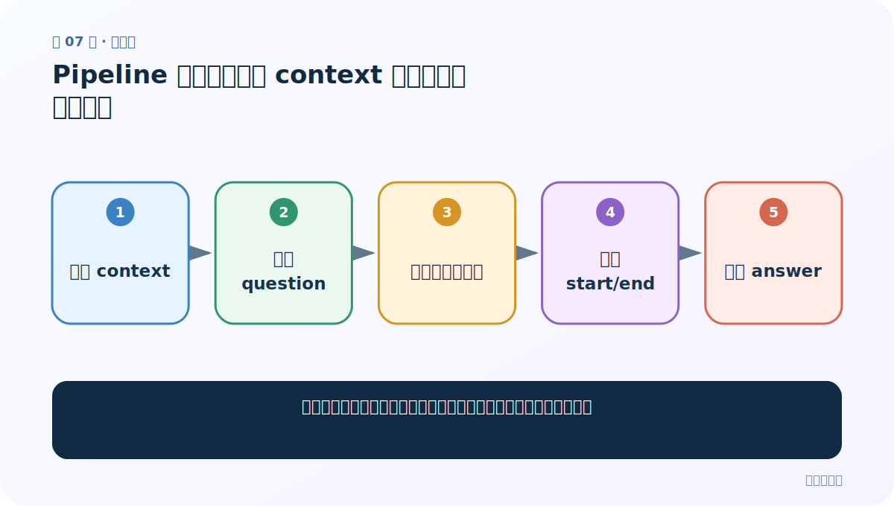
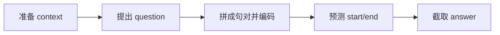
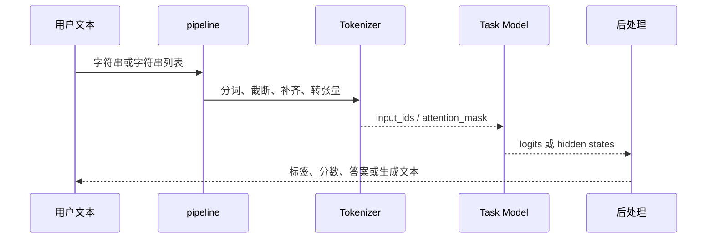

# 第 7 节：Pipeline 阅读理解：从 context 中预测答案起止位置

> 笔记编号 7/29 · 对应原视频 P161 · [打开这一集](https://www.bilibili.com/video/BV14mdfBDE4Q?p=161)

[← 上一节：6 Pipeline 完形填空：`[MASK]`、候选概率与多个空位](./06-pipeline-fill-mask.md) · [返回总目录](./README.md) · [下一节：8 Pipeline 文本摘要：生成长度、截断与事实一致性 →](./08-pipeline-summarization.md)

## 这节解决什么问题

抽取式问答怎样从一段材料中找答案，而不是凭模型记忆自由发挥？



图从左向右读。先跟着数据或推理过程走一遍，再学习下面的术语。

## 辅助流程图



### pipeline 内部调用时序



## 老师原声整理稿（按讲解顺序）

### 0:00–2:55　抽取式问答的边界

老师称阅读理解为抽取式问答：输入一段 `context` 和一个 `question`，模型输出材料中的答案片段。它是带任务头的成品任务，与只输出隐藏特征不同。抽取式意味着答案应来自 context；若材料没有答案，普通模型仍可能硬选一段，需要专门的无答案训练或阈值策略。

### 2:55–6:53　创建 question-answering pipeline

任务名 `question-answering`，模型应是针对问答微调的检查点。课堂用本地中文 MRC 模型，准备“我叫……、职业……、喜好……”的 context，再提出名字、职业、爱好问题。调用时使用关键字参数 `question=`、`context=`，所以二者书写顺序不重要。

### 6:53–12:35　输出与同义表达

返回包含 `answer`、`score`、`start`、`end`。start/end 是在原 context 字符串中的边界，可用切片核验。老师故意让材料写“喜好”、问题写“爱好”，观察模型能否理解近义表达。真正评估要用 Exact Match/F1 和成套问答数据，不能只凭三道自编题。

## 完整原声逐段记录

[查看本节按时间戳整理的完整音轨转写](./transcripts/p161.md)

逐段记录用于核查老师讲解是否遗漏；正文会进一步纠正口误和语音识别中的技术术语。

## 零基础先记住

- 答案通常从 context 原文截取
- 关键字参数避免 question/context 位置写反
- 无答案问题需要专门处理

## 最小可运行代码

下面代码是帮助理解本节概念的最小示例，默认从项目根目录运行。

```python
from transformers import pipeline
qa = pipeline("question-answering", model="your-chinese-qa-checkpoint")
context = "小林是一名教师，他喜欢编程和徒步。"
print(qa(question="小林做什么工作？", context=context))
```

### 输入和输出怎么看

返回答案文本、置信分数以及答案在 context 中的起止位置。

## 最容易踩的坑

使用普通 BERT base 而不是问答微调模型，却期待 start/end 头已经学会找答案。

## 本节知识链

`准备 context → 提出 question → 拼成句对并编码 → 预测 start/end → 截取 answer`

## 自测

**问题：为什么抽取式问答不适合回答 context 完全没提到的问题？**

<details>
<summary>点开核对答案</summary>

它的输出空间是 context 的起止位置；没有答案时也可能被迫选一个片段。

</details>

## 学完检查

- [ ] 我能用自己的话复述老师的讲解顺序
- [ ] 我能在运行前预测关键输出或张量形状
- [ ] 我知道这节方法最容易用错的地方
- [ ] 我能独立回答自测题

[← 上一节：6 Pipeline 完形填空：`[MASK]`、候选概率与多个空位](./06-pipeline-fill-mask.md) · [返回总目录](./README.md) · [下一节：8 Pipeline 文本摘要：生成长度、截断与事实一致性 →](./08-pipeline-summarization.md)
