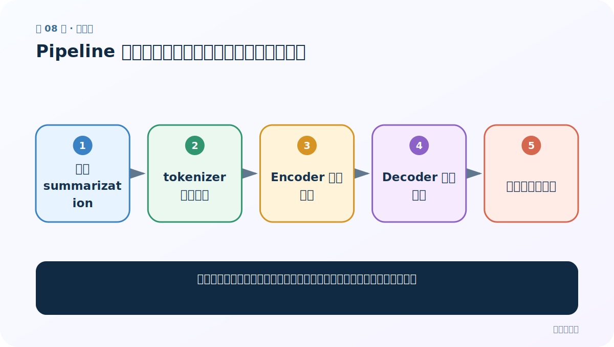
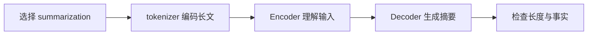
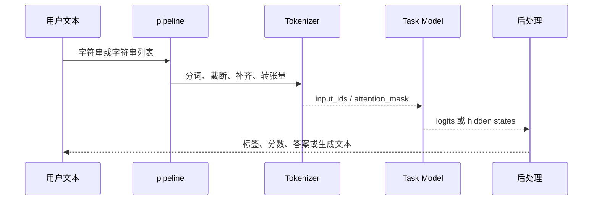
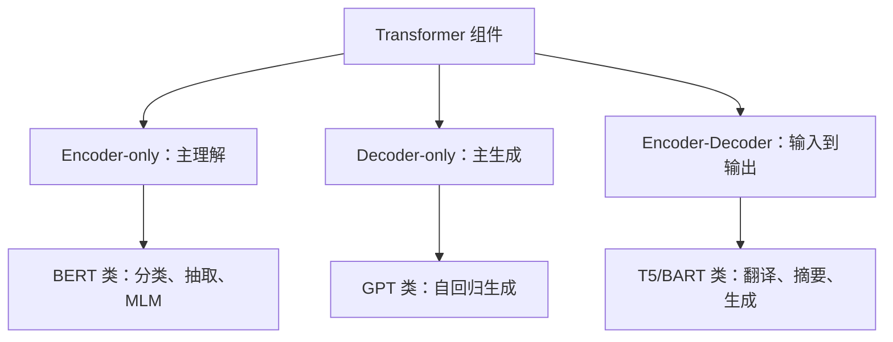

# 第 8 节：Pipeline 文本摘要：生成长度、截断与事实一致性

> 笔记编号 8/29 · 对应原视频 P162 · [打开这一集](https://www.bilibili.com/video/BV14mdfBDE4Q?p=162)

[← 上一节：7 Pipeline 阅读理解：从 context 中预测答案起止位置](./07-pipeline-question-answering.md) · [返回总目录](./README.md) · [下一节：9 Pipeline NER：token 标签怎样合并成人名、地点和组织 →](./09-pipeline-ner.md)

## 这节解决什么问题

怎样把长文本压缩为摘要，并避免输入被截断或模型编造原文没有的事实？



图从左向右读。先跟着数据或推理过程走一遍，再学习下面的术语。

## 辅助流程图



### pipeline 内部调用时序



### 预训练模型三大家族



## 老师原声整理稿（按讲解顺序）

### 0:00–3:10　摘要是生成任务

文本摘要不是从固定标签中选择，而是生成新的 token 序列，常使用 Encoder-Decoder 检查点。pipeline 任务名 `summarization`。模型必须与输入语言、领域匹配；英文摘要模型直接处理中文通常不可靠。

### 3:10–6:35　长度参数怎么理解

`max_length`/`min_length` 在许多版本中指生成序列的 token 长度；较新的生成接口也常用 `max_new_tokens` 指新增 token 数。输入本身还有模型最大上下文限制，过长会被截断。摘要长文应先分块或使用长上下文模型，不能无声丢掉后半篇。

### 6:35–9:36　输出与质量检查

结果通常是 `summary_text`。老师用 pipeline 展示直接生成；学习时还要补一层人工核对：摘要是否覆盖核心事实、是否把人物数字改错、是否出现原文没有的结论。ROUGE 可比较词面重合，但不能完全判断事实一致性。

## 完整原声逐段记录

[查看本节按时间戳整理的完整音轨转写](./transcripts/p162.md)

逐段记录用于核查老师讲解是否遗漏；正文会进一步纠正口误和语音识别中的技术术语。

## 零基础先记住

- 摘要属于条件生成任务
- 输入长度和输出长度是两套限制
- 流畅不等于事实正确

## 最小可运行代码

下面代码是帮助理解本节概念的最小示例，默认从项目根目录运行。

```python
from transformers import pipeline

pipe = pipeline("summarization", model="your-chinese-summarization-checkpoint")
result = pipe("这里放入一段较长的中文文章。")
print(result)
```

### 输入和输出怎么看

返回带 `summary_text` 的列表；具体键和长度受版本/模型影响。

## 最容易踩的坑

输入超过最大长度后被静默截断，却以为摘要覆盖了整篇文章。

## 本节知识链

`选择 summarization → tokenizer 编码长文 → Encoder 理解输入 → Decoder 生成摘要 → 检查长度与事实`

## 自测

**问题：`max_new_tokens` 与模型最大输入长度有什么区别？**

<details>
<summary>点开核对答案</summary>

前者限制新生成多少 token；后者限制模型能读入多少 token，二者互不替代。

</details>

## 学完检查

- [ ] 我能用自己的话复述老师的讲解顺序
- [ ] 我能在运行前预测关键输出或张量形状
- [ ] 我知道这节方法最容易用错的地方
- [ ] 我能独立回答自测题

[← 上一节：7 Pipeline 阅读理解：从 context 中预测答案起止位置](./07-pipeline-question-answering.md) · [返回总目录](./README.md) · [下一节：9 Pipeline NER：token 标签怎样合并成人名、地点和组织 →](./09-pipeline-ner.md)
