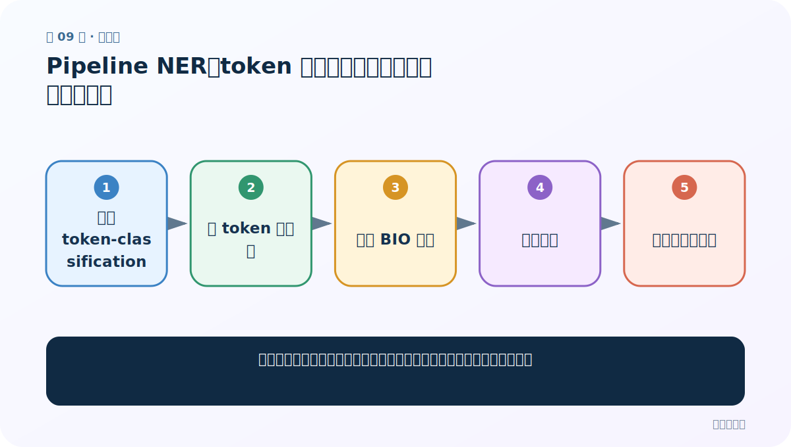
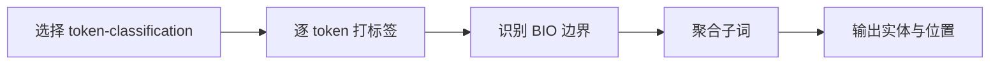
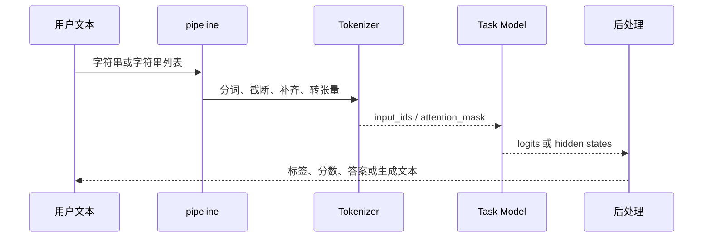

# 第 9 节：Pipeline NER：token 标签怎样合并成人名、地点和组织

> 笔记编号 9/29 · 对应原视频 P163 · [打开这一集](https://www.bilibili.com/video/BV14mdfBDE4Q?p=163)

[← 上一节：8 Pipeline 文本摘要：生成长度、截断与事实一致性](./08-pipeline-summarization.md) · [返回总目录](./README.md) · [下一节：10 Auto 模型文本分类：手工完成分词、前向与 argmax →](./10-auto-text-classification.md)

## 这节解决什么问题

命名实体识别为什么会返回许多子词片段，怎样把它们合并成完整实体？



图从左向右读。先跟着数据或推理过程走一遍，再学习下面的术语。

## 辅助流程图



### pipeline 内部调用时序



## 老师原声整理稿（按讲解顺序）

### 0:00–3:50　NER 是 token 级分类

命名实体识别为句中每个 token 判断人名 PER、地点 LOC、组织 ORG 等。它与整句文本分类不同：输出长度随 token 数变化。模型应带 TokenClassification/NER 任务头，并使用训练时同一标签集合。

### 3:50–8:20　BIO 与子词

标签常以 B- 开始一个实体、I- 延续实体、O 表示非实体。WordPiece/BPE 可能把一个名字拆成多个子词，因此 pipeline 原始输出可能一段实体出现多条。设置合适的 `aggregation_strategy` 可依据标签与位置合并，但中文字符级模型的聚合效果仍要抽样检查。

### 8:20–12:29　读懂返回位置

结果常含 `entity_group`、`score`、`word`、`start`、`end`。start/end 可回原字符串切片验证。老师演示指定本地 NER 模型并打印结果；工程中还要处理空格、特殊字符和重叠实体，并用实体级 Precision/Recall/F1，而不是 token 准确率。

## 完整原声逐段记录

[查看本节按时间戳整理的完整音轨转写](./transcripts/p163.md)

逐段记录用于核查老师讲解是否遗漏；正文会进一步纠正口误和语音识别中的技术术语。

## 零基础先记住

- NER 输出是 token/实体级，不是整句单标签
- BIO 标签表达实体边界
- 子词需要聚合回原文实体

## 最小可运行代码

下面代码是帮助理解本节概念的最小示例，默认从项目根目录运行。

```python
from transformers import pipeline
ner = pipeline(
    "token-classification",
    model="your-chinese-ner-checkpoint",
    aggregation_strategy="simple",
)
print(ner("小林今天从武汉来到北京。"))
```

### 输入和输出怎么看

返回识别到的人名、地点等实体，以及分数和原文位置。

## 最容易踩的坑

只看 token accuracy；大量 O 标签会让它很高，却掩盖实体识别很差。

## 本节知识链

`选择 token-classification → 逐 token 打标签 → 识别 BIO 边界 → 聚合子词 → 输出实体与位置`

## 自测

**问题：B-LOC 与 I-LOC 有什么差别？**

<details>
<summary>点开核对答案</summary>

B-LOC 表示地点实体开头，I-LOC 表示同一地点实体的后续 token。

</details>

## 学完检查

- [ ] 我能用自己的话复述老师的讲解顺序
- [ ] 我能在运行前预测关键输出或张量形状
- [ ] 我知道这节方法最容易用错的地方
- [ ] 我能独立回答自测题

[← 上一节：8 Pipeline 文本摘要：生成长度、截断与事实一致性](./08-pipeline-summarization.md) · [返回总目录](./README.md) · [下一节：10 Auto 模型文本分类：手工完成分词、前向与 argmax →](./10-auto-text-classification.md)
