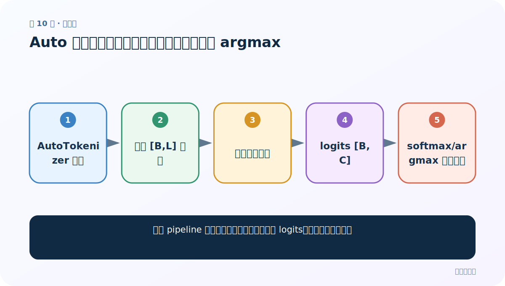
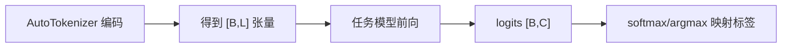
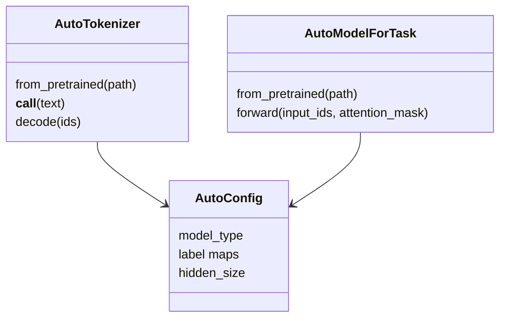
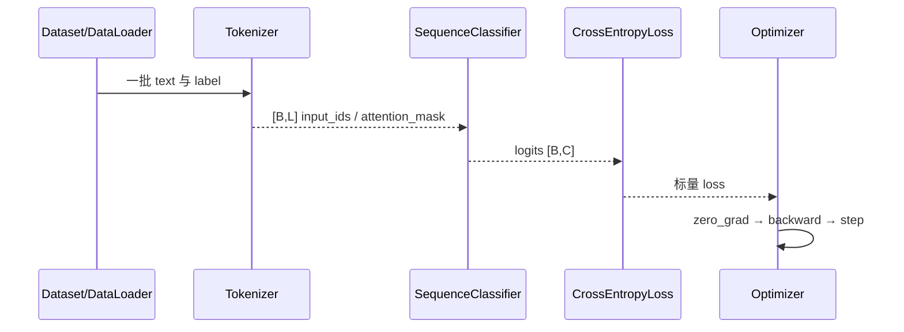

# 第 10 节：Auto 模型文本分类：手工完成分词、前向与 argmax

> 笔记编号 10/29 · 对应原视频 P164 · [打开这一集](https://www.bilibili.com/video/BV14mdfBDE4Q?p=164)

[← 上一节：9 Pipeline NER：token 标签怎样合并成人名、地点和组织](./09-pipeline-ner.md) · [返回总目录](./README.md) · [下一节：11 Auto 模型特征提取：last_hidden_state 与 masked mean pooling →](./11-auto-feature-extraction.md)

## 这节解决什么问题

不用 pipeline 后，怎样一步步把字符串变成 logits、概率和业务标签？



图从左向右读。先跟着数据或推理过程走一遍，再学习下面的术语。

## 辅助流程图



### Auto 类对象关系



### 中文分类训练时序



## 老师原声整理稿（按讲解顺序）

### 0:00–7:00　为什么改用 Auto 类

pipeline 方便但隐藏步骤；Auto 接口让你控制截断、补齐、批量、设备和后处理。加载时使用同一个路径创建 `AutoTokenizer` 与 `AutoModelForSequenceClassification`，后者会根据 config 自动选择 BERT、RoBERTa 等具体实现。

### 7:00–19:00　张量形状与前向

tokenizer 用 `return_tensors='pt'` 返回字典。若 B=2、L=32，`input_ids [2,32] = 2 条文本 × 每条 32 个 token ID`，`attention_mask [2,32]` 中 1 表示有效位置、0 表示 padding。模型输出 `logits [2,C] = 每条文本对 C 个类别的未归一化分数`。推理需 `model.eval()` 与 `torch.no_grad()`。

### 19:00–35:40　概率、标签和 config

对 logits 最后一维做 softmax 得到每类概率，argmax 得到类别 ID，再用 `model.config.id2label` 映射业务标签。老师逐步对比 pipeline 自动做掉的工作。若是多标签模型，不应 softmax/argmax，而应 sigmoid 后按阈值保留多个标签。

## 完整原声逐段记录

[查看本节按时间戳整理的完整音轨转写](./transcripts/p164.md)

逐段记录用于核查老师讲解是否遗漏；正文会进一步纠正口误和语音识别中的技术术语。

## 零基础先记住

- AutoTokenizer 与任务模型必须同检查点
- logits 不是概率
- 单标签 softmax，多标签 sigmoid

## 最小可运行代码

下面代码是帮助理解本节概念的最小示例，默认从项目根目录运行。

```python
import torch
from transformers import AutoTokenizer, AutoModelForSequenceClassification
path="your-classification-checkpoint"
tok=AutoTokenizer.from_pretrained(path)
model=AutoModelForSequenceClassification.from_pretrained(path).eval()
batch=tok(["文本很好"], padding=True, truncation=True, return_tensors="pt")
with torch.no_grad():
    logits=model(**batch).logits
idx=logits.argmax(-1).item()
print(model.config.id2label[idx])
```

### 输入和输出怎么看

从 `[1,L]` 输入得到 `[1,C]` logits，并输出最高分类标签。

## 最容易踩的坑

模型和输入不在同一 device，或推理时忘记 eval/no_grad 造成随机 dropout 与额外显存。

## 本节知识链

`AutoTokenizer 编码 → 得到 [B,L] 张量 → 任务模型前向 → logits [B,C] → softmax/argmax 映射标签`

## 自测

**问题：`logits [4,3]` 表示什么？**

<details>
<summary>点开核对答案</summary>

一批 4 条文本，每条对 3 个类别各有一个未归一化分数。

</details>

## 学完检查

- [ ] 我能用自己的话复述老师的讲解顺序
- [ ] 我能在运行前预测关键输出或张量形状
- [ ] 我知道这节方法最容易用错的地方
- [ ] 我能独立回答自测题

[← 上一节：9 Pipeline NER：token 标签怎样合并成人名、地点和组织](./09-pipeline-ner.md) · [返回总目录](./README.md) · [下一节：11 Auto 模型特征提取：last_hidden_state 与 masked mean pooling →](./11-auto-feature-extraction.md)
