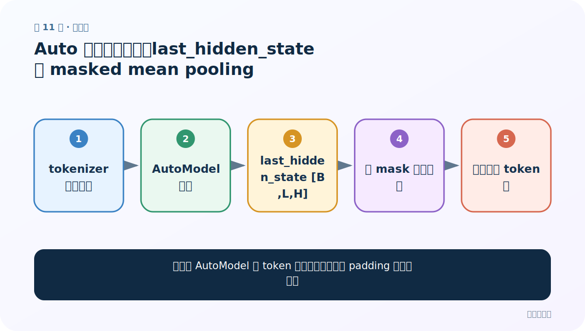
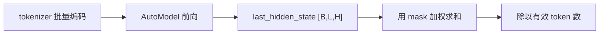
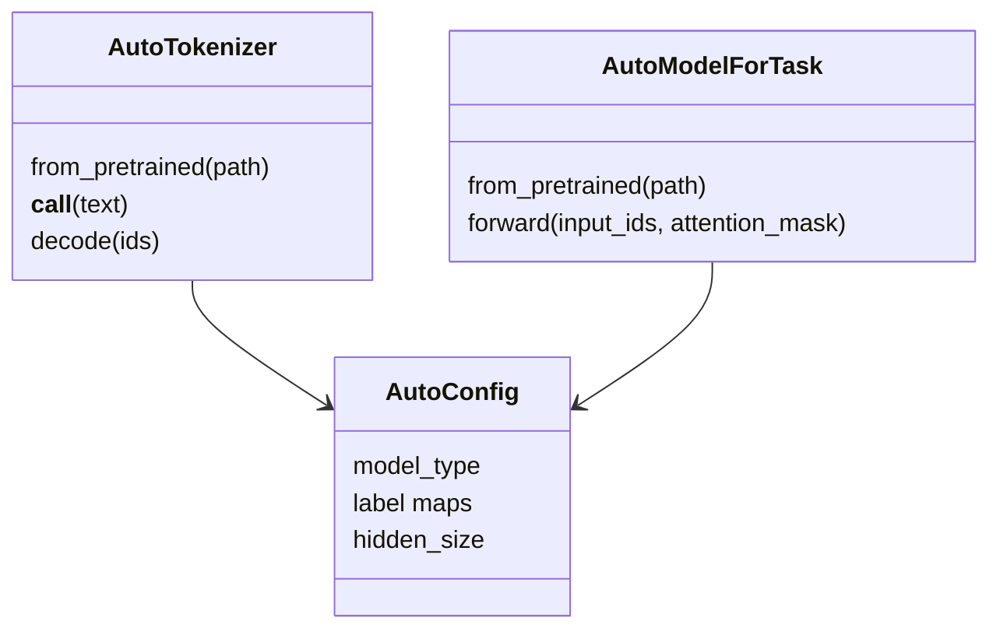

# 第 11 节：Auto 模型特征提取：last_hidden_state 与 masked mean pooling

> 笔记编号 11/29 · 对应原视频 P165 · [打开这一集](https://www.bilibili.com/video/BV14mdfBDE4Q?p=165)

[← 上一节：10 Auto 模型文本分类：手工完成分词、前向与 argmax](./10-auto-text-classification.md) · [返回总目录](./README.md) · [下一节：12 Auto 模型完形填空：定位 mask，再从词表 logits 取 top-k →](./12-auto-fill-mask.md)

## 这节解决什么问题

怎样从 AutoModel 的 token 表示得到一个忽略 padding 的句向量？



图从左向右读。先跟着数据或推理过程走一遍，再学习下面的术语。

## 辅助流程图



### Auto 类对象关系



## 老师原声整理稿（按讲解顺序）

### 0:00–5:30　基础模型没有任务头

`AutoModel` 加载主体 Encoder，输出通用隐藏状态，不直接给分类标签。`last_hidden_state [B,L,H]`：B 是批量，L 是补齐后的 token 长度，H 是隐藏维度。

### 5:30–11:30　为什么不能普通 mean

批量中短句会被 PAD 补到最长；若直接沿 L 平均，padding 位置也参与。把 `attention_mask [B,L]` 扩展为 `[B,L,1]`，与隐藏状态相乘，只保留有效 token，再除以每句有效 token 数。

### 11:30–17:00　特征用途与限制

得到 `[B,H]` 句向量后可用于简单分类、聚类或相似度。但普通 MLM 预训练模型的池化未必适合语义相似度，正式检索应优先专门训练的 sentence embedding 模型，并按其模型卡执行 pooling/normalize。

## 完整原声逐段记录

[查看本节按时间戳整理的完整音轨转写](./transcripts/p165.md)

逐段记录用于核查老师讲解是否遗漏；正文会进一步纠正口误和语音识别中的技术术语。

## 零基础先记住

- last_hidden_state 是 token 级表示
- masked mean 防止 padding 污染句向量
- 通用 BERT 向量不天然等于优质句向量

## 最小可运行代码

下面代码是帮助理解本节概念的最小示例，默认从项目根目录运行。

```python
import torch
from transformers import AutoTokenizer, AutoModel
path="your-base-checkpoint"
tok=AutoTokenizer.from_pretrained(path)
model=AutoModel.from_pretrained(path).eval()
batch=tok(["短句","这是另一条更长的句子"],padding=True,return_tensors="pt")
with torch.no_grad(): h=model(**batch).last_hidden_state
mask=batch["attention_mask"].unsqueeze(-1)
sent=(h*mask).sum(1)/mask.sum(1).clamp_min(1)
print(h.shape,sent.shape)
```

### 输入和输出怎么看

例如先得到 `[2,L,H]`，再池化为 `[2,H]`。

## 最容易踩的坑

把 padding token 一起平均，导致不同批次长度改变同一句的向量。

## 本节知识链

`tokenizer 批量编码 → AutoModel 前向 → last_hidden_state [B,L,H] → 用 mask 加权求和 → 除以有效 token 数`

## 自测

**问题：attention_mask 为什么要 unsqueeze(-1)？**

<details>
<summary>点开核对答案</summary>

把 `[B,L]` 变成 `[B,L,1]`，才能沿隐藏维 H 广播并与 `[B,L,H]` 相乘。

</details>

## 学完检查

- [ ] 我能用自己的话复述老师的讲解顺序
- [ ] 我能在运行前预测关键输出或张量形状
- [ ] 我知道这节方法最容易用错的地方
- [ ] 我能独立回答自测题

[← 上一节：10 Auto 模型文本分类：手工完成分词、前向与 argmax](./10-auto-text-classification.md) · [返回总目录](./README.md) · [下一节：12 Auto 模型完形填空：定位 mask，再从词表 logits 取 top-k →](./12-auto-fill-mask.md)
