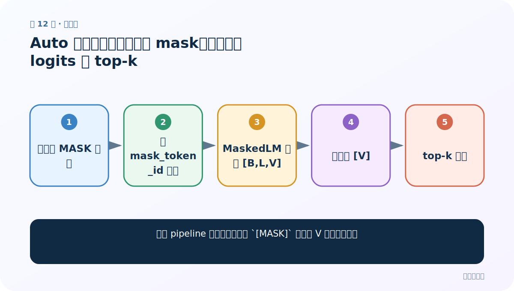
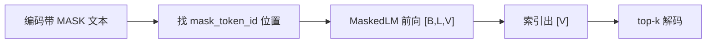
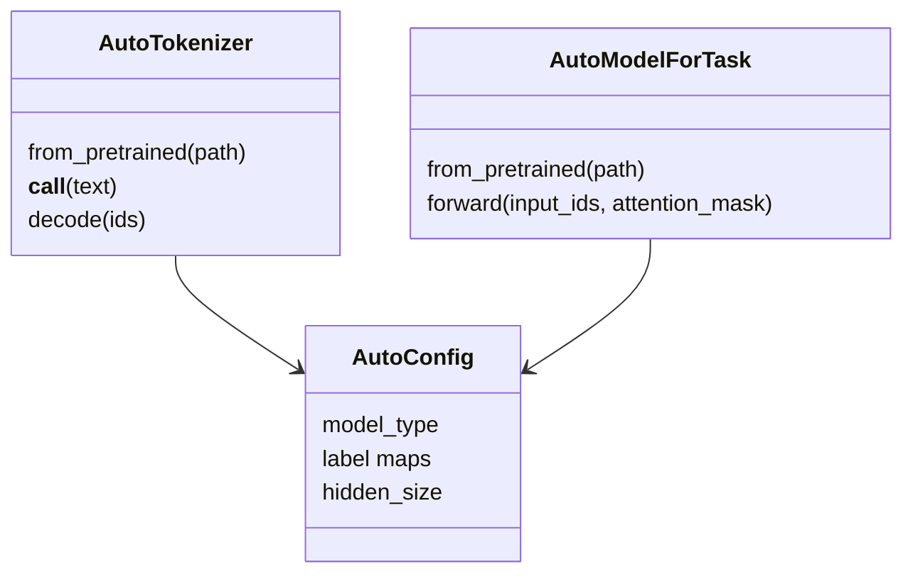
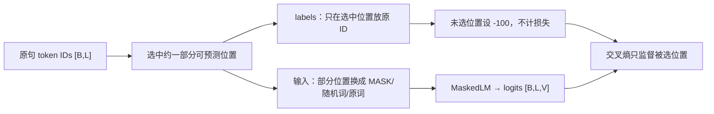

# 第 12 节：Auto 模型完形填空：定位 mask，再从词表 logits 取 top-k

> 笔记编号 12/29 · 对应原视频 P166 · [打开这一集](https://www.bilibili.com/video/BV14mdfBDE4Q?p=166)

[← 上一节：11 Auto 模型特征提取：last_hidden_state 与 masked mean pooling](./11-auto-feature-extraction.md) · [返回总目录](./README.md) · [下一节：13 Auto 模型阅读理解：start_logits 与 end_logits 组合答案 →](./13-auto-question-answering.md)

## 这节解决什么问题

不用 pipeline 时，怎样只读取 `[MASK]` 位置的 V 维词表分数？



图从左向右读。先跟着数据或推理过程走一遍，再学习下面的术语。

## 辅助流程图



### Auto 类对象关系



### MLM 数据与标签



## 老师原声整理稿（按讲解顺序）

### 0:00–5:00　任务模型与输入

使用 `AutoModelForMaskedLM`，因为它在每个 token 隐藏状态后接了词表分类头。输入字符串中的遮罩符应来自 `tokenizer.mask_token`。

### 5:00–10:30　形状一步步缩小

模型 logits 形状 `[B,L,V] = B 条文本 × L 个位置 × V 个词表候选`。通过 `input_ids == mask_token_id` 找到遮罩坐标，索引后得到该位置 `[V]` 分数，再 `topk(k)` 得到候选 ID。不要对所有 L 个位置都 top-k 后误当成空位预测。

### 10:30–16:00　解码与多空位

用 `convert_ids_to_tokens` 看原 token，用 `decode` 看可读文本。若有多个 MASK，索引结果会是 `[M,V]`；独立 top-k 并不保证联合最优，循环填充、beam search 或专门生成模型更合适。

## 完整原声逐段记录

[查看本节按时间戳整理的完整音轨转写](./transcripts/p166.md)

逐段记录用于核查老师讲解是否遗漏；正文会进一步纠正口误和语音识别中的技术术语。

## 零基础先记住

- MaskedLM 输出每个位置对整个词表的 logits
- 先定位 MASK，再取该位置
- top-k ID 要用同一 tokenizer 解码

## 最小可运行代码

下面代码是帮助理解本节概念的最小示例，默认从项目根目录运行。

```python
import torch
from transformers import AutoTokenizer, AutoModelForMaskedLM
path="your-mlm-checkpoint"
tok=AutoTokenizer.from_pretrained(path)
model=AutoModelForMaskedLM.from_pretrained(path).eval()
text=f"我喜欢学习{tok.mask_token}语言"
x=tok(text,return_tensors="pt")
with torch.no_grad(): logits=model(**x).logits
pos=(x["input_ids"][0]==tok.mask_token_id).nonzero().item()
ids=logits[0,pos].topk(5).indices
print(tok.convert_ids_to_tokens(ids))
```

### 输入和输出怎么看

从 `[1,L,V]` 中抽出遮罩位置 `[V]`，打印分数最高的 5 个 token。

## 最容易踩的坑

用 `argmax()` 不指定维度，对整个三维 logits 取出一个扁平索引。

## 本节知识链

`编码带 MASK 文本 → 找 mask_token_id 位置 → MaskedLM 前向 [B,L,V] → 索引出 [V] → top-k 解码`

## 自测

**问题：`[2,20,30000]` 的最后一维是什么？**

<details>
<summary>点开核对答案</summary>

词表中 30000 个 token 在每个位置的候选分数。

</details>

## 学完检查

- [ ] 我能用自己的话复述老师的讲解顺序
- [ ] 我能在运行前预测关键输出或张量形状
- [ ] 我知道这节方法最容易用错的地方
- [ ] 我能独立回答自测题

[← 上一节：11 Auto 模型特征提取：last_hidden_state 与 masked mean pooling](./11-auto-feature-extraction.md) · [返回总目录](./README.md) · [下一节：13 Auto 模型阅读理解：start_logits 与 end_logits 组合答案 →](./13-auto-question-answering.md)
