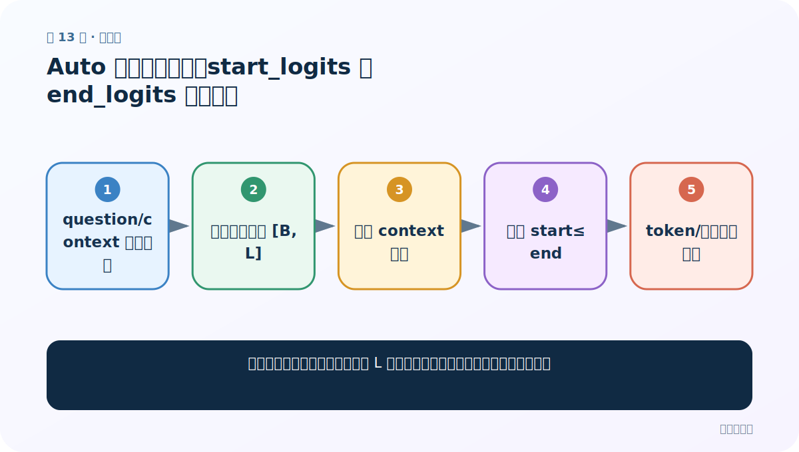
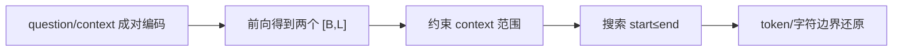
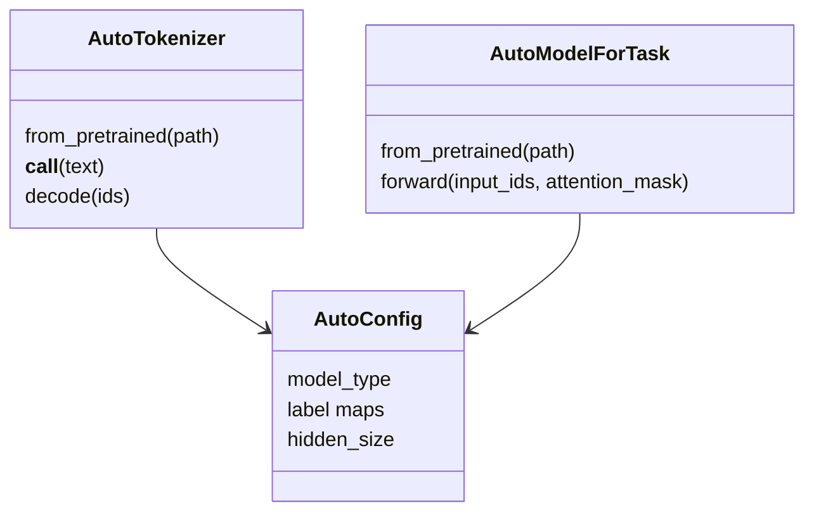

# 第 13 节：Auto 模型阅读理解：start_logits 与 end_logits 组合答案

> 笔记编号 13/29 · 对应原视频 P167 · [打开这一集](https://www.bilibili.com/video/BV14mdfBDE4Q?p=167)

[← 上一节：12 Auto 模型完形填空：定位 mask，再从词表 logits 取 top-k](./12-auto-fill-mask.md) · [返回总目录](./README.md) · [下一节：14 Auto 模型文本摘要：tokenize、generate 与 decode 分工 →](./14-auto-summarization.md)

## 这节解决什么问题

问答模型为什么输出两条长度为 L 的分数，怎样避免答案终点跑到起点前面？



图从左向右读。先跟着数据或推理过程走一遍，再学习下面的术语。

## 辅助流程图



### Auto 类对象关系



## 老师原声整理稿（按讲解顺序）

### 0:00–5:30　成对编码

`AutoModelForQuestionAnswering` 输出开始和结束位置。tokenizer 接收 question 与 context，并加入特殊 token。需要 `truncation='only_second'` 等策略优先截断 context，同时保留问题。

### 5:30–12:00　两个 logits 的形状

`start_logits [B,L]` 给每个 token 作为答案起点的分数，`end_logits [B,L]` 给终点分数。简单分别 argmax 可能得到 end < start，或落到问题/特殊 token；更稳妥是在 context token 范围内枚举满足 `start≤end`、长度不超上限的组合，最大化 start+end 分数。

### 12:00–18:00　从 token 回到原文

用 `offset_mapping` 将 token 位置映射回 context 字符边界，可精确保留原文；直接 decode token 片段可能改变空格或子词符号。长文超过窗口时需要滑动窗口与 `overflow_to_sample_mapping`，再跨窗口比较候选。

## 完整原声逐段记录

[查看本节按时间戳整理的完整音轨转写](./transcripts/p167.md)

逐段记录用于核查老师讲解是否遗漏；正文会进一步纠正口误和语音识别中的技术术语。

## 零基础先记住

- 问答头输出 start/end 两组 token 分数
- 答案必须约束在 context 且 start≤end
- offset_mapping 比直接 decode 更适合回原文

## 最小可运行代码

下面代码是帮助理解本节概念的最小示例，默认从项目根目录运行。

```python
import torch
from transformers import AutoTokenizer, AutoModelForQuestionAnswering
path="your-qa-checkpoint"
tok=AutoTokenizer.from_pretrained(path)
model=AutoModelForQuestionAnswering.from_pretrained(path).eval()
x=tok("他做什么工作？","小林是一名教师。",return_tensors="pt")
with torch.no_grad(): out=model(**x)
s=out.start_logits.argmax(-1).item(); e=out.end_logits.argmax(-1).item()
print(tok.decode(x["input_ids"][0,s:e+1]))
```

### 输入和输出怎么看

教学版直接取最高起止位置并解码；正式项目还需加入合法区间约束。

## 最容易踩的坑

独立 argmax 后不检查 end 是否早于 start。

## 本节知识链

`question/context 成对编码 → 前向得到两个 [B,L] → 约束 context 范围 → 搜索 start≤end → token/字符边界还原`

## 自测

**问题：为什么输出不是 `[B,C]`？**

<details>
<summary>点开核对答案</summary>

答案类别不是固定 C 类，而是输入序列中 L 个可能起点和 L 个可能终点。

</details>

## 学完检查

- [ ] 我能用自己的话复述老师的讲解顺序
- [ ] 我能在运行前预测关键输出或张量形状
- [ ] 我知道这节方法最容易用错的地方
- [ ] 我能独立回答自测题

[← 上一节：12 Auto 模型完形填空：定位 mask，再从词表 logits 取 top-k](./12-auto-fill-mask.md) · [返回总目录](./README.md) · [下一节：14 Auto 模型文本摘要：tokenize、generate 与 decode 分工 →](./14-auto-summarization.md)
