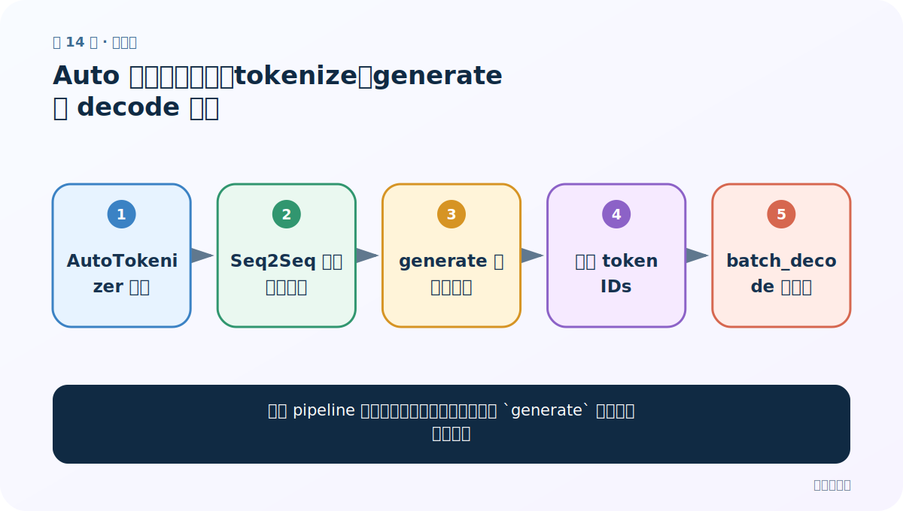
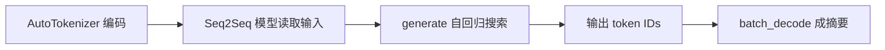
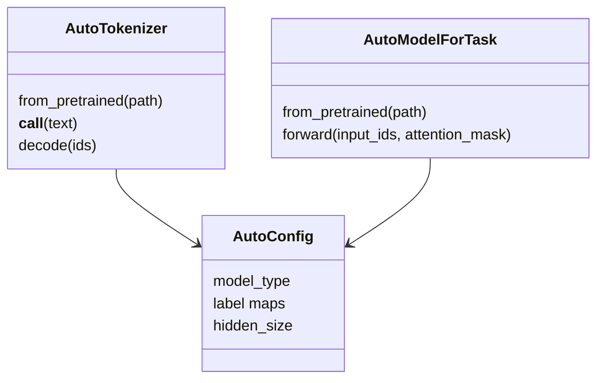
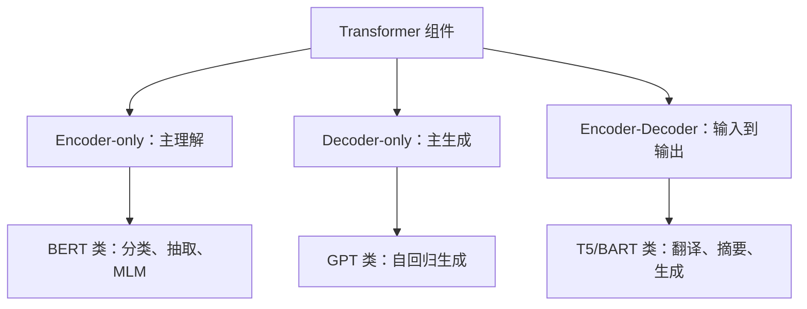

# 第 14 节：Auto 模型文本摘要：tokenize、generate 与 decode 分工

> 笔记编号 14/29 · 对应原视频 P168 · [打开这一集](https://www.bilibili.com/video/BV14mdfBDE4Q?p=168)

[← 上一节：13 Auto 模型阅读理解：start_logits 与 end_logits 组合答案](./13-auto-question-answering.md) · [返回总目录](./README.md) · [下一节：15 Auto 模型 NER：subword 标签对齐与实体聚合 →](./15-auto-ner.md)

## 这节解决什么问题

不用 pipeline 时，摘要模型的前向训练输出和 `generate` 推理有什么不同？



图从左向右读。先跟着数据或推理过程走一遍，再学习下面的术语。

## 辅助流程图



### Auto 类对象关系



### 预训练模型三大家族



## 老师原声整理稿（按讲解顺序）

### 0:00–5:00　加载 Seq2Seq 任务模型

摘要应使用 `AutoModelForSeq2SeqLM` 等带生成头的 Encoder-Decoder 模型。tokenizer 编码长文得到 `[B,Lsrc]`，Encoder 生成上下文表示。

### 5:00–11:00　为什么用 generate

直接 `model(**inputs)` 只做一次前向并返回 logits；开放式推理需要上一时刻输出作为下一时刻输入，因此用 `model.generate` 循环生成、处理 EOS、beam search、长度惩罚等。输出 IDs 形状 `[B,Lout]`。

### 11:00–17:00　解码与参数

`batch_decode(ids, skip_special_tokens=True)` 还原摘要。`num_beams`、`max_new_tokens`、`length_penalty` 等影响速度和长度，不能只追求 beam 越多。还要检查源文本截断和生成事实错误。

## 完整原声逐段记录

[查看本节按时间戳整理的完整音轨转写](./transcripts/p168.md)

逐段记录用于核查老师讲解是否遗漏；正文会进一步纠正口误和语音识别中的技术术语。

## 零基础先记住

- 摘要推理应调用 generate
- generate 输出 token IDs，不是字符串
- 生成参数需在验证集上选

## 最小可运行代码

下面代码是帮助理解本节概念的最小示例，默认从项目根目录运行。

```python
from transformers import AutoTokenizer, AutoModelForSeq2SeqLM
path="your-summarization-checkpoint"
tok=AutoTokenizer.from_pretrained(path)
model=AutoModelForSeq2SeqLM.from_pretrained(path)
x=tok("这里放入一段较长的文章。",return_tensors="pt",truncation=True)
ids=model.generate(**x,max_new_tokens=64,num_beams=4)
print(tok.batch_decode(ids,skip_special_tokens=True))
```

### 输入和输出怎么看

得到 `[B,Lout]` 生成 ID，并解码成摘要字符串列表。

## 最容易踩的坑

把训练时的 logits.argmax 当作完整生成；它没有正确执行逐步解码。

## 本节知识链

`AutoTokenizer 编码 → Seq2Seq 模型读取输入 → generate 自回归搜索 → 输出 token IDs → batch_decode 成摘要`

## 自测

**问题：为什么 `generate` 比单次 forward 慢？**

<details>
<summary>点开核对答案</summary>

它要逐 token 多次调用解码器，并可能同时维护多个 beam 候选。

</details>

## 学完检查

- [ ] 我能用自己的话复述老师的讲解顺序
- [ ] 我能在运行前预测关键输出或张量形状
- [ ] 我知道这节方法最容易用错的地方
- [ ] 我能独立回答自测题

[← 上一节：13 Auto 模型阅读理解：start_logits 与 end_logits 组合答案](./13-auto-question-answering.md) · [返回总目录](./README.md) · [下一节：15 Auto 模型 NER：subword 标签对齐与实体聚合 →](./15-auto-ner.md)
