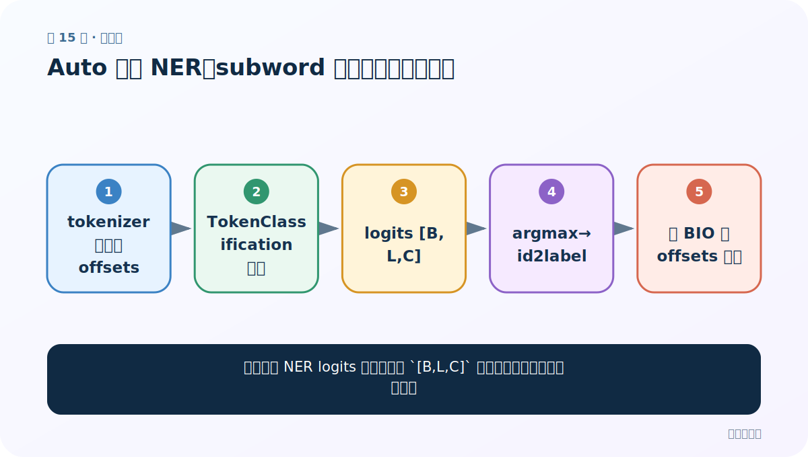
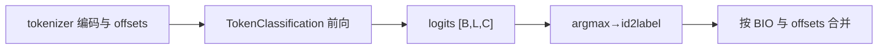
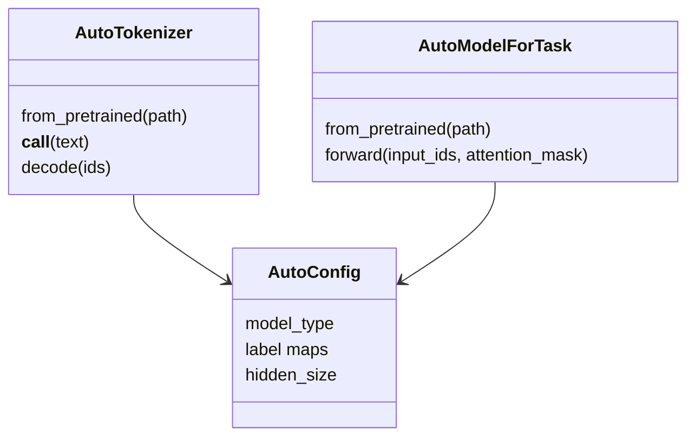

# 第 15 节：Auto 模型 NER：subword 标签对齐与实体聚合

> 笔记编号 15/29 · 对应原视频 P169 · [打开这一集](https://www.bilibili.com/video/BV14mdfBDE4Q?p=169)

[← 上一节：14 Auto 模型文本摘要：tokenize、generate 与 decode 分工](./14-auto-summarization.md) · [返回总目录](./README.md) · [下一节：16 具体模型类做完形填空：显式使用 BertTokenizer 与 BertForMaskedLM →](./16-specific-model-fill-mask.md)

## 这节解决什么问题

自己处理 NER logits 时，怎样把 `[B,L,C]` 的子词标签重新对应到原文？



图从左向右读。先跟着数据或推理过程走一遍，再学习下面的术语。

## 辅助流程图



### Auto 类对象关系



## 老师原声整理稿（按讲解顺序）

### 0:00–5:00　任务模型输出

`AutoModelForTokenClassification` 为每个输入 token 输出 C 类 logits，所以形状 `[B,L,C] = B 条句子 × L 个 token × C 个标签`。argmax 只沿 C 维做。

### 5:00–11:00　排除特殊与 padding

`[CLS]`、`[SEP]`、`[PAD]` 不对应原文字实体，需结合 attention mask、special tokens mask 或 offset `(0,0)` 排除。标签 ID 用 `config.id2label` 转回 BIO 标签。

### 11:00–17:00　合并实体

同一汉字串可能对应多个 token；按 offset 拼原文、按 B/I 规则判断新实体与延续。若 I-ORG 没有合法前导 B-ORG，应制定修复策略并记录。训练时标签也必须通过 `word_ids()` 对齐到子词，非首子词可复制 I 标签或设 -100，取决于方案。

## 完整原声逐段记录

[查看本节按时间戳整理的完整音轨转写](./transcripts/p169.md)

逐段记录用于核查老师讲解是否遗漏；正文会进一步纠正口误和语音识别中的技术术语。

## 零基础先记住

- argmax 应在标签维 C 上
- 特殊 token 不参与实体
- offset 与 BIO 共同完成原文聚合

## 最小可运行代码

下面代码是帮助理解本节概念的最小示例，默认从项目根目录运行。

```python
import torch
from transformers import AutoTokenizer, AutoModelForTokenClassification
path="your-ner-checkpoint"
tok=AutoTokenizer.from_pretrained(path)
model=AutoModelForTokenClassification.from_pretrained(path).eval()
x=tok("小林去了北京",return_tensors="pt",return_offsets_mapping=True)
offsets=x.pop("offset_mapping")[0]
with torch.no_grad(): logits=model(**x).logits
ids=logits.argmax(-1)[0]
print([(tuple(o.tolist()),model.config.id2label[i.item()]) for o,i in zip(offsets,ids)])
```

### 输入和输出怎么看

打印每个 token 的原文边界和预测 BIO 标签，供后续合并。

## 最容易踩的坑

把 `[CLS]` 的高分标签也当成实体，或按 token 字符串拼接导致子词符号残留。

## 本节知识链

`tokenizer 编码与 offsets → TokenClassification 前向 → logits [B,L,C] → argmax→id2label → 按 BIO 与 offsets 合并`

## 自测

**问题：`logits [2,30,9]` 表示什么？**

<details>
<summary>点开核对答案</summary>

2 条文本，每条 30 个 token 位置，每个位置在 9 个 NER 标签上有分数。

</details>

## 学完检查

- [ ] 我能用自己的话复述老师的讲解顺序
- [ ] 我能在运行前预测关键输出或张量形状
- [ ] 我知道这节方法最容易用错的地方
- [ ] 我能独立回答自测题

[← 上一节：14 Auto 模型文本摘要：tokenize、generate 与 decode 分工](./14-auto-summarization.md) · [返回总目录](./README.md) · [下一节：16 具体模型类做完形填空：显式使用 BertTokenizer 与 BertForMaskedLM →](./16-specific-model-fill-mask.md)
