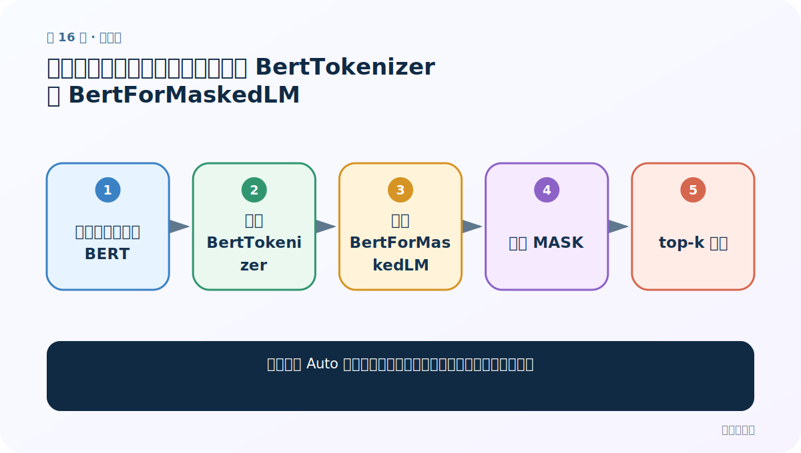
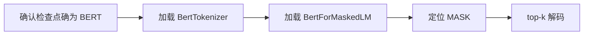
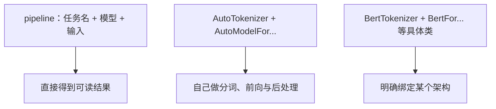
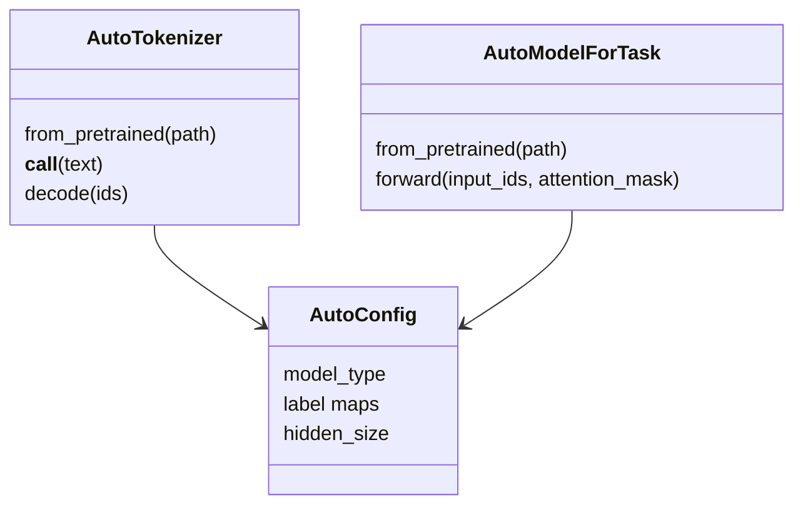
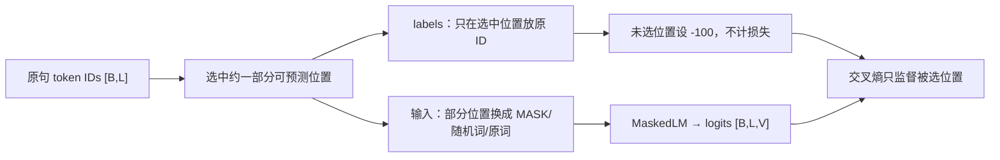

# 第 16 节：具体模型类做完形填空：显式使用 BertTokenizer 与 BertForMaskedLM

> 笔记编号 16/29 · 对应原视频 P170 · [打开这一集](https://www.bilibili.com/video/BV14mdfBDE4Q?p=170)

[← 上一节：15 Auto 模型 NER：subword 标签对齐与实体聚合](./15-auto-ner.md) · [返回总目录](./README.md) · [下一节：17 中文分类案例（一）：先把原始数据加载成 text/label 样本 →](./17-classification-data-loading.md)

## 这节解决什么问题

具体类与 Auto 类代码几乎相同时，为什么还要知道它们的区别？



图从左向右读。先跟着数据或推理过程走一遍，再学习下面的术语。

## 辅助流程图



### Transformers 三种调用层次



### Auto 类对象关系



### MLM 数据与标签



## 老师原声整理稿（按讲解顺序）

### 0:00–4:30　Auto 与具体类的边界

Auto 类读取 config 后决定具体实现；`BertTokenizer` 与 `BertForMaskedLM` 则直接声明“我确定这是 BERT”。优点是类型清楚、便于访问 BERT 专属组件；缺点是换成 RoBERTa/T5 检查点时不能无改动复用。

### 4:30–9:30　代码步骤没有魔法

仍然是 tokenizer 编码、找到 mask_token_id、模型前向得到 `[B,L,V]`、取遮罩位置 top-k、解码。老师只演示这一种具体类写法，因为其余任务与 Auto 版本结构类似。

### 9:30–14:30　何时选择哪层

快速试玩用 pipeline；需要通用项目和多架构切换用 Auto；研究某个架构内部、静态类型或自定义模块时用具体类。三者可加载同一权重并得到等价结果，区别主要在封装和控制范围。

## 完整原声逐段记录

[查看本节按时间戳整理的完整音轨转写](./transcripts/p170.md)

逐段记录用于核查老师讲解是否遗漏；正文会进一步纠正口误和语音识别中的技术术语。

## 零基础先记住

- 具体类显式绑定架构
- 检查点架构不匹配会加载失败或产生大量未匹配权重
- 三层 API 可按控制需求选择

## 最小可运行代码

下面代码是帮助理解本节概念的最小示例，默认从项目根目录运行。

```python
import torch
from transformers import BertTokenizer, BertForMaskedLM
path="your-bert-mlm-checkpoint"
tok=BertTokenizer.from_pretrained(path)
model=BertForMaskedLM.from_pretrained(path).eval()
x=tok(f"我喜欢{tok.mask_token}语言",return_tensors="pt")
with torch.no_grad(): logits=model(**x).logits
pos=(x["input_ids"][0]==tok.mask_token_id).nonzero().item()
print(tok.convert_ids_to_tokens(logits[0,pos].topk(5).indices))
```

### 输入和输出怎么看

与 AutoModelForMaskedLM 相同地返回遮罩位置 top-5，但类名明确为 BERT。

## 最容易踩的坑

看到文件夹名含 bert 就强行用 BertForMaskedLM；应以 config.model_type 和任务头为准。

## 本节知识链

`确认检查点确为 BERT → 加载 BertTokenizer → 加载 BertForMaskedLM → 定位 MASK → top-k 解码`

## 自测

**问题：什么时候 Auto 类更合适？**

<details>
<summary>点开核对答案</summary>

代码需要兼容多种检查点架构，而不想为 BERT、RoBERTa 等分别改类名时。

</details>

## 学完检查

- [ ] 我能用自己的话复述老师的讲解顺序
- [ ] 我能在运行前预测关键输出或张量形状
- [ ] 我知道这节方法最容易用错的地方
- [ ] 我能独立回答自测题

[← 上一节：15 Auto 模型 NER：subword 标签对齐与实体聚合](./15-auto-ner.md) · [返回总目录](./README.md) · [下一节：17 中文分类案例（一）：先把原始数据加载成 text/label 样本 →](./17-classification-data-loading.md)
