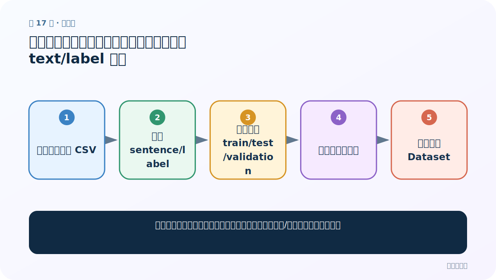
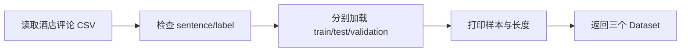
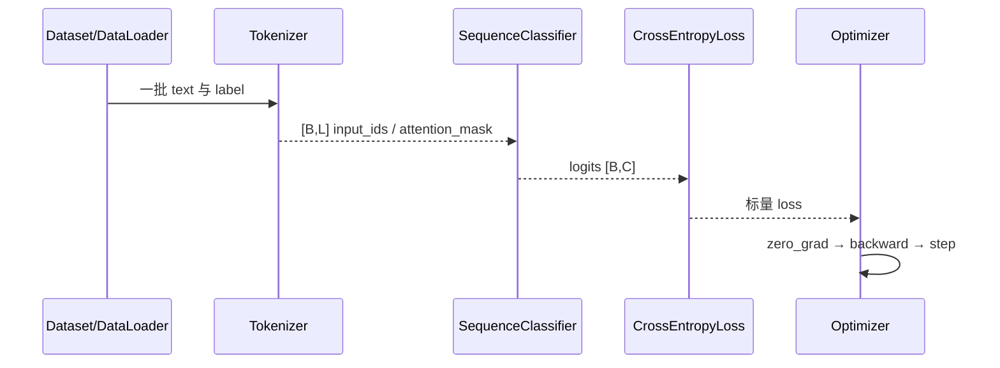

# 第 17 节：中文分类案例（一）：先把原始数据加载成 text/label 样本

> 笔记编号 17/29 · 对应原视频 P171 · [打开这一集](https://www.bilibili.com/video/BV14mdfBDE4Q?p=171)

[← 上一节：16 具体模型类做完形填空：显式使用 BertTokenizer 与 BertForMaskedLM](./16-specific-model-fill-mask.md) · [返回总目录](./README.md) · [下一节：18 中文分类案例（二）：批量分词、padding、truncation 与 attention_mask →](./18-classification-preprocessing.md)

## 这节解决什么问题

微调分类模型前，怎样确认每条文本、标签映射和训练/验证划分都没有错位？



图从左向右读。先跟着数据或推理过程走一遍，再学习下面的术语。

## 辅助流程图



### 中文分类训练时序



## 老师原声整理稿（按讲解顺序）

### 0:00–6:38　三个收尾案例与酒店评论数据

老师说明 NLP 阶段最后做三个迁移案例：中文评论二分类、中文填空、中文句子关系。分类数据是之前用过的酒店评论，`label=1` 表示好评、`label=0` 表示差评，文本字段是 `sentence`；已经提供 train、test、validation 三个 CSV，所以不再在代码里重新切分。目标是用预训练中文 BERT 抽取 768 维文本表示，再接自己的全连接二分类层。

### 6:38–18:10　用 datasets.load_dataset 读取单个 CSV

老师创建数据目录并复制三个文件，导入 Hugging Face `datasets`。第一种写法把文件路径放进 `data_files` 字典，再用 `load_dataset('csv', data_files=...)`，返回 DatasetDict；第二种直接指定一个 CSV 再取对应 split。课堂两种都演示，是为了看懂 API，不是要求项目重复加载两遍。加载后打印前三条、特征字段和长度，确认解析无错。

### 18:10–27:04　两种加载写法的差异

DatasetDict 方式适合一次组织多个 split，单文件方式适合函数按路径加载。老师发现两种结果相同，后续选择更直接的单文件写法。训练集打印约 9600 条，前几条标签如 1、1、0；这些数字只对应课堂文件。正式学习还应检查 0/1 分布、空文本和重复样本。

### 27:04–32:10　测试集、验证集与统一返回

用同样方法加载 test 与 validation，验证集约 1200 条，并打印前三条和长度。函数最后返回三个 Dataset，后续预处理、训练和评估直接复用。这里已经有独立文件，因此不要再对测试集二次切割，更不能把 test 用于调参。

## 完整原声逐段记录

[查看本节按时间戳整理的完整音轨转写](./transcripts/p171.md)

逐段记录用于核查老师讲解是否遗漏；正文会进一步纠正口误和语音识别中的技术术语。

## 零基础先记住

- 课堂数据字段是 sentence 与 0/1 label
- train/test/validation 已分好，不再重复切分
- 加载后必须打印样本、字段和长度核查

## 最小可运行代码

下面代码是帮助理解本节概念的最小示例，默认从项目根目录运行。

```python
from datasets import load_dataset
train = load_dataset("csv", data_files="data/train.csv", split="train")
test = load_dataset("csv", data_files="data/test.csv", split="train")
valid = load_dataset("csv", data_files="data/validation.csv", split="train")
print(train[:3], len(train), train.features)
```

### 输入和输出怎么看

得到三个 Dataset；`split='train'` 是 CSV 加载器生成的 split 名，不表示把 test 文件当训练数据。

## 最容易踩的坑

看到 `split='train'` 就误以为测试 CSV 参与训练；这里它只是单文件 DatasetDict 内部的默认 split 键。

## 本节知识链

`读取酒店评论 CSV → 检查 sentence/label → 分别加载 train/test/validation → 打印样本与长度 → 返回三个 Dataset`

## 自测

**问题：既然已有 validation 和 test，二者分别干什么？**

<details>
<summary>点开核对答案</summary>

validation 用于训练过程选模型/参数，test 留到最后做一次公正评估。

</details>

## 学完检查

- [ ] 我能用自己的话复述老师的讲解顺序
- [ ] 我能在运行前预测关键输出或张量形状
- [ ] 我知道这节方法最容易用错的地方
- [ ] 我能独立回答自测题

[← 上一节：16 具体模型类做完形填空：显式使用 BertTokenizer 与 BertForMaskedLM](./16-specific-model-fill-mask.md) · [返回总目录](./README.md) · [下一节：18 中文分类案例（二）：批量分词、padding、truncation 与 attention_mask →](./18-classification-preprocessing.md)
