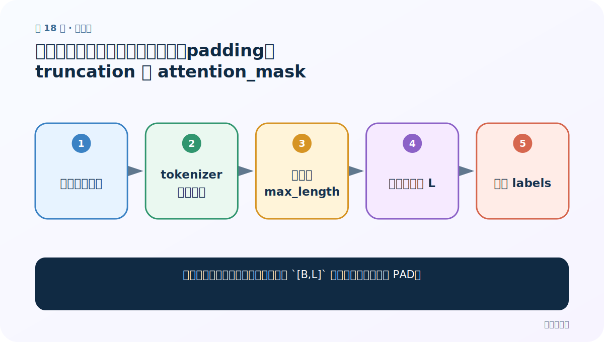
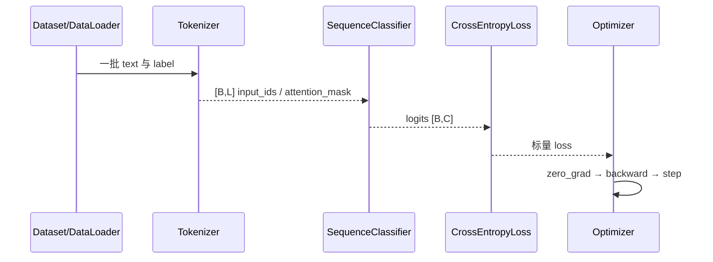

# 第 18 节：中文分类案例（二）：批量分词、padding、truncation 与 attention_mask

> 笔记编号 18/29 · 对应原视频 P172 · [打开这一集](https://www.bilibili.com/video/BV14mdfBDE4Q?p=172)

[← 上一节：17 中文分类案例（一）：先把原始数据加载成 text/label 样本](./17-classification-data-loading.md) · [返回总目录](./README.md) · [下一节：19 中文分类案例（三）：自定义 BERT + Linear(768→2) 网络 →](./19-classification-model.md)

## 这节解决什么问题

一批句子长短不同，怎样变成规则的 `[B,L]` 张量又不让模型关注 PAD？



图从左向右读。先跟着数据或推理过程走一遍，再学习下面的术语。

## 辅助流程图


### 中文分类训练时序



## 老师原声整理稿（按讲解顺序）

### 0:00–3:56　整理函数一次只处理一批

老师定义 `collate_fn1(data)`，强调传入的不是整个 Dataset，而是 DataLoader 取出的 8 条样本。先从每条字典中取 `sentence` 列表和 `label` 列表，再统一交给预训练模型配套 tokenizer。

### 3:56–9:50　batch_encode_plus 的课堂参数

课程使用 `batch_encode_plus`：`truncation=True` 开启截断，`max_length=300` 固定最大序列长度，`padding='max_length'` 补到 300，`return_tensors='pt'` 返回 PyTorch 张量。300 是老师为了覆盖大多数评论直接选的教学值；更严谨做法是先统计 token 长度分布再决定。

### 9:50–14:48　取出四类张量

编码结果包含 `input_ids`、`token_type_ids`、`attention_mask`，再把 labels 转成长整型张量并一起返回。若 B=8、L=300，前三者是 `[8,300] = 8 条评论 × 每条 300 个位置`，labels 是 `[8]`。token_type_ids 区分句段，attention_mask 区分有效位置与 PAD。

### 14:48–20:19　DataLoader 调用 collate_fn

用 `DataLoader(dataset, batch_size=8, shuffle=..., drop_last=..., collate_fn=collate_fn1)`，每取一批都自动执行整理函数。老师只取第一批打印，逐项确认四个结果和 8 个 0/1 标签。固定补到 300 便于观察，但动态 padding 通常更省显存。

## 完整原声逐段记录

[查看本节按时间戳整理的完整音轨转写](./transcripts/p172.md)

逐段记录用于核查老师讲解是否遗漏；正文会进一步纠正口误和语音识别中的技术术语。

## 零基础先记住

- max_length 按 token 计数
- attention_mask 屏蔽 padding
- 动态 padding 更省算力

## 最小可运行代码

下面代码是帮助理解本节概念的最小示例，默认从项目根目录运行。

```python
import torch
def collate_fn(rows):
    encoded=tokenizer.batch_encode_plus(
        [r["sentence"] for r in rows],
        truncation=True,max_length=300,padding="max_length",
        return_tensors="pt",
    )
    return (
        encoded["input_ids"],
        encoded.get("token_type_ids"),
        encoded["attention_mask"],
        torch.tensor([r["label"] for r in rows],dtype=torch.long),
    )
```

### 输入和输出怎么看

返回含 `input_ids [B,L]`、`attention_mask [B,L]`、`labels [B]` 的批次字典。

## 最容易踩的坑

把 max_length 设得远大于实际文本，导致大量 padding、显存浪费和训练变慢。

## 本节知识链

`收集一批文本 → tokenizer 批量编码 → 截断到 max_length → 补齐到同一 L → 附加 labels`

## 自测

**问题：为什么 labels 不需要 padding？**

<details>
<summary>点开核对答案</summary>

句子级分类每条文本只有一个标签，所以批次标签天然是固定长度 `[B]`。

</details>

## 学完检查

- [ ] 我能用自己的话复述老师的讲解顺序
- [ ] 我能在运行前预测关键输出或张量形状
- [ ] 我知道这节方法最容易用错的地方
- [ ] 我能独立回答自测题

[← 上一节：17 中文分类案例（一）：先把原始数据加载成 text/label 样本](./17-classification-data-loading.md) · [返回总目录](./README.md) · [下一节：19 中文分类案例（三）：自定义 BERT + Linear(768→2) 网络 →](./19-classification-model.md)
