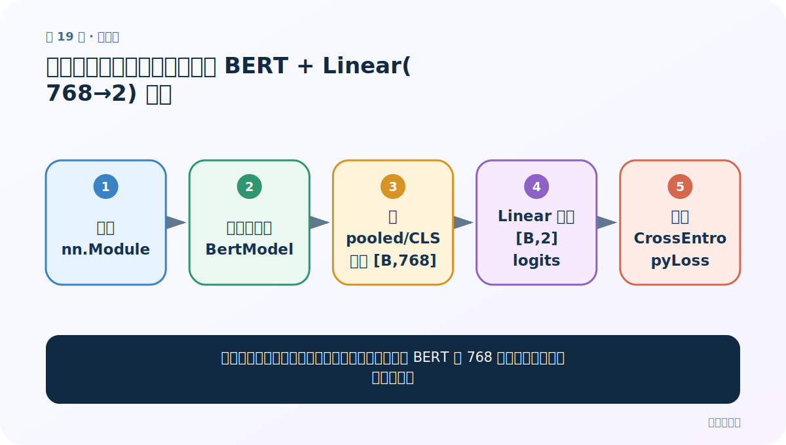
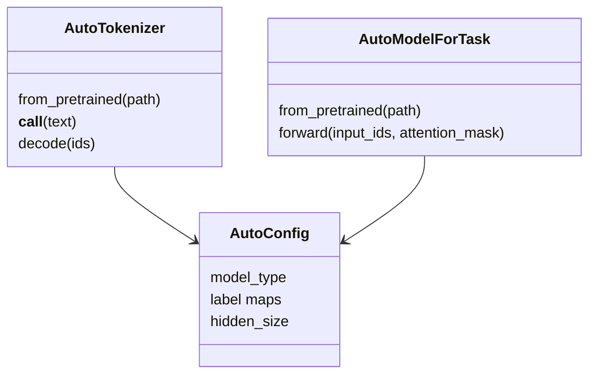
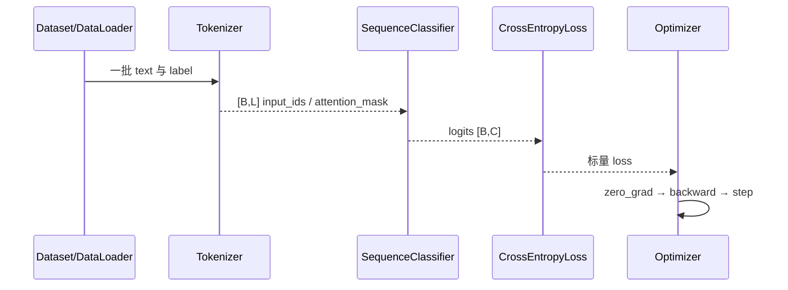

# 第 19 节：中文分类案例（三）：自定义 BERT + Linear(768→2) 网络

> 笔记编号 19/29 · 对应原视频 P173 · [打开这一集](https://www.bilibili.com/video/BV14mdfBDE4Q?p=173)

[← 上一节：18 中文分类案例（二）：批量分词、padding、truncation 与 attention_mask](./18-classification-preprocessing.md) · [返回总目录](./README.md) · [下一节：20 中文分类案例（四）：训练循环、梯度更新和逐轮保存 →](./20-classification-training.md)

## 这节解决什么问题

老师没有直接用现成分类模型，而是怎样把预训练 BERT 的 768 维表示接到自己的二分类层？



图从左向右读。先跟着数据或推理过程走一遍，再学习下面的术语。

## 辅助流程图


### Auto 类对象关系



### 中文分类训练时序



## 老师原声整理稿（按讲解顺序）

### 0:00–5:20　自定义类的两个成员

老师继承 `nn.Module`，在 `__init__` 中保存已经加载的中文 `BertModel`，再定义 `nn.Linear(768,2)`。768 来自该 BERT Base 的 hidden size，2 来自好评/差评两个类别；若换模型或类别数，这两个数字都要随 config/数据改变。

### 5:20–10:40　forward 的三步

forward 接收 `input_ids`、`token_type_ids`、`attention_mask`，先传进预训练 BERT。课堂取 BERT 的 pooled output/CLS 级表示 `[B,768]`，再经线性层得到 `[B,2]`。老师随后用 softmax 转概率；训练用 CrossEntropyLoss 时更推荐直接返回原始 logits，因为该损失内部已含 log-softmax。

### 10:40–16:00　手工测试形状

用一批全 1 或示例张量调用模型，打印 BERT 输出与最终结果形状。形状检查是为了在正式训练前发现参数名、batch/length 维度和 768→2 映射错误。模型转到 device 后，测试输入也必须同设备。

### 16:00–20:00　冻结发生在训练函数

本节先搭网络；下一节训练时把预训练 BERT 参数 `requires_grad=False`，只更新自己的线性层。这是“固定特征提取器”迁移方式，而不是全量微调。纠正一个易错点：CrossEntropyLoss 要 logits，不需要 forward 先 softmax。

## 完整原声逐段记录

[查看本节按时间戳整理的完整音轨转写](./transcripts/p173.md)

逐段记录用于核查老师讲解是否遗漏；正文会进一步纠正口误和语音识别中的技术术语。

## 零基础先记住

- 分类头的输出维必须等于类别数
- 新任务头随机初始化是正常现象
- 模型和输入必须同 device

## 最小可运行代码

下面代码是帮助理解本节概念的最小示例，默认从项目根目录运行。

```python
import torch.nn as nn
class HotelClassifier(nn.Module):
    def __init__(self, bert):
        super().__init__()
        self.pre_model=bert
        self.classifier=nn.Linear(bert.config.hidden_size,2)
    def forward(self,input_ids,token_type_ids,attention_mask):
        out=self.pre_model(
            input_ids=input_ids,
            token_type_ids=token_type_ids,
            attention_mask=attention_mask,
        )
        return self.classifier(out.pooler_output)
```

### 输入和输出怎么看

输入 `[B,L]` 三类张量，输出 `[B,2] = B 条评论 × 好/差评两个 logits`。

## 最容易踩的坑

在线性层后先 softmax 再交给 CrossEntropyLoss；会重复做归一化并影响数值稳定。

## 本节知识链

`定义 nn.Module → 保存预训练 BertModel → 取 pooled/CLS 表示 [B,768] → Linear 输出 [B,2] logits → 交给 CrossEntropyLoss`

## 自测

**问题：768 和 2 分别由什么决定？**

<details>
<summary>点开核对答案</summary>

768 由预训练 BERT 的 hidden_size 决定；2 由目标任务好评/差评两个类别决定。

</details>

## 学完检查

- [ ] 我能用自己的话复述老师的讲解顺序
- [ ] 我能在运行前预测关键输出或张量形状
- [ ] 我知道这节方法最容易用错的地方
- [ ] 我能独立回答自测题

[← 上一节：18 中文分类案例（二）：批量分词、padding、truncation 与 attention_mask](./18-classification-preprocessing.md) · [返回总目录](./README.md) · [下一节：20 中文分类案例（四）：训练循环、梯度更新和逐轮保存 →](./20-classification-training.md)
