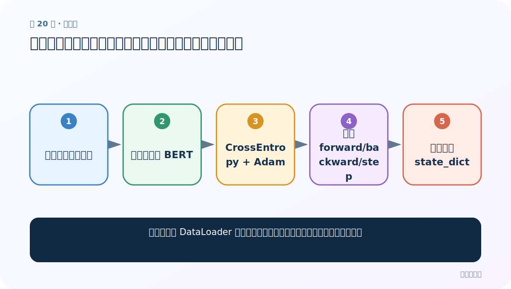
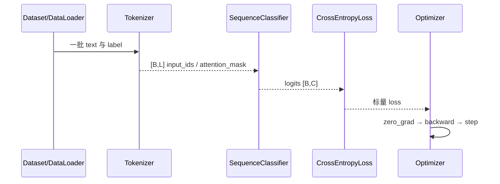

# 第 20 节：中文分类案例（四）：训练循环、梯度更新和逐轮保存

> 笔记编号 20/29 · 对应原视频 P174 · [打开这一集](https://www.bilibili.com/video/BV14mdfBDE4Q?p=174)

[← 上一节：19 中文分类案例（三）：自定义 BERT + Linear(768→2) 网络](./19-classification-model.md) · [返回总目录](./README.md) · [下一节：21 中文分类案例（五）：加载 checkpoint、全量准确率与评估边界 →](./21-classification-evaluation.md)

## 这节解决什么问题

一个批次从 DataLoader 到参数更新完整经历哪些步骤，为什么顺序不能乱？



图从左向右读。先跟着数据或推理过程走一遍，再学习下面的术语。

## 辅助流程图


### 中文分类训练时序



## 老师原声整理稿（按讲解顺序）

### 0:00–5:47　训练函数的准备阶段

老师按流程写：加载训练 Dataset，创建自定义模型并移到 device，然后遍历 `model.pre_model.parameters()` 把 `requires_grad=False`。因此预训练 BERT 只做固定特征提取，真正学习的是 768→2 的线性层。损失用 `nn.CrossEntropyLoss()`，优化器用 Adam。

### 5:47–14:30　三轮、逐批训练

设置 `model.train()`，外层训练 3 轮；每轮重新获取 DataLoader，记录开始时间。每批把 `input_ids/token_type_ids/attention_mask/labels` 移到 device，前向得到 `[B,2]`，算 CrossEntropy，随后 `zero_grad → backward → step`。因为 BERT 已冻结，自动微分只为分类层保留梯度。

### 14:30–23:40　每 20 批打印局部结果

课堂每隔 20 批打印当前一段的 loss/accuracy。这里的 loss 和准确率只覆盖最近/当前 20 批，不是整轮指标，所以会明显震荡；若要整轮结果，应在循环外维护 total_loss、correct、total。老师现场解释了为什么某 20 批可从 25% 跳到 100%。

### 23:40–29:20　清理调试输出与逐轮保存

先移除 forward 内每批打印输入的调试语句，避免日志刷屏。每轮完成后保存 `state_dict`，文件名含轮次 classification1/2/3；IDE 文件树没刷新时从磁盘 reload。课程为继续讲解可先用第一轮模型，但正式项目应依据 validation 指标选择，而不是默认第三轮最好。

## 完整原声逐段记录

[查看本节按时间戳整理的完整音轨转写](./transcripts/p174.md)

逐段记录用于核查老师讲解是否遗漏；正文会进一步纠正口误和语音识别中的技术术语。

## 零基础先记住

- train() 与 eval() 控制 dropout 等行为
- PyTorch 梯度默认累积
- 最佳验证 checkpoint 通常比最后一轮更可靠

## 最小可运行代码

下面代码是帮助理解本节概念的最小示例，默认从项目根目录运行。

```python
for p in model.pre_model.parameters():
    p.requires_grad=False
criterion=torch.nn.CrossEntropyLoss()
optimizer=torch.optim.Adam(filter(lambda p:p.requires_grad,model.parameters()))
model.train()
for ids,types,mask,labels in train_loader:
    ids,types,mask,labels=[x.to(device) for x in (ids,types,mask,labels)]
    logits=model(ids,types,mask)
    loss=criterion(logits,labels)
    optimizer.zero_grad(); loss.backward(); optimizer.step()
```

### 输入和输出怎么看

每批只更新分类层；BERT 参数没有梯度。

## 最容易踩的坑

以为设置 requires_grad=False 等于 model.eval()。冻结控制参数梯度，train/eval 控制 dropout 等运行行为，是两回事。

## 本节知识链

`加载训练集与模型 → 冻结预训练 BERT → CrossEntropy + Adam → 每批 forward/backward/step → 每轮保存 state_dict`

## 自测

**问题：为什么课堂训练快于全量微调？**

<details>
<summary>点开核对答案</summary>

BERT 主体被冻结，不计算/保存其参数梯度，只训练很小的线性分类头。

</details>

## 学完检查

- [ ] 我能用自己的话复述老师的讲解顺序
- [ ] 我能在运行前预测关键输出或张量形状
- [ ] 我知道这节方法最容易用错的地方
- [ ] 我能独立回答自测题

[← 上一节：19 中文分类案例（三）：自定义 BERT + Linear(768→2) 网络](./19-classification-model.md) · [返回总目录](./README.md) · [下一节：21 中文分类案例（五）：加载 checkpoint、全量准确率与评估边界 →](./21-classification-evaluation.md)
