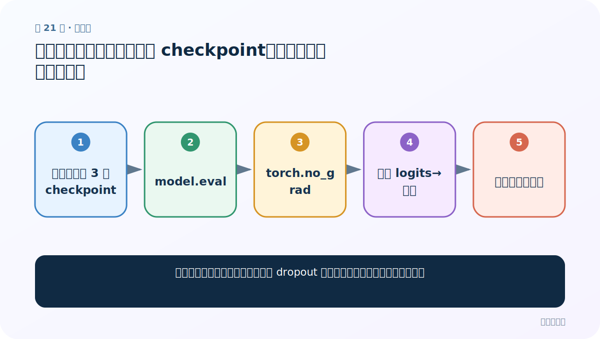
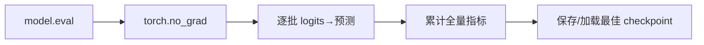
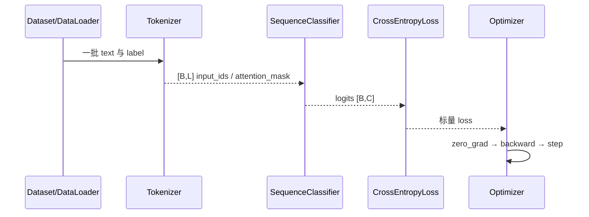

# 第 21 节：中文分类案例（五）：eval/no_grad、准确率与保存最佳模型

> 笔记编号 21/29 · 对应原视频 P175 · [打开这一集](https://www.bilibili.com/video/BV14mdfBDE4Q?p=175)

[← 上一节：20 中文分类案例（四）：训练循环、梯度更新和学习率调度](./20-classification-training.md) · [返回总目录](./README.md) · [下一节：22 中文填空案例（一）：固定遮罩第 16 个位置的数据整理 →](./22-mlm-preprocessing.md)

## 这节解决什么问题

验证时怎样保证不更新参数、不受 dropout 随机性影响，并正确汇总整套数据？



图从左向右读。先跟着数据或推理过程走一遍，再学习下面的术语。

## 辅助流程图



### 中文分类训练时序



## 老师原声整理稿（按讲解顺序）

### 0:00–3:49　测试 DataLoader 与训练不同

评估函数加载 test CSV 并创建 DataLoader。老师把原来写死训练路径的加载器逻辑改成可接收 Dataset；测试时 `shuffle=False`，通常也不应 `drop_last=True`，否则会漏掉最后不足一批的样本。

### 3:49–6:44　加载 state_dict

重新创建同结构模型，选择保存的 classification checkpoint，调用 `load_state_dict(torch.load(...))` 加载参数并移到 device。课堂倾向选择第三轮，但严格做法应先用 validation 选最佳轮次，再只在 test 上评一次。

### 6:44–12:44　eval/no_grad 与全量准确率

初始化 correct/total，调用 `model.eval()`；逐批迁移四个张量，在 `torch.no_grad()` 下前向，对 `[B,2]` 取最高类别，累计正确数和总数。最后 `correct/total` 才是整个测试集准确率。老师对比训练时每 20 批局部指标，说明两者统计范围不同。

### 12:44–18:06　课堂总结与二分类损失纠问

老师复盘数据加载、每批 tokenizer、四个返回张量、BERT 768 维表示和自定义 2 维分类。学生问二分类为何不用 BCE：两维互斥 logits 配整数标签可以用 CrossEntropy；若改为单 logit，则配 BCEWithLogitsLoss 和浮点 0/1 标签。CrossEntropy 方案也便于把输出改为 3、4 类。

## 完整原声逐段记录

[查看本节按时间戳整理的完整音轨转写](./transcripts/p175.md)

逐段记录用于核查老师讲解是否遗漏；正文会进一步纠正口误和语音识别中的技术术语。

## 零基础先记住

- eval() 和 no_grad() 不能互相替代
- 指标按样本总数加权
- 模型与 tokenizer 一起 save_pretrained

## 最小可运行代码

下面代码是帮助理解本节概念的最小示例，默认从项目根目录运行。

```python
state=torch.load("models/classification3.pt",map_location=device)
model.load_state_dict(state)
model.eval(); correct=total=0
with torch.no_grad():
    for ids,types,mask,labels in test_loader:
        ids,types,mask,labels=[x.to(device) for x in (ids,types,mask,labels)]
        pred=model(ids,types,mask).argmax(-1)
        correct+=(pred==labels).sum().item()
        total+=labels.numel()
print(correct/total)
```

### 输入和输出怎么看

输出整个验证集按样本计算的准确率。

## 最容易踩的坑

只调用 no_grad 不调用 eval，dropout 仍随机工作，导致同一输入结果波动。

## 本节知识链

`model.eval → torch.no_grad → 逐批 logits→预测 → 累计全量指标 → 保存/加载最佳 checkpoint`

## 自测

**问题：最后一个 batch 较小时，为什么不能简单平均每批 accuracy？**

<details>
<summary>点开核对答案</summary>

那会让小批与满批权重相同；应累计正确样本数再除总样本数。

</details>

## 学完检查

- [ ] 我能用自己的话复述老师的讲解顺序
- [ ] 我能在运行前预测关键输出或张量形状
- [ ] 我知道这节方法最容易用错的地方
- [ ] 我能独立回答自测题

[← 上一节：20 中文分类案例（四）：训练循环、梯度更新和学习率调度](./20-classification-training.md) · [返回总目录](./README.md) · [下一节：22 中文填空案例（一）：固定遮罩第 16 个位置的数据整理 →](./22-mlm-preprocessing.md)
