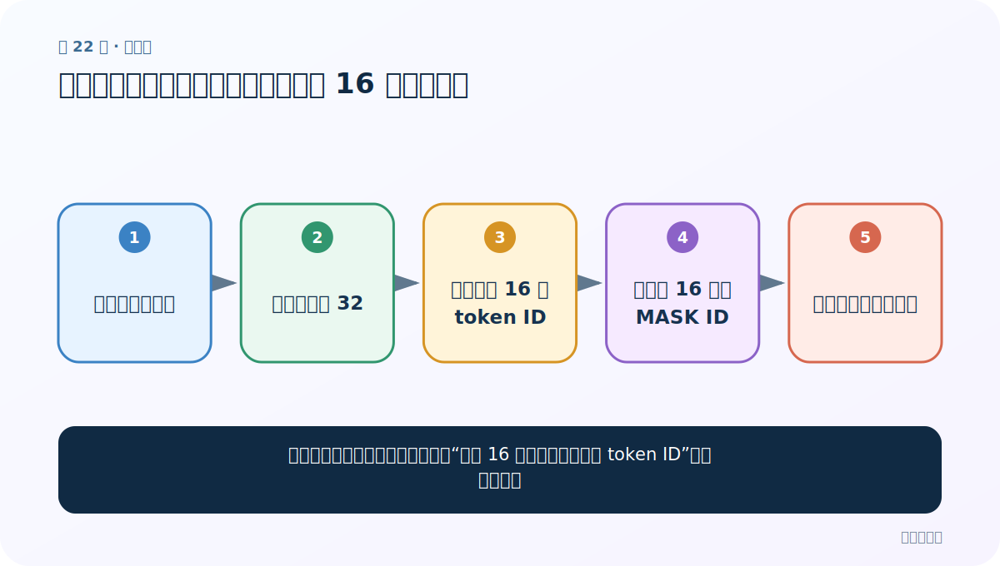
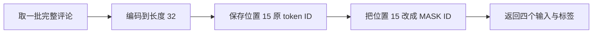
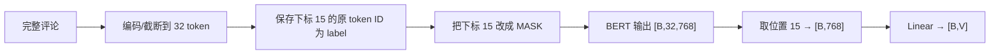
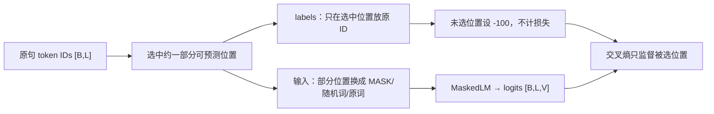

# 第 22 节：中文填空案例（一）：固定遮罩第 16 个位置的数据整理

> 笔记编号 22/29 · 对应原视频 P176 · [打开这一集](https://www.bilibili.com/video/BV14mdfBDE4Q?p=176)

[← 上一节：21 中文分类案例（五）：eval/no_grad、准确率与保存最佳模型](./21-classification-evaluation.md) · [返回总目录](./README.md) · [下一节：23 中文填空案例（二）：自定义 BERT + Linear(768→词表大小) →](./23-mlm-model.md)

## 这节解决什么问题

老师怎样把完整酒店评论改成“第 16 个 token 被遮住、标签是原 token ID”的分类样本？



图从左向右读。先跟着数据或推理过程走一遍，再学习下面的术语。

## 辅助流程图



### 课堂固定位置填空流程



### MLM 数据与标签



## 老师原声整理稿（按讲解顺序）

### 0:00–4:55　把填空看成 21128 类分类

老师用中文 BERT 词表举例：若词表大小是 21128，那么空位就有 21128 个候选，本质是一个大规模多分类。课堂继续复用酒店评论 train/test/validation，而不是另找语料。老师先口头说可随机遮罩若干词，但为了代码简单，实际案例固定处理第 16 个 token 位置。

### 4:55–11:50　复制分类案例并改 collate_fn

数据加载与上一案例相同，主要改批整理函数：每批 8 条评论，用 tokenizer 截断/补齐到长度 32，得到 `input_ids/token_type_ids/attention_mask`。注意 Python 下标从 0 开始，口头“第 16 个位置”对应下标 15（代码若采用 16，正文应按实际代码核对）。

### 11:50–18:50　先存答案，再写入 MASK

从原始 input_ids 取目标位置 ID 作为 `labels [B]`；随后把同一位置替换为 `tokenizer.mask_token_id`。这时 `input_ids [B,32]` 是带遮罩输入，labels `[B]` 是每条评论原来被遮住的一个 token ID。模型只预测这一个位置，不是标准 BERT MLM 的全位置 `[B,L]` labels。

### 18:50–27:59　DataLoader 测试与教学简化的边界

老师把新整理函数接进 DataLoader，打印一批确认固定位置确实变成 MASK、labels 保存原 ID。这个固定位置方案便于复用分类训练循环，但不是经典 15% 动态遮罩/80-10-10；短文本若第 16 位是 PAD，预测没有意义，因此训练和评估阶段会先过滤真实长度大于 32 的文本。

## 完整原声逐段记录

[查看本节按时间戳整理的完整音轨转写](./transcripts/p176.md)

逐段记录用于核查老师讲解是否遗漏；正文会进一步纠正口误和语音识别中的技术术语。

## 零基础先记住

- 课堂实现固定预测一个位置
- 必须先保存原 token ID，再把输入换成 MASK
- 这是教学简化，不等于完整 BERT MLM 数据构造

## 最小可运行代码

下面代码是帮助理解本节概念的最小示例，默认从项目根目录运行。

```python
def fill_mask_collate(rows):
    enc=tokenizer(
        [r["sentence"] for r in rows],
        padding="max_length",truncation=True,max_length=32,
        return_tensors="pt",
    )
    pos=15  # 第 16 个 token，Python 从 0 开始
    labels=enc["input_ids"][:,pos].clone()
    enc["input_ids"][:,pos]=tokenizer.mask_token_id
    return enc["input_ids"],enc.get("token_type_ids"),enc["attention_mask"],labels
```

### 输入和输出怎么看

输入三类张量是 `[B,32]`，标签是 `[B]`，每条只监督一个词表 ID。

## 最容易踩的坑

先覆盖为 MASK 再取 labels；这样标签会全变成 mask_token_id。

## 本节知识链

`取一批完整评论 → 编码到长度 32 → 保存位置 15 原 token ID → 把位置 15 改成 MASK ID → 返回四个输入与标签`

## 自测

**问题：课堂 labels 为什么是 `[B]` 而不是标准 MLM 常见的 `[B,L]`？**

<details>
<summary>点开核对答案</summary>

课堂只预测每条文本固定的一个位置，所以每条只需要一个目标 ID。

</details>

## 学完检查

- [ ] 我能用自己的话复述老师的讲解顺序
- [ ] 我能在运行前预测关键输出或张量形状
- [ ] 我知道这节方法最容易用错的地方
- [ ] 我能独立回答自测题

[← 上一节：21 中文分类案例（五）：eval/no_grad、准确率与保存最佳模型](./21-classification-evaluation.md) · [返回总目录](./README.md) · [下一节：23 中文填空案例（二）：自定义 BERT + Linear(768→词表大小) →](./23-mlm-model.md)
