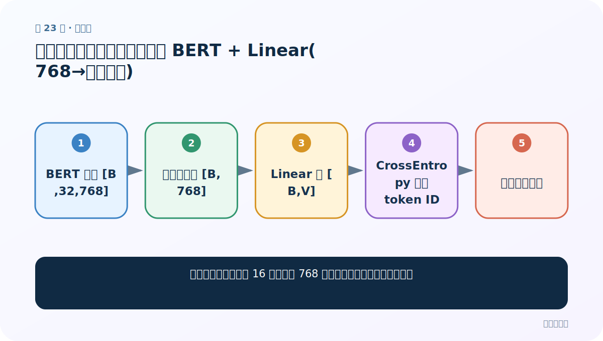
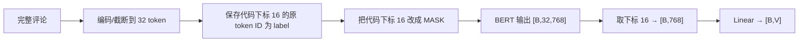
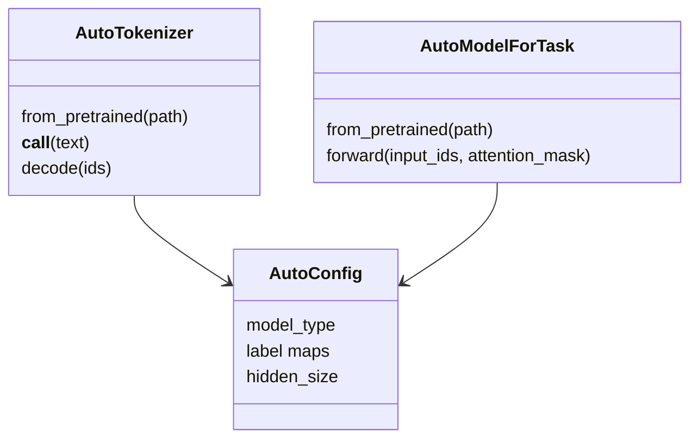

# 第 23 节：中文填空案例（二）：自定义 BERT + Linear(768→词表大小)

> 笔记编号 23/29 · 对应原视频 P177 · [打开这一集](https://www.bilibili.com/video/BV14mdfBDE4Q?p=177)

[← 上一节：22 中文填空案例（一）：固定遮罩下标 16 的数据整理](./22-mlm-preprocessing.md) · [返回总目录](./README.md) · [下一节：24 中文填空案例（三）：过滤长文本并复用分类训练循环 →](./24-mlm-training.md)

## 这节解决什么问题

怎样只取每条文本代码下标 16 的 768 维表示，并预测整个中文词表？



图从左向右读。先跟着数据或推理过程走一遍，再学习下面的术语。

## 辅助流程图


### 课堂固定位置填空流程



### Auto 类对象关系



## 老师原声整理稿（按讲解顺序）

### 0:00–1:58　从分类网络复制后改输出维

老师复用前面的自定义 `nn.Module`，BERT 主体不变，把 `Linear(768,2)` 改成 `Linear(768, tokenizer.vocab_size)`；课堂中文词表约 21128。用 `vocab_size` 而非把 21128 写死，换 tokenizer 时更安全，并关闭 bias 以减少少量参数。

### 1:58–4:53　只取被遮罩位置

BERT 的 `last_hidden_state [B,32,768]` 含所有位置。课堂实际代码用 `hidden[:,16,:]` 取 `[B,768]`，再过线性层得到 `[B,21128] = B 条评论 × 每条在整个词表上的 logits`。这里必须与数据整理阶段的 `input_ids[:,16]` 完全一致；它是下标 16，也就是自然计数第 17 个 token。

### 4:53–8:57　测试模型结构

用 DataLoader 的一批输入测试前向，检查输出第二维确实等于词表大小。训练时用 CrossEntropyLoss 直接接 logits 和 labels `[B]`；不必先 softmax。老师强调其他初始化、设备移动与分类模型几乎相同，只改任务头和抽取位置。

## 完整原声逐段记录

[查看本节按时间戳整理的完整音轨转写](./transcripts/p177.md)

逐段记录用于核查老师讲解是否遗漏；正文会进一步纠正口误和语音识别中的技术术语。

## 零基础先记住

- 课堂模型只输出一个位置的 `[B,V]`
- V 由 tokenizer.vocab_size 决定
- CrossEntropyLoss 接 logits，不接 softmax 概率

## 最小可运行代码

下面代码是帮助理解本节概念的最小示例，默认从项目根目录运行。

```python
class FixedPositionFillMask(torch.nn.Module):
    def __init__(self,bert,tokenizer):
        super().__init__()
        self.pre_model=bert
        self.linear=torch.nn.Linear(bert.config.hidden_size,tokenizer.vocab_size,bias=False)
    def forward(self,ids,types,mask):
        h=self.pre_model(input_ids=ids,token_type_ids=types,attention_mask=mask).last_hidden_state
        return self.linear(h[:,16,:])
```

### 输入和输出怎么看

若 B=8、V=21128，输出 `[8,21128]`。

## 最容易踩的坑

把整个 `[B,L,H]` 直接传 Linear 后得到 `[B,L,V]`，却仍拿 `[B]` 标签计算而没有选位置。

## 本节知识链

`BERT 输出 [B,32,768] → 选固定位置 [B,768] → Linear 到 [B,V] → CrossEntropy 预测 token ID → 手工测试形状`

## 自测

**问题：为什么线性层输入是 768？**

<details>
<summary>点开核对答案</summary>

被遮罩位置从 BERT 取出的单个 token 上下文表示维度是 hidden_size=768。

</details>

## 学完检查

- [ ] 我能用自己的话复述老师的讲解顺序
- [ ] 我能在运行前预测关键输出或张量形状
- [ ] 我知道这节方法最容易用错的地方
- [ ] 我能独立回答自测题

[← 上一节：22 中文填空案例（一）：固定遮罩下标 16 的数据整理](./22-mlm-preprocessing.md) · [返回总目录](./README.md) · [下一节：24 中文填空案例（三）：过滤长文本并复用分类训练循环 →](./24-mlm-training.md)
