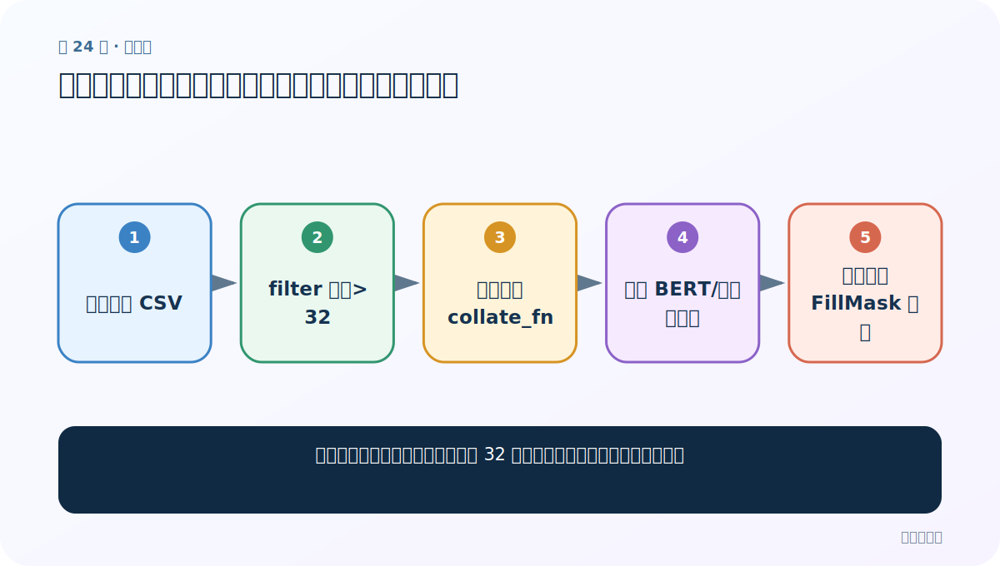
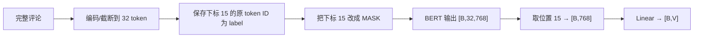

# 第 24 节：中文填空案例（三）：过滤长文本并复用分类训练循环

> 笔记编号 24/29 · 对应原视频 P178 · [打开这一集](https://www.bilibili.com/video/BV14mdfBDE4Q?p=178)

[← 上一节：23 中文填空案例（二）：自定义 BERT + Linear(768→词表大小)](./23-mlm-model.md) · [返回总目录](./README.md) · [下一节：25 中文填空案例（四）：加载 FillMask 模型并计算固定位置准确率 →](./25-mlm-evaluation.md)

## 这节解决什么问题

为什么训练前要保留真实长度大于 32 的评论，哪些地方与分类训练不同？



图从左向右读。先跟着数据或推理过程走一遍，再学习下面的术语。

## 辅助流程图


### 课堂固定位置填空流程



## 老师原声整理稿（按讲解顺序）

### 0:00–3:55　为什么先过滤长度大于 32

课堂把分类训练函数复制过来，第一处修改是 `dataset.filter(lambda x: len(x['sentence']) > 32)`。如果原文很短，补到 32 后第 16 个位置可能是 PAD，拿 PAD 当真实填空标签没有意义。老师选择长文本，确保固定遮罩位置来自原文。严格说字符长度不等于 tokenizer 后 token 长度，稳妥做法应按编码后的有效 token 数过滤。

### 3:55–7:30　三处关键修改

数据改用过滤后的训练集，DataLoader 的整理函数换成填空版本，模型换成 768→词表大小的填空网络；保存文件名换成 FillMask1/2/3。其余 device、冻结预训练 BERT、CrossEntropy、Adam、三轮循环基本复用。

### 7:30–12:19　损失和预测

labels 是每条原文固定位置的词表 ID `[B]`，模型 logits `[B,V]`，CrossEntropy 直接计算。每 20 批可打印局部 loss 和 token top-1 准确率，但仍不是整轮指标。老师强调复用代码时要逐项改路径、函数和模型名，不能只改标题。

## 完整原声逐段记录

[查看本节按时间戳整理的完整音轨转写](./transcripts/p178.md)

逐段记录用于核查老师讲解是否遗漏；正文会进一步纠正口误和语音识别中的技术术语。

## 零基础先记住

- 过滤是为避免预测 PAD
- 课堂只训练自定义词表头
- 字符长度过滤是简化，token 长度更严谨

## 最小可运行代码

下面代码是帮助理解本节概念的最小示例，默认从项目根目录运行。

```python
train_ds=load_dataset("csv",data_files="data/train.csv",split="train")
train_ds=train_ds.filter(lambda x: len(x["sentence"])>32)
loader=DataLoader(train_ds,batch_size=8,shuffle=True,collate_fn=fill_mask_collate)
for ids,types,mask,labels in loader:
    logits=model(ids.to(device),types.to(device),mask.to(device))
    loss=torch.nn.functional.cross_entropy(logits,labels.to(device))
    optimizer.zero_grad(); loss.backward(); optimizer.step()
```

### 输入和输出怎么看

每批用固定位置原 token ID 监督 `[B,V]` 输出。

## 最容易踩的坑

按 Python 字符数判断长度，却忽略 tokenizer 可能加入特殊 token 或拆分子词。

## 本节知识链

`加载训练 CSV → filter 长度>32 → 使用填空 collate_fn → 冻结 BERT/训练词表头 → 逐轮保存 FillMask 模型`

## 自测

**问题：为什么第 16 个位置若是 PAD 会破坏训练？**

<details>
<summary>点开核对答案</summary>

模型会反复学习预测 PAD，而不是根据真实上下文恢复有意义的原 token。

</details>

## 学完检查

- [ ] 我能用自己的话复述老师的讲解顺序
- [ ] 我能在运行前预测关键输出或张量形状
- [ ] 我知道这节方法最容易用错的地方
- [ ] 我能独立回答自测题

[← 上一节：23 中文填空案例（二）：自定义 BERT + Linear(768→词表大小)](./23-mlm-model.md) · [返回总目录](./README.md) · [下一节：25 中文填空案例（四）：加载 FillMask 模型并计算固定位置准确率 →](./25-mlm-evaluation.md)
