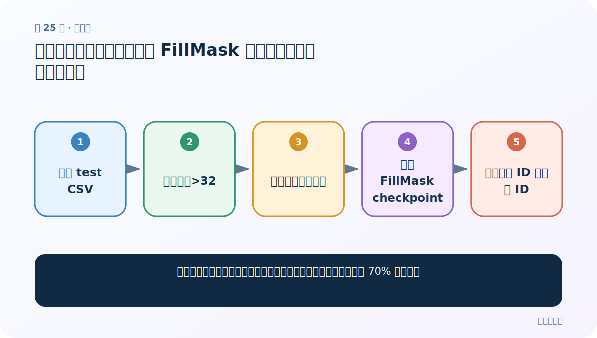
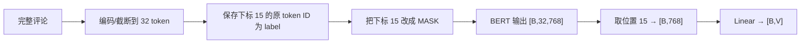

# 第 25 节：中文填空案例（四）：加载 FillMask 模型并计算固定位置准确率

> 笔记编号 25/29 · 对应原视频 P179 · [打开这一集](https://www.bilibili.com/video/BV14mdfBDE4Q?p=179)

[← 上一节：24 中文填空案例（三）：过滤长文本并复用分类训练循环](./24-mlm-training.md) · [返回总目录](./README.md) · [下一节：26 NSP 案例（一）：自定义句对数据，构造真下一句与随机下一句 →](./26-nsp-custom-dataset.md)

## 这节解决什么问题

怎样让测试数据采用与训练完全相同的过滤和遮罩规则，并解释约 70% 的结果？



图从左向右读。先跟着数据或推理过程走一遍，再学习下面的术语。

## 辅助流程图


### 课堂固定位置填空流程



## 老师原声整理稿（按讲解顺序）

### 0:00–2:52　评估代码仍只改三处

加载 test CSV，先过滤 sentence 长度大于 32；DataLoader 使用填空 `collate_fn2`；模型路径从 classification 改为 FillMask checkpoint。训练和评估的数据规则必须一致，否则准确率不可比较。

### 2:52–4:48　固定位置 top-1

model.eval/no_grad 前向得到 `[B,V]`，argmax 得每条预测 token ID，与 labels `[B]` 比较并累计 correct/total。课堂跑出的准确率大约 70%，表示固定第 16 个 token 的 top-1 命中率，不是整句完形填空准确率，也不能外推到随机位置。

### 4:48–8:28　结果为什么看似较高

固定位置、同领域酒店评论、冻结的预训练 BERT 和词频分布都可能让任务较容易。除了 top-1，还应看 top-5、按 token 频次分组和可读候选，避免模型只会猜常见字。老师完成评估后进入 NSP 句子关系任务。

## 完整原声逐段记录

[查看本节按时间戳整理的完整音轨转写](./transcripts/p179.md)

逐段记录用于核查老师讲解是否遗漏；正文会进一步纠正口误和语音识别中的技术术语。

## 零基础先记住

- 测试必须复用相同过滤与遮罩位置
- 70% 是固定位置 token top-1
- 应增加 top-k 与错误样例分析

## 最小可运行代码

下面代码是帮助理解本节概念的最小示例，默认从项目根目录运行。

```python
model.eval(); hit=total=0
with torch.no_grad():
    for ids,types,mask,labels in test_loader:
        ids,types,mask,labels=[x.to(device) for x in (ids,types,mask,labels)]
        pred=model(ids,types,mask).argmax(-1)
        hit+=(pred==labels).sum().item()
        total+=labels.numel()
print(hit/total)
```

### 输入和输出怎么看

输出课堂固定遮罩位置的词表 top-1 准确率。

## 最容易踩的坑

用 classification3 checkpoint 加载填空网络；层形状不同会报错或根本不是同一任务。

## 本节知识链

`加载 test CSV → 过滤长度>32 → 使用填空整理函数 → 加载 FillMask checkpoint → 比较预测 ID 与真实 ID`

## 自测

**问题：为什么约 70% 不能说明任意位置填空都有 70%？**

<details>
<summary>点开核对答案</summary>

训练和测试都固定同一位置及同一领域，未覆盖其他位置和更一般文本。

</details>

## 学完检查

- [ ] 我能用自己的话复述老师的讲解顺序
- [ ] 我能在运行前预测关键输出或张量形状
- [ ] 我知道这节方法最容易用错的地方
- [ ] 我能独立回答自测题

[← 上一节：24 中文填空案例（三）：过滤长文本并复用分类训练循环](./24-mlm-training.md) · [返回总目录](./README.md) · [下一节：26 NSP 案例（一）：自定义句对数据，构造真下一句与随机下一句 →](./26-nsp-custom-dataset.md)
