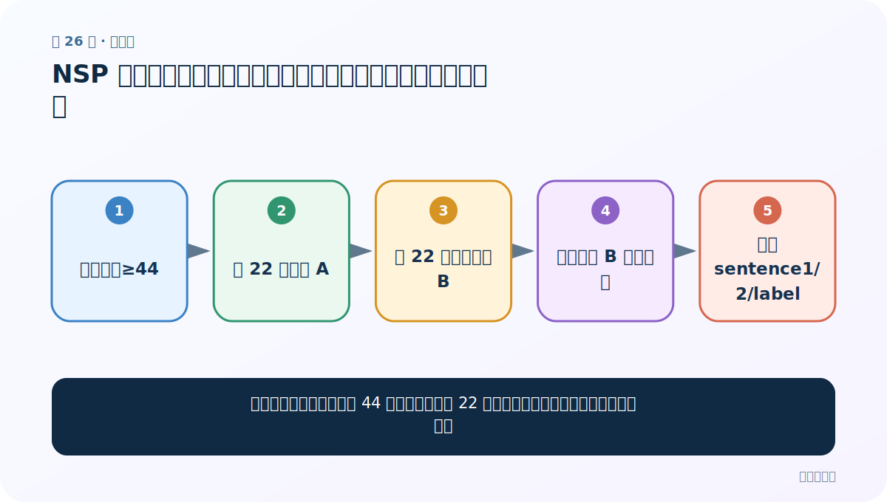
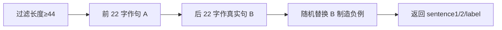
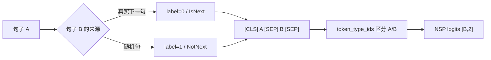

# 第 26 节：NSP 案例（一）：自定义句对数据，构造真下一句与随机下一句

> 笔记编号 26/29 · 对应原视频 P180 · [打开这一集](https://www.bilibili.com/video/BV14mdfBDE4Q?p=180)

[← 上一节：25 中文填空案例（四）：加载 FillMask 模型并计算固定位置准确率](./25-mlm-evaluation.md) · [返回总目录](./README.md) · [下一节：27 NSP 案例（二）：句对编码、token_type_ids 与特殊 token →](./27-nsp-preprocessing.md)

## 这节解决什么问题

老师怎样把一条长度至少 44 的评论切成两个 22 字片段，并随机替换后半句制造负样本？



图从左向右读。先跟着数据或推理过程走一遍，再学习下面的术语。

## 辅助流程图



### NSP 句对构造与训练



## 老师原声整理稿（按讲解顺序）

### 0:00–4:46　任务与数据构造思路

NSP 判断第二句是否为第一句的下半/后续。老师仍用酒店评论，先筛选真实字符长度至少约 44 的样本，取前 22 字作为 sentence1、后 22 字作为真实 sentence2，保证两段都有内容而不是 padding。这里是从同一评论硬切两段，不是按自然句号切句。

### 4:46–12:30　为什么要自定义 Dataset

前两个案例可直接使用 datasets.Dataset；NSP 需要 `__getitem__` 每次生成句对和标签，所以老师继承 PyTorch Dataset，自行实现长度与取样。正样本保留本条后 22 字；负样本随机选另一条评论的后 22 字替换 sentence2。

### 12:30–20:30　随机标签与替换细节

课堂通过随机数决定正/负，并在负例时随机索引其他样本。标签的 0/1 含义必须与代码统一；不要凭 BERT 文档默认值猜。还要避免随机到当前同一条，尽量让负样本真正不连续。

### 20:30–26:06　测试自定义 Dataset

打印若干样本，检查 sentence1、sentence2 都是 22 字，label 与是否替换一致。老师强调长度过滤发生在切分前，后续 tokenizer 再负责 `[CLS]/[SEP]`、padding 和 mask。

## 完整原声逐段记录

[查看本节按时间戳整理的完整音轨转写](./transcripts/p180.md)

逐段记录用于核查老师讲解是否遗漏；正文会进一步纠正口误和语音识别中的技术术语。

## 零基础先记住

- 正例是相邻句，负例是替换后的随机句
- 标签 0/1 约定要核对
- 困难负样本能减少只学主题的捷径

## 最小可运行代码

下面代码是帮助理解本节概念的最小示例，默认从项目根目录运行。

```python
import random
from torch.utils.data import Dataset
class NSPDataset(Dataset):
    def __init__(self,rows):
        self.rows=[r["sentence"] for r in rows if len(r["sentence"])>=44]
    def __len__(self): return len(self.rows)
    def __getitem__(self,i):
        text=self.rows[i]
        a,true_b=text[:22],text[22:44]
        if random.random()<0.5:
            return a,true_b,0
        j=random.choice([j for j in range(len(self.rows)) if j!=i])
        return a,self.rows[j][22:44],1
```

### 输入和输出怎么看

返回两个各 22 字片段和二分类标签。

## 最容易踩的坑

随机负样本抽到 i+1，导致同一句对被标成 NotNext。

## 本节知识链

`过滤长度≥44 → 前 22 字作句 A → 后 22 字作真实句 B → 随机替换 B 制造负例 → 返回 sentence1/2/label`

## 自测

**问题：为什么全从别的主题抽负句可能太简单？**

<details>
<summary>点开核对答案</summary>

模型只需判断主题相似度，无需真正学习句间连续关系。

</details>

## 学完检查

- [ ] 我能用自己的话复述老师的讲解顺序
- [ ] 我能在运行前预测关键输出或张量形状
- [ ] 我知道这节方法最容易用错的地方
- [ ] 我能独立回答自测题

[← 上一节：25 中文填空案例（四）：加载 FillMask 模型并计算固定位置准确率](./25-mlm-evaluation.md) · [返回总目录](./README.md) · [下一节：27 NSP 案例（二）：句对编码、token_type_ids 与特殊 token →](./27-nsp-preprocessing.md)
