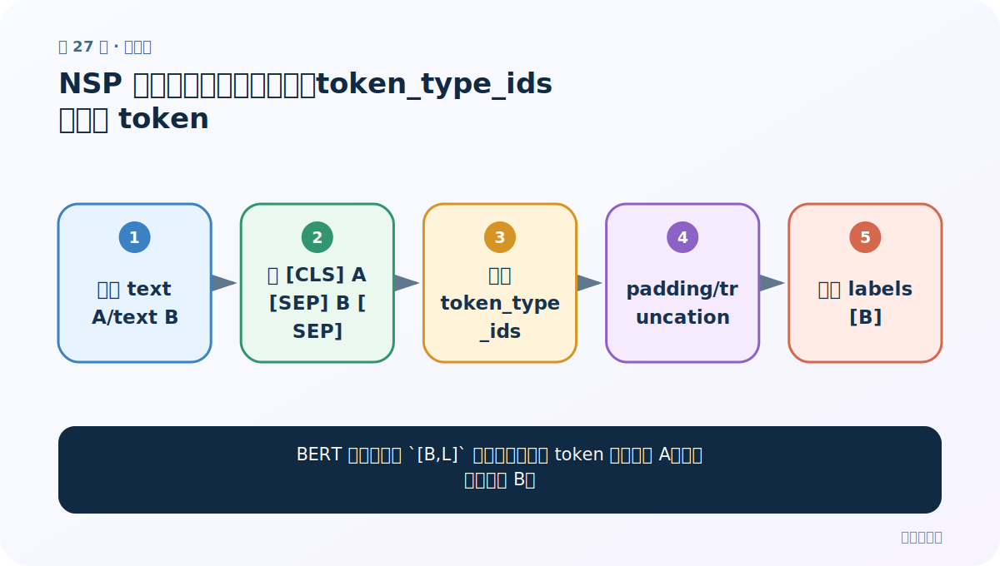
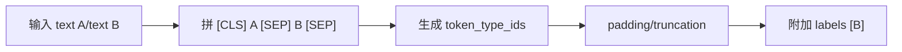
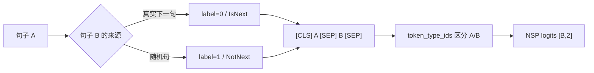

# 第 27 节：NSP 案例（二）：句对编码、token_type_ids 与特殊 token

> 笔记编号 27/29 · 对应原视频 P181 · [打开这一集](https://www.bilibili.com/video/BV14mdfBDE4Q?p=181)

[← 上一节：26 NSP 案例（一）：自定义句对数据，构造真下一句与随机下一句](./26-nsp-custom-dataset.md) · [返回总目录](./README.md) · [下一节：28 NSP 案例（三）：复用自定义 BERT + Linear(768→2) →](./28-nsp-model.md)

## 这节解决什么问题

BERT 怎样在同一 `[B,L]` 序列中知道哪些 token 属于句子 A、哪些属于句子 B？



图从左向右读。先跟着数据或推理过程走一遍，再学习下面的术语。

## 辅助流程图



### NSP 句对构造与训练



## 老师原声整理稿（按讲解顺序）

### 0:00–4:50　理解 DataLoader 传入的数据结构

老师先打印一批，解释自定义 Dataset 经过默认收集后可能呈现 sentence1 列表、sentence2 列表和 label 张量，而不一定还是“8 个小字典”。因此 collate 函数要按真实批结构取值，不能照搬上一个案例的 `for item in data`。

### 4:50–9:40　句对 tokenizer

将 8 个 sentence1 和 8 个 sentence2 成对交给 tokenizer/batch_encode_plus。BERT 自动拼 `[CLS] A [SEP] B [SEP]`，生成 `input_ids`、`token_type_ids`、`attention_mask`。因为两段各 22 字，再加特殊 token，总长度可设成能容纳句对的固定值。

### 9:40–15:37　返回四项并测试

collate 返回三类 `[B,L]` 输入和 labels `[B]`，接入 DataLoader 后只取一批打印。token_type_ids 的 0/1 区段帮助 BERT 区分 A/B；attention_mask 仍只表示有效 token/PAD。老师说明后续模型与分类案例高度相似。

## 完整原声逐段记录

[查看本节按时间戳整理的完整音轨转写](./transcripts/p181.md)

逐段记录用于核查老师讲解是否遗漏；正文会进一步纠正口误和语音识别中的技术术语。

## 零基础先记住

- 句对用 tokenizer 的两个文本参数
- token_type_ids 区分 A/B 段
- 不是所有 Transformer 都使用 segment embedding

## 最小可运行代码

下面代码是帮助理解本节概念的最小示例，默认从项目根目录运行。

```python
import torch
def nsp_collate(rows):
    a,b,y=zip(*rows)
    batch=tokenizer(
        list(a),list(b),padding=True,truncation=True,
        max_length=128,return_tensors="pt",
    )
    batch["labels"]=torch.tensor(y)
    return batch
```

### 输入和输出怎么看

得到句对编码 `[B,L]` 和 NSP 标签 `[B]`。

## 最容易踩的坑

手工在字符串里写 `[SEP]`，但 tokenizer 又自动加特殊 token，造成重复或普通文本化。

## 本节知识链

`输入 text A/text B → 拼 [CLS] A [SEP] B [SEP] → 生成 token_type_ids → padding/truncation → 附加 labels [B]`

## 自测

**问题：attention_mask 与 token_type_ids 有什么不同？**

<details>
<summary>点开核对答案</summary>

前者区分有效 token/PAD；后者区分句子 A 段和句子 B 段。

</details>

## 学完检查

- [ ] 我能用自己的话复述老师的讲解顺序
- [ ] 我能在运行前预测关键输出或张量形状
- [ ] 我知道这节方法最容易用错的地方
- [ ] 我能独立回答自测题

[← 上一节：26 NSP 案例（一）：自定义句对数据，构造真下一句与随机下一句](./26-nsp-custom-dataset.md) · [返回总目录](./README.md) · [下一节：28 NSP 案例（三）：复用自定义 BERT + Linear(768→2) →](./28-nsp-model.md)
