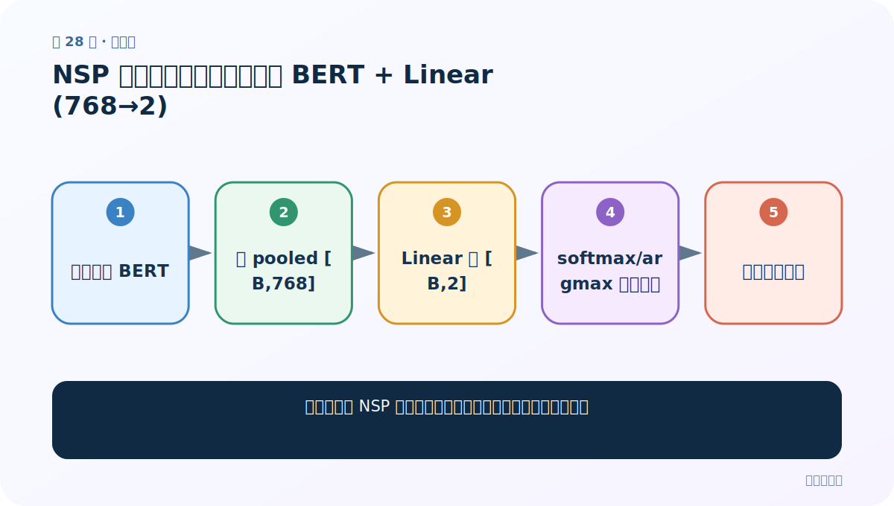
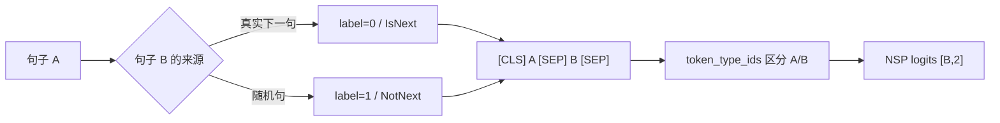
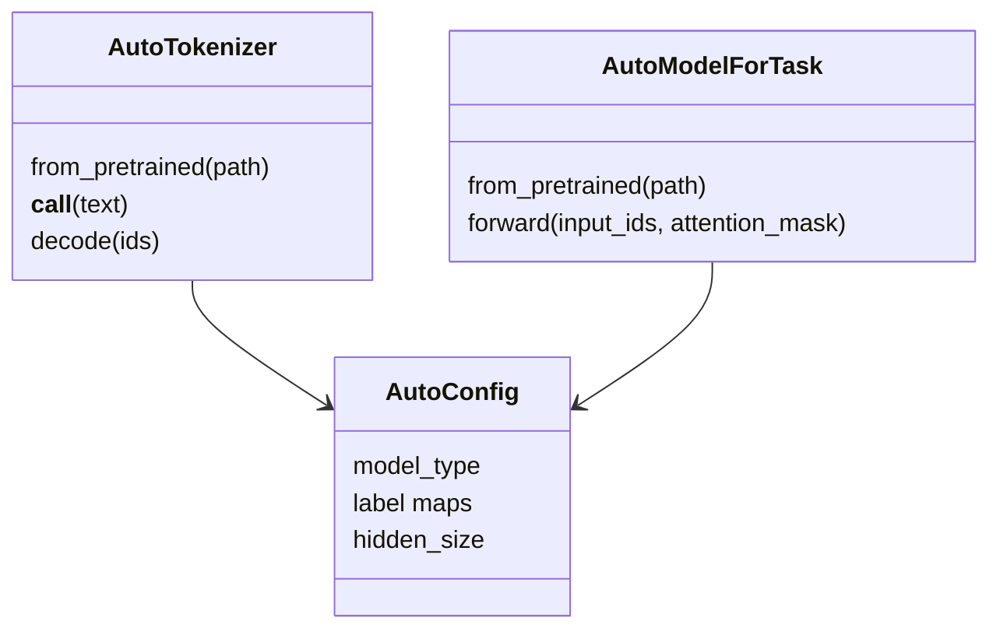

# 第 28 节：NSP 案例（三）：复用自定义 BERT + Linear(768→2)

> 笔记编号 28/29 · 对应原视频 P182 · [打开这一集](https://www.bilibili.com/video/BV14mdfBDE4Q?p=182)

[← 上一节：27 NSP 案例（二）：句对编码、token_type_ids 与特殊 token](./27-nsp-preprocessing.md) · [返回总目录](./README.md) · [下一节：29 NSP 案例（四）：训练、评估与数据捷径检查 →](./29-nsp-training-evaluation.md)

## 这节解决什么问题

为什么课堂 NSP 模型几乎可以原样复制酒店评论二分类网络？



图从左向右读。先跟着数据或推理过程走一遍，再学习下面的术语。

## 辅助流程图


### NSP 句对构造与训练



### Auto 类对象关系



## 老师原声整理稿（按讲解顺序）

### 0:00–1:57　模型与分类案例一模一样

老师直接复制酒店评论分类的自定义模型：预训练中文 BertModel 接收句对三类张量，取 pooled/CLS 级 `[B,768]`，再用 Linear(768,2) 输出是否连续的两个 logits。变化在数据和标签语义，不在网络形状。

### 1:57–4:06　用图解释负样本随机索引

课堂重点反而回到 Dataset：多条 44 字评论各分 22+22；当随机标为负例时，从另一条的后 22 字覆盖当前 sentence2，于是 A/B 无真实连续关系。随后测试模型输出 `[B,2]`。

## 完整原声逐段记录

[查看本节按时间戳整理的完整音轨转写](./transcripts/p182.md)

逐段记录用于核查老师讲解是否遗漏；正文会进一步纠正口误和语音识别中的技术术语。

## 零基础先记住

- 课堂没有调用 BertForNextSentencePrediction
- 同一 `[B,2]` 形状可承载不同二分类语义
- 真正区别来自句对构造和标签

## 最小可运行代码

下面代码是帮助理解本节概念的最小示例，默认从项目根目录运行。

```python
class NSPClassifier(torch.nn.Module):
    def __init__(self,bert):
        super().__init__()
        self.pre_model=bert
        self.linear=torch.nn.Linear(bert.config.hidden_size,2)
    def forward(self,ids,types,mask):
        pooled=self.pre_model(
            input_ids=ids,token_type_ids=types,attention_mask=mask
        ).pooler_output
        return self.linear(pooled)
```

### 输入和输出怎么看

输出 `[B,2] = B 对句子 × 连续/不连续两个 logits`。

## 最容易踩的坑

把课堂自定义二分类头说成直接使用 BERT 原生 NSP 预训练头；两者接口与权重来源不同。

## 本节知识链

`句对输入 BERT → 取 pooled [B,768] → Linear 到 [B,2] → softmax/argmax 判断关系 → 测试模型结构`

## 自测

**问题：为什么 NSP 不是 `[B,L,2]`？**

<details>
<summary>点开核对答案</summary>

它判断整对句子的关系，每对只输出一次二分类；不是给每个 token 分类。

</details>

## 学完检查

- [ ] 我能用自己的话复述老师的讲解顺序
- [ ] 我能在运行前预测关键输出或张量形状
- [ ] 我知道这节方法最容易用错的地方
- [ ] 我能独立回答自测题

[← 上一节：27 NSP 案例（二）：句对编码、token_type_ids 与特殊 token](./27-nsp-preprocessing.md) · [返回总目录](./README.md) · [下一节：29 NSP 案例（四）：训练、评估与数据捷径检查 →](./29-nsp-training-evaluation.md)
