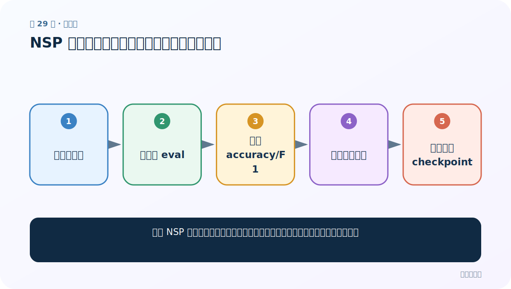
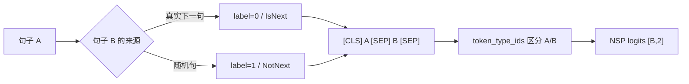
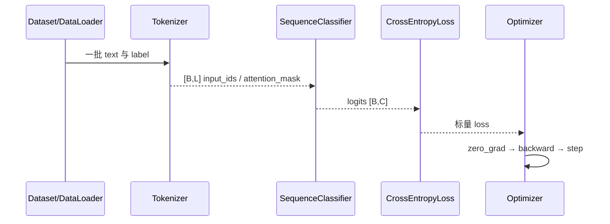

# 第 29 节：NSP 案例（四）：训练、评估与数据捷径检查

> 笔记编号 29/29 · 对应原视频 P183 · [打开这一集](https://www.bilibili.com/video/BV14mdfBDE4Q?p=183)

[← 上一节：28 NSP 案例（三）：复用自定义 BERT + Linear(768→2)](./28-nsp-model.md) · [返回总目录](./README.md) · 已是最后一节 →

## 这节解决什么问题

即使 NSP 准确率很高，怎样判断模型学的是句间关系，而不是负样本构造漏洞？



图从左向右读。先跟着数据或推理过程走一遍，再学习下面的术语。

## 辅助流程图


### NSP 句对构造与训练



### 中文分类训练时序



## 老师原声整理稿（按讲解顺序）

### 0:00–2:54　复制训练函数并换数据整理版本

老师复用分类训练代码，只把 DataLoader 换成 NSP Dataset/collate 版本，模型换成 NSP 自定义网络，保存名换成 NSP1/2/3。句对最大长度比分类的 300 短，因此一轮约几十秒，明显更快；日志仍每 20 批报告局部 loss/accuracy。

### 2:55–4:37　评估也只改三处

复制分类评估函数，数据加载器换版本 3、checkpoint 路径换 NSP3、最后打印文本和预测/真实关系标签。其余 eval、no_grad、argmax、correct/total 都相同。

### 4:37–10:30　读懂预测标签

输出中应同时展示原始 sentence1/2、模型预测关系和真实 label，才能发现随机负例是否构造正确。准确率只衡量当前人工规则；若负句总来自完全不同主题，模型可能靠主题差异走捷径。

### 10:30–15:13　三案例总复盘

中文分类、固定位置填空、NSP 都遵循“加载/构造数据 → collate 成 BERT 输入 → 预训练 BERT 抽特征 → 自定义任务头 → 冻结主体训练 → 评估”。变化主要是标签形状、任务头输出维和 Dataset 构造。下一专题进一步解释 BERT 架构与 MLM/NSP 原理。

## 完整原声逐段记录

[查看本节按时间戳整理的完整音轨转写](./transcripts/p183.md)

逐段记录用于核查老师讲解是否遗漏；正文会进一步纠正口误和语音识别中的技术术语。

## 零基础先记住

- NSP 训练本质是句对二分类
- 高准确率要排查负样本捷径
- 最终保存模型、tokenizer、标签约定和数据构造版本

## 最小可运行代码

下面代码是帮助理解本节概念的最小示例，默认从项目根目录运行。

```python
# 训练阶段与二分类相同：CrossEntropy + Adam，只训练自定义线性头
for p in model.pre_model.parameters():
    p.requires_grad=False
model.eval(); correct=total=0
with torch.no_grad():
    for ids,types,mask,labels in test_loader:
        ids,types,mask,labels=[x.to(device) for x in (ids,types,mask,labels)]
        pred=model(ids,types,mask).argmax(-1)
        correct+=(pred==labels).sum().item()
        total+=labels.numel()
print("NSP accuracy",correct/total)
```

### 输入和输出怎么看

输出验证集句对级准确率；正式评估还应分标签统计并检查困难负例。

## 最容易踩的坑

负样本全部跨主题，模型只学主题不一致就达到高分。

## 本节知识链

`训练二分类 → 验证集 eval → 累计 accuracy/F1 → 检查困难负例 → 保存完整 checkpoint`

## 自测

**问题：怎样构造更难的 NSP 负样本？**

<details>
<summary>点开核对答案</summary>

从同文档或同主题中选非相邻句，并尽量匹配长度/标点，让模型必须学习更细的连续关系。

</details>

## 学完检查

- [ ] 我能用自己的话复述老师的讲解顺序
- [ ] 我能在运行前预测关键输出或张量形状
- [ ] 我知道这节方法最容易用错的地方
- [ ] 我能独立回答自测题

[← 上一节：28 NSP 案例（三）：复用自定义 BERT + Linear(768→2)](./28-nsp-model.md) · [返回总目录](./README.md) · 已是最后一节 →
