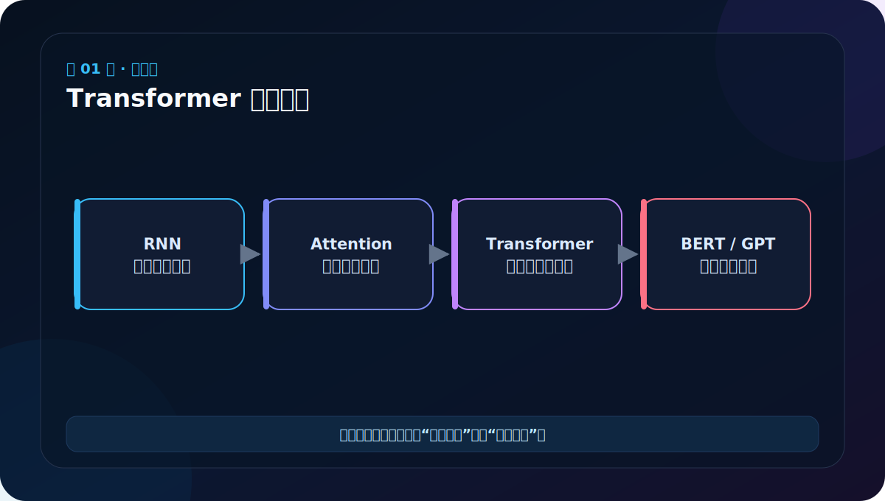
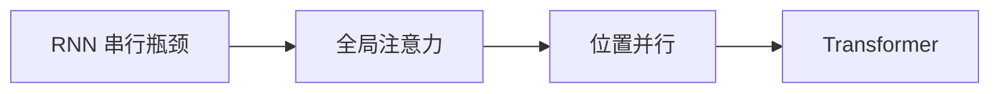
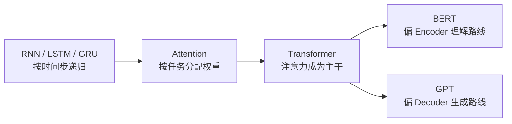
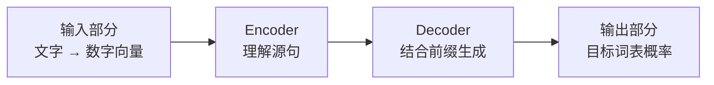

# 第 1 节：Transformer 的由来：为什么不再逐词递归

> 笔记编号 1/38 · 对应原视频 P106 · [打开这一集](https://www.bilibili.com/video/BV14mdfBDE4Q?p=106)

← 已是第一节 · [返回总目录](./README.md) · [下一节：2 总体架构文字版：Encoder 理解，Decoder 生成 →](./02-transformer-architecture-text.md)

## 这节解决什么问题

RNN 必须按时间步依次传递隐藏状态，训练难并行，远距离信息也要走很长的路。Transformer 用注意力让任意两个位置直接交互。



图要沿箭头或结构层级阅读。先说清楚数据从哪里来、形状怎样变化，再记组件名称。

## 老师原声整理稿（按讲解顺序）

### 0:00–1:27　老师先交代：这一大章究竟要学什么

老师开头说，接下来整章叫“Transformer 架构和实现”。这里的“架构”，你可以先理解为一张建筑设计图：模型由哪些房间组成、数据从哪扇门进去、经过哪些房间、最后从哪里出来。“实现”则是把设计图里的每一个方框写成真正可以运行的 PyTorch 代码。

老师先把完整 Transformer 分成四块：

1. **输入部分**：把文字变成模型能够计算的数字向量。
2. **编码器 Encoder**：阅读并理解输入句子，得到包含上下文的信息。
3. **解码器 Decoder**：一边参考编码器的理解结果，一边逐步生成目标句子。
4. **输出部分**：把解码器内部的数字表示变成“词表中每个词的概率”。

老师还提前提醒，后面编码器代码讲得会比较慢、比较细，解码器反而会快一些。不是因为解码器不重要，而是两者复用了很多相同零件：注意力、前馈网络、残差连接和归一化等。也就是说，**编码器部分不是可以跳过的前置知识；它是后面读懂解码器的地基。**

### 1:27–3:10　Transformer 出现以前，大家主要用什么

老师接着回顾 RNN、LSTM 和 GRU。先不要急着记三个缩写的结构，只要抓住它们共同的工作方式：处理句子时通常按顺序一步一步往后走。

例如句子是：

> 我 / 今天 / 学习 / Transformer

循环网络先处理“我”，得到一个隐藏状态；再把这个隐藏状态和“今天”一起处理；然后继续传给“学习”，最后才轮到“Transformer”。这种方式像接力跑，后一个人必须等前一个人把接力棒传过来。

老师由此指出几个问题：

- **难以在一个序列内部充分并行。** 第 4 步依赖第 3 步，第 3 步又依赖第 2 步，不能把所有位置同时算完。
- **长文本中的早期信息可能逐渐变弱。** 第一个词的信息要经过很多次传递才能到达最后一个词。
- **训练可能遇到梯度消失或梯度爆炸。** 你现在不用推导梯度，只需先理解：模型根据错误反向调整参数时，信号可能变得过小，学不动；也可能变得过大，训练不稳定。

LSTM 和 GRU 对长期信息问题做了改进，但它们仍保留“按时间步递归”的基本路线，所以并行限制并没有彻底消失。

### 3:10–4:58　注意力为什么先在机器翻译中受到重视

老师回忆前面讲过的机器翻译：早期 Encoder–Decoder 往往试图把整个源句压进一个固定向量，再让 Decoder 依靠这个向量生成译文。句子变长后，一个固定向量很难完整保存所有细节。

注意力机制提供了另一种方法。Decoder 每生成一个词，都可以重新查看源句中的所有位置，并给当前最相关的位置更高权重。例如翻译法语中的一个名词时，模型可以重点读取英语源句中对应的名词，而不是要求一个固定向量始终记住整句的每个细节。

因此老师强调，注意力早期的重要应用场景就是机器翻译。Transformer 再向前走了一步：它不只是给旧式循环模型外挂一个注意力模块，而是让注意力成为整个架构的核心计算。

### 4:58–6:28　2017 年论文、BERT，以及 GPT 名字中的 T

老师把时间线串了起来：

- **2017 年**，Google 团队发表 *Attention Is All You Need*，提出 Transformer。
- **2018 年**，BERT 使用 Transformer 编码器路线，在多项自然语言理解任务上取得很强效果，让整个架构获得更广泛关注。
- 此后许多模型即使训练任务和细节不同，核心骨架仍继续使用 Transformer。

老师还用 GPT 的名字帮助记忆：GPT 中的 **T 就是 Transformer**。但这里必须分清层级：

- Transformer 是一种网络架构，好比建筑结构。
- BERT、GPT 是采用这种结构并配合不同训练目标得到的模型家族。
- ChatGPT 是在 GPT 路线上继续训练、对齐并做成的对话系统，不等于 Transformer 本身。

课堂上老师打开论文页面，是想让大家知道后续课件中的一些 BERT 架构图、预训练和微调图并不是凭空画出来的，后面的预训练模型专题还会重新解释。

### 6:28–9:26　Transformer 的第一个核心优势：并行

老师把循环网络的“串行”与 Transformer 的“并行”放在一起比较。

循环网络像：

> 第 1 个词算完 → 第 2 个词才能算 → 第 3 个词才能算

Transformer 在训练时可以把整段序列同时组成矩阵，计算各位置之间的相关程度。这样 GPU 尤其擅长的大规模矩阵乘法就能充分发挥作用，也更容易使用多块 GPU 做分布式训练。

注意，“并行”主要说的是**训练时，同一层中的多个位置可以一起计算**。真正生成文本时，Decoder 仍然常常要一个 token 接一个 token 地生成，因为下一个 token 依赖已经生成的前缀。不能把“训练可并行”误解成“任何情况下都一次生成完整答案”。

### 9:26–11:26　第二个核心优势：更直接地处理长距离关系

为了让大家理解注意力，老师用了人的记忆作类比。假如让你回忆从初中到现在发生的每一天，你不可能把所有细节都同样清楚地说出来；但对你很重要的几件事，可能多年后仍然记得。

老师想表达的是：

> 与当前任务关系小的信息，权重可以低一些；关系大的信息，权重可以高一些。

在循环网络中，句首和句尾的信息要经过许多隐藏状态传递才能相遇。自注意力则允许句尾位置直接和句首位置计算关系，信息交互路径更短。

这里也要校准老师的生活类比：模型不是像人一样“真正理解重要性”，也不是把低权重词直接删掉；它是通过训练学出一组连续数值权重，再用这些权重对信息做加权组合。

课件还展示了随着句子变长，不同模型效果变化的实验曲线。老师希望大家观察的是趋势：没有注意力的循环模型在长序列上下降更明显，加入注意力后相对稳定。图中的 20、30、40 等长度来自特定实验，**不是所有任务通用的硬分界线**。

### 11:26–12:53　SOTA 和“市场占用”到底是什么意思

老师展示机器翻译排行榜，指出当时排名靠前的许多系统都使用 Transformer。他想说明学习它不是只为了考试，而是因为后续工业系统和招聘要求中经常出现。

课上提到的 **SOTA** 是 *State of the Art* 的缩写。它不是某个固定模型的名字，而表示：在某个时间、某个数据集、某项任务上达到的先进水平。

所以“SOTA 模型”必须带着条件理解：

- 换一个任务，最佳模型可能不同。
- 换一个数据集，排名可能变化。
- 随着新研究出现，今天的 SOTA 也可能被超过。

### 12:53–15:23　老师最后复习的两组概念

第一组是 Transformer 的来源与优势：

- 来自 Google 团队在 2017 年发表的论文。
- 关键创新是以 Self-Attention 为核心，而不是继续依赖循环结构。
- 相比传统循环网络，更容易并行，也更容易让远距离位置直接交互。

第二组是 NLP 任务的粗略划分：

- **NLU，Natural Language Understanding，自然语言理解。** 重点是从现有文本中判断、分类或提取信息，例如分词、词性标注、命名实体识别、情感分类。
- **NLG，Natural Language Generation，自然语言生成。** 重点是产生新的文本，例如机器翻译、摘要、对话生成。

老师为了入门记忆，把 Encoder 与“理解”、Decoder 与“生成”对应起来。这个方向大体有帮助：BERT 更偏 Encoder 路线，GPT 更偏 Decoder 路线。但它不是绝对禁令，真实系统可能同时包含理解和生成，一个架构也可能通过不同训练方式服务多种任务。

读完整节，你目前只需要牢牢记住一条主线：

> 循环网络按顺序传递信息，难并行且远距离路径长；Transformer 用注意力让位置直接交互，因此成为后来许多 NLP 模型的基础架构。

## 辅助流程图



### 模型发展关系图



### 本章四大组件图



## 完整原声逐段记录

[查看本节按时间戳整理的完整音轨转写](./transcripts/p106.md)

这份逐段记录用于核查老师讲过的内容是否遗漏；学习时优先阅读上面的校正文章，遇到想追溯的细节再按时间戳查看原声记录。

## 零基础先记住

- 2017 年论文 Attention Is All You Need 提出 Transformer
- 训练时多个位置可以并行计算
- 长距离交互路径更短，但标准注意力仍有长度平方级成本

## 最小可运行代码

下面代码默认从项目根目录运行。涉及模型组件时，使用 [transformer_from_scratch](../../transformer_from_scratch/README.md) 中经过测试的 PyTorch 实现。

```python
tokens = ["我", "喜欢", "自然", "语言", "处理"]
for i, token in enumerate(tokens):
    visible = tokens if True else tokens[: i + 1]
    print(token, "可以直接比较：", visible)
```

### 输入和输出怎么看

这不是神经网络实现，而是先体会差异：每个位置可以直接与整段序列比较，不必等前一个隐藏状态传来。

## 最容易踩的坑

Transformer 不等于大语言模型；它是网络架构。GPT、BERT 是基于它构建并用不同目标训练的模型家族。

## 本节知识链

`RNN 串行瓶颈 → 全局注意力 → 位置并行 → Transformer`

Transformer 学习的主线始终是形状。每经过一个箭头，都问自己：batch、序列长度、特征维、头数和词表维中的哪一个发生了变化？

## 自测

**问题：Transformer 能建模长距离关系，是否意味着能无限处理长文本？**

<details>
<summary>点开核对答案</summary>

不能。上下文窗口、显存和标准注意力的 O(L²) 计算仍会限制长度。

</details>

## 学完检查

- [ ] 我能不用术语解释本节组件解决的问题
- [ ] 我能在运行前写出关键张量形状
- [ ] 我能指出 Q、K、V 或 mask 的来源
- [ ] 我知道代码“形状正确但逻辑可能错误”的情况
- [ ] 我能独立回答自测题

← 已是第一节 · [返回总目录](./README.md) · [下一节：2 总体架构文字版：Encoder 理解，Decoder 生成 →](./02-transformer-architecture-text.md)
