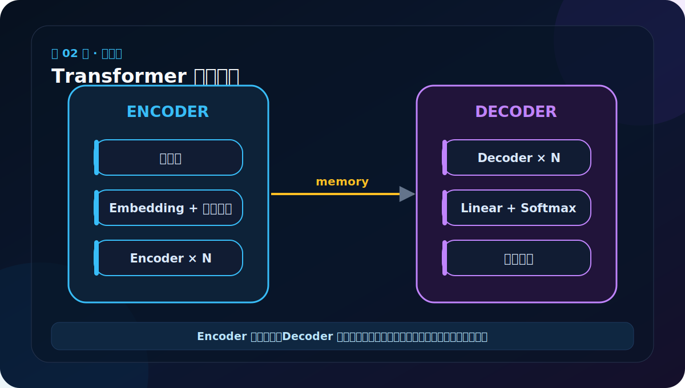
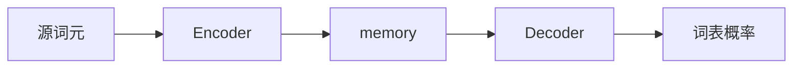
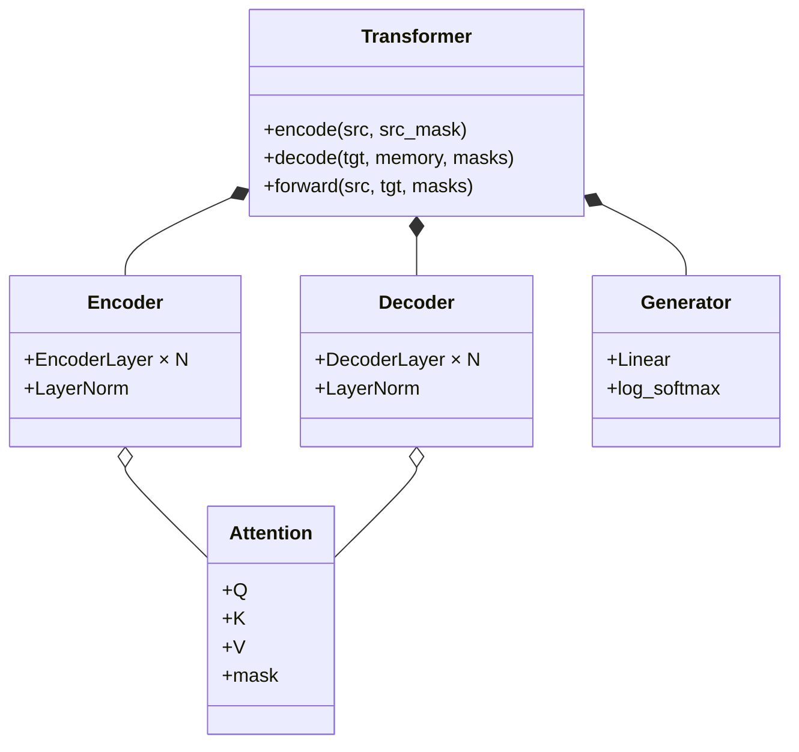

# 第 2 节：总体架构文字版：Encoder 理解，Decoder 生成

> 笔记编号 2/38 · 对应原视频 P107 · [打开这一集](https://www.bilibili.com/video/BV14mdfBDE4Q?p=107)

[← 上一节：1 Transformer 的由来：为什么不再逐词递归](./01-transformer-origin.md) · [返回总目录](./README.md) · [下一节：3 架构图上半部分：看懂 Encoder 数据流 →](./03-transformer-diagram-upper.md)

## 这节解决什么问题

源句先由 Encoder 变成带上下文的 memory；Decoder 一边看已经给出的目标前缀，一边查询 memory，预测下一个词。



图要沿箭头或结构层级阅读。先说清楚数据从哪里来、形状怎样变化，再记组件名称。

## 老师原声整理稿（按讲解顺序）

### 0:00–2:10　先明确这一节的目标

老师开头说，这一节只要求先看懂 Transformer 的“总架构”，还不要求马上知道每个公式怎么计算。学习目标有两个：第一，能说出模型由哪四部分组成；第二，能继续说出每一部分里面有哪些层、这些层大致负责什么。

老师把任务背景放在机器翻译上：输入是一句已知英语，目标是一句已知法语，模型学习从一种语言到另一种语言的映射。他还顺带提到预训练模型和迁移学习：别人已经在大量数据上训练好模型，我们可以加载它，再针对自己的任务继续使用。这里先记概念，后面有专门专题。

### 2:10–4:30　完整模型不是两个框，而是四个部分

老师指着架构图从下往上辨认：

1. **输入部分**：接收源文本和训练时的目标文本。
2. **编码器 Encoder**：左侧大模块，处理源句。
3. **解码器 Decoder**：右侧大模块，处理目标前缀并读取编码结果。
4. **输出部分**：最上方的 Linear 与 Softmax，把隐藏表示变成预测。

只回答“四部分是输入、编码、解码、输出”还不够。老师用“别人问你学了什么，你只回答小学、初中、高中、大学”作类比：分类名称对了，却没说明具体内容。面试或自测时必须继续展开内部层级。

图中每个 Attention 方框都离不开 Q、K、V。现在不需要计算，但要形成习惯：看到 Attention，就问“谁提供 Query，谁提供 Key，谁提供 Value”。

### 4:30–8:20　输入部分：词义和位置缺一不可

Embedding 把 token ID 查成稠密向量，让模型能用数字表示词义。随后加入 Positional Encoding。

老师用“我爱你”和“你爱我”说明位置的重要性。两句话拥有相同的词，顺序不同，角色和语义就不同。单纯注意力不天然包含先后；位置编码相当于给每个词加坐标。

训练翻译模型时有两路输入：左边是已知源语言句子，右边是右移后的目标语言句子。最上方才是模型预测的目标分布。不要把“训练时输入的目标句”和“模型最终预测”混成一个东西。

### 8:20–13:40　四级层级：组件 → 子层 → 编码器层 → 编码器

这一段是老师反复强调的重点：

- **组件**：Attention、Feed Forward、LayerNorm、残差连接等零件。
- **子层 Sublayer**：把某个组件放进带残差和归一化的通用外壳。
- **编码器层 EncoderLayer**：由自注意力子层和 FFN 子层组成。
- **编码器 Encoder**：由 N 个 EncoderLayer 堆叠组成，原论文典型配置 N=6。

所以“一个编码器有六个编码器”是错误说法，正确的是“一个 Encoder 由六个 EncoderLayer 组成”。N 也不是只能等于 6；增加层数可能提高容量，同时增加计算量。

### 13:40–18:30　Decoder 为什么有三个子层

Decoder 的层级结构相似，但每个 DecoderLayer 有三个子层：

1. 带因果 mask 的目标自注意力。
2. 读取 Encoder memory 的交叉注意力。
3. Position-wise FFN。

这就是 Decoder 后面讲得更快的原因：残差、归一化、FFN 和普通多头注意力已经实现，可以复用。图中从 Encoder 连到 Decoder 的线表示各 DecoderLayer 都能读取同一份 memory；DecoderLayer 之间还会逐层传递目标隐藏状态。

### 18:30–21:35　输出部分：先得到分数，再得到概率

Decoder 输出仍是 d_model 维隐藏向量。Linear 把它投影到目标词表大小 V。若词表有 10,000 个词，就为每个位置产生 10,000 个分数；随后 Softmax 把这些分数转成和为 1 的概率。

Linear 输出的是 logits，不是概率。真正生成时也不一定永远选最大概率词，还可能采样或使用 beam search；这一节先理解“隐藏状态 → 词表分布”。

### 21:35–23:19　老师最后检查什么

老师用选择题复习：输入负责词嵌入与位置编码；Encoder 把源信息加工后交给 Decoder；Decoder 自注意力会对目标序列位置分配权重。

最后要求手绘架构图，目的不是练美术，而是强迫自己重建层级和连线。若能不看原图画出四大部分、Encoder 的两个子层、Decoder 的三个子层和 Encoder→Decoder 连接，才算真正读懂总架构。

## 辅助流程图



### 组件层级图



## 完整原声逐段记录

[查看本节按时间戳整理的完整音轨转写](./transcripts/p107.md)

这份逐段记录用于核查老师讲过的内容是否遗漏；学习时优先阅读上面的校正文章，遇到想追溯的细节再按时间戳查看原声记录。

## 零基础先记住

- 输入部分：Embedding + Positional Encoding
- Encoder 与 Decoder 都由重复层堆叠
- Generator 把 Decoder 隐藏状态映射为目标词表概率

## 最小可运行代码

下面代码默认从项目根目录运行。涉及模型组件时，使用 [transformer_from_scratch](../../transformer_from_scratch/README.md) 中经过测试的 PyTorch 实现。

```python
shapes = {
    "src_ids": "[B, Ls]",
    "memory": "[B, Ls, D]",
    "decoder": "[B, Lt, D]",
    "log_probs": "[B, Lt, Vt]",
}
for name, shape in shapes.items():
    print(name, shape)
```

### 输入和输出怎么看

输出四个关键形状。后面每学一个组件，都要问它接收哪一种形状、返回哪一种形状。

## 最容易踩的坑

训练 Decoder 时输入不是完整答案原封不动地预测自己，而是目标序列右移后预测下一位置。

## 本节知识链

`源词元 → Encoder → memory → Decoder → 词表概率`

Transformer 学习的主线始终是形状。每经过一个箭头，都问自己：batch、序列长度、特征维、头数和词表维中的哪一个发生了变化？

## 自测

**问题：memory 的序列长度跟源句还是目标句一致？**

<details>
<summary>点开核对答案</summary>

跟源句一致，形状是 [B, Ls, D]；它是 Encoder 对源序列每个位置的表示。

</details>

## 学完检查

- [ ] 我能不用术语解释本节组件解决的问题
- [ ] 我能在运行前写出关键张量形状
- [ ] 我能指出 Q、K、V 或 mask 的来源
- [ ] 我知道代码“形状正确但逻辑可能错误”的情况
- [ ] 我能独立回答自测题

[← 上一节：1 Transformer 的由来：为什么不再逐词递归](./01-transformer-origin.md) · [返回总目录](./README.md) · [下一节：3 架构图上半部分：看懂 Encoder 数据流 →](./03-transformer-diagram-upper.md)
