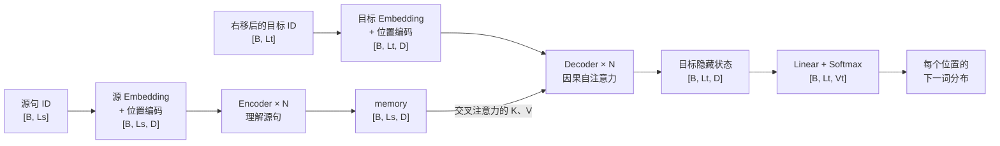
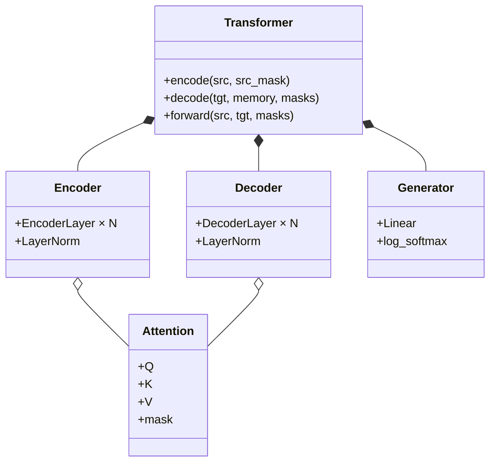

# 第 2 节：总体架构文字版：Encoder 理解，Decoder 生成

> 教材编号 2/38 · 原视频 P107 仅作可选溯源：[打开这一集](https://www.bilibili.com/video/BV14mdfBDE4Q?p=107)（不看视频也能完成本节）

[← 上一节：1 Transformer 的由来：为什么不再逐词递归](./01-transformer-origin.md) · [返回总目录](./README.md) · [下一节：3 架构图上半部分：看懂 Encoder 数据流 →](./03-transformer-diagram-upper.md)

## 这节解决什么问题

源句先由 Encoder 变成带上下文的 memory；Decoder 一边看已经给出的目标前缀，一边查询 memory，预测下一个词。


图要沿箭头或结构层级阅读。先说清楚数据从哪里来、形状怎样变化，再记组件名称。

## 不看视频也能学懂：先把陌生词压缩成 8 个

这一节第一次出现的名词很多，但真正的新关系只有一条：**把已知的源句压成一份可查询的记忆，再根据已经写出的目标前缀预测下一个词。** 先把下面 8 个词弄清楚，后面的框图就不会只剩方框。

| 名词 | 在本节中只需要这样理解 |
|---|---|
| token | 分词后送入模型的单位，例如“我”“爱”“你”或 `<BOS>` |
| token ID | token 在词表里的整数编号；编号只表示身份，不表示大小 |
| Embedding | 用 ID 查表，取出长度为 `D` 的向量 |
| 位置编码 | 给向量补上“这是第几个位置”的信息 |
| Encoder | 把源句每个位置改写成包含上下文的表示 |
| memory | Encoder 的全部输出；不是一条摘要，而是源句每个位置各有一个向量 |
| Decoder | 同时查看目标前缀和 memory，产生目标侧隐藏表示 |
| Generator | `Linear + Softmax/LogSoftmax`，把隐藏向量变成目标词表上的分数或概率 |

这一节统一采用 `batch_first=True` 的形状顺序：

```text
B = 一次处理的句子数
Ls = 源句 token 数
Lt = 当前目标序列 token 数
D = 每个隐藏向量的宽度
Vs / Vt = 源词表 / 目标词表大小
```

于是 `[B, Ls, D]` 的意思不是三个神秘参数，而是：`B` 句话，每句话有 `Ls` 个位置，每个位置用 `D` 个数字表示。

## 用“我爱你 → I love you”完整走一遍训练

先看一条已经对齐的训练样本：

```text
源句：我 爱 你
目标：I love you
```

为了让模型学会何时开始和结束，目标侧还会加入特殊 token：

```text
完整目标：<BOS> I love you <EOS>
```

### 第 1 步：源句变成 Encoder 能处理的张量

假设源词表把 `我、爱、你` 编成 `[8, 21, 35]`。ID 经过 Embedding 查表，再加位置编码：

```text
src_ids             [1, 3]
src_embedding       [1, 3, D]
+ position          [1, 3, D]
Encoder memory      [1, 3, D]
```

序列长度仍是 3。Encoder 没把整句压成一个向量，而是为三个源位置都产生一份带上下文的表示。例如“爱”位置的向量现在不只表示“爱”这个词，还混入了它与“我”“你”的关系。

### 第 2 步：把一个目标序列错开一格，自动制造训练题

训练时完整译文是已知的，但不能让当前位置直接看到它要预测的答案。做法是把同一条目标序列切成两份：

| 位置 | 1 | 2 | 3 | 4 |
|---|---|---|---|---|
| Decoder 输入 `tgt_in` | `<BOS>` | `I` | `love` | `you` |
| 正确标签 `tgt_out` | `I` | `love` | `you` | `<EOS>` |

这叫**右移目标序列**。第 3 列的训练题可以读成：“已知前缀 `<BOS> I`，再结合源句 `我爱你`，下一个词应该是什么？”答案是 `love`。

### 第 3 步：Decoder 先看目标前缀，但不能偷看未来

Decoder 的第一个子层是带因果 mask 的自注意力：

```text
预测 I       只能看 <BOS>
预测 love    可以看 <BOS>, I
预测 you     可以看 <BOS>, I, love
预测 <EOS>   可以看 <BOS>, I, love, you
```

训练时四个位置可以并行计算，但 mask 会把右上角“未来答案”挡住。**并行计算不等于允许偷看未来。**

### 第 4 步：Decoder 再用当前目标状态查询源句 memory

第二个子层是交叉注意力。以准备预测 `love` 的位置为例：

```text
Query：当前目标位置的状态（它已经知道前缀 <BOS> I）
Key：  源句 memory 的三个位置
Value：源句 memory 的三个位置
```

可以把它理解为：当前正在写英文第二个词，于是拿着“我已经写了 I，现在需要下一个词”的问题，去源句的三个位置中寻找最相关的信息。此时通常会重点读取“爱”，但权重是模型学出来的，不是人工指定的词对齐规则。

### 第 5 步：Generator 为每个位置给整个目标词表打分

若目标词表有 `Vt=10,000` 个 token：

```text
Decoder 隐藏状态   [1, 4, D]
Linear logits      [1, 4, 10000]
Softmax 后概率     [1, 4, 10000]
正确标签           [1, 4]
```

第 2 个位置的 10,000 个数分别表示“下一个 token 是词表中每个候选词”的分数。训练损失会把这组分布与正确标签 `love` 比较；反向传播再调整 Embedding、Attention、FFN 和 Generator 中的参数。

### 第 6 步：四个位置一起算损失

一次训练不是只学 `I → love`。这条样本同时产生四道下一词预测题：

```text
<BOS>                 → I
<BOS> I               → love
<BOS> I love          → you
<BOS> I love you      → <EOS>
```

到这里，四大部分就不再只是需要背诵的名词：输入部分准备两路数字；Encoder 写 memory；Decoder 根据“目标前缀 + memory”产生状态；Generator 把状态变成下一词分布。

## 训练和真正翻译，最容易混淆的地方

训练时，正确译文存在，所以可以一次准备出整张 `tgt_in`，用 mask 并行计算所有位置。真正翻译一句新句子时，没有正确目标可供右移，只能从 `<BOS>` 开始循环：

```text
第 1 次：<BOS>                  → 预测 I
第 2 次：<BOS> I                → 预测 love
第 3 次：<BOS> I love           → 预测 you
第 4 次：<BOS> I love you       → 预测 <EOS>，停止
```

因此“Transformer 能并行训练”不等于“自回归生成时所有词也能同时凭空出现”。不使用 KV cache 的朴素实现会在每一步重新计算前缀；实际系统常缓存已经算过的 Key/Value 来减少重复计算，但缓存不改变“下一个 token 依赖已生成前缀”这一逻辑。

## 三种 Attention 到底是谁问谁

| 位置 | Query 来自 | Key / Value 来自 | 它解决的问题 |
|---|---|---|---|
| Encoder 自注意力 | 源句 | 源句 | 每个源词读取其他源词，形成上下文表示 |
| Decoder 因果自注意力 | 目标前缀 | 目标前缀 | 当前目标位置读取已经出现的目标词 |
| Decoder 交叉注意力 | Decoder 当前状态 | Encoder memory | 当前目标位置从源句中取翻译所需的信息 |

“Self-Attention”中的 `Self` 表示 Q、K、V 来自同一条序列，不表示模型只看自己一个位置；“Cross-Attention”才表示查询和被查询的信息来自两侧。

## 再看组件层级：不要把“层”和“整个模块”叫混

```text
组件：Multi-Head Attention、FFN、LayerNorm、残差、Dropout
  ↓ 组件装进带残差和归一化的外壳
子层：注意力子层 / FFN 子层
  ↓ 多个子层按顺序组合
EncoderLayer 或 DecoderLayer
  ↓ 独立参数的层重复 N 次
Encoder 或 Decoder
  ↓ 两侧再加 Embedding、位置编码和 Generator
完整 Transformer
```

原论文的基础配置使用 6 个 EncoderLayer 和 6 个 DecoderLayer，但“6”是一个架构配置，不是 Encoder 这个概念的定义。课程后面的练习可以为了更快运行改成 2 层，数据流仍然相同。

## 本节边界：现在懂到什么程度就够了

学完本节，你应该能用上面的翻译例子说明每条箭头在传什么；暂时不要求手算注意力权重、正弦位置编码或 LayerNorm。反过来，只会背“输入、Encoder、Decoder、输出”还不算过关，因为那无法回答下面三个问题：

1. Decoder 训练输入为什么要右移？
2. memory 为什么保留源句长度 `Ls`？
3. 预测 `love` 时，Decoder 的两种注意力分别读取什么？

## 老师原声整理稿（按讲解顺序）

### 0:00–2:10　先明确这一节的目标

老师开头说，这一节只要求先看懂 Transformer 的“总架构”，还不要求马上知道每个公式怎么计算。学习目标有两个：第一，能说出模型由哪四部分组成；第二，能继续说出每一部分里面有哪些层、这些层大致负责什么。

老师把任务背景放在机器翻译上：输入是一句已知英语，目标是一句已知法语，模型学习从一种语言到另一种语言的映射。他还顺带提到预训练模型和迁移学习：别人已经在大量数据上训练好模型，我们可以加载它，再针对自己的任务继续使用。这里先记概念，后面有专门专题。

### 2:10–4:30　完整模型不是两个框，而是四个部分

老师指着架构图从下往上辨认：

1. **输入部分**：接收源文本和训练时的目标文本。
2. **编码器 Encoder**：左侧大模块，处理源句。
3. **解码器 Decoder**：右侧大模块，处理目标前缀并读取编码结果。
4. **输出部分**：最上方的 Linear 与 Softmax，把隐藏表示变成预测。

只回答“四部分是输入、编码、解码、输出”还不够。老师用“别人问你学了什么，你只回答小学、初中、高中、大学”作类比：分类名称对了，却没说明具体内容。面试或自测时必须继续展开内部层级。

图中每个 Attention 方框都离不开 Q、K、V。现在不需要计算，但要形成习惯：看到 Attention，就问“谁提供 Query，谁提供 Key，谁提供 Value”。

### 4:30–8:20　输入部分：词义和位置缺一不可

Embedding 把 token ID 查成稠密向量，让模型能用数字表示词义。随后加入 Positional Encoding。

老师用“我爱你”和“你爱我”说明位置的重要性。两句话拥有相同的词，顺序不同，角色和语义就不同。单纯注意力不天然包含先后；位置编码相当于给每个词加坐标。

训练翻译模型时有两路输入：左边是已知源语言句子，右边是右移后的目标语言句子。最上方才是模型预测的目标分布。不要把“训练时输入的目标句”和“模型最终预测”混成一个东西。

### 8:20–13:40　四级层级：组件 → 子层 → 编码器层 → 编码器

这一段是老师反复强调的重点：

- **组件**：Attention、Feed Forward、LayerNorm、残差连接等零件。
- **子层 Sublayer**：把某个组件放进带残差和归一化的通用外壳。
- **编码器层 EncoderLayer**：由自注意力子层和 FFN 子层组成。
- **编码器 Encoder**：由 N 个 EncoderLayer 堆叠组成，原论文典型配置 N=6。

所以“一个编码器有六个编码器”是错误说法，正确的是“一个 Encoder 由六个 EncoderLayer 组成”。N 也不是只能等于 6；增加层数可能提高容量，同时增加计算量。

### 13:40–18:30　Decoder 为什么有三个子层

Decoder 的层级结构相似，但每个 DecoderLayer 有三个子层：

1. 带因果 mask 的目标自注意力。
2. 读取 Encoder memory 的交叉注意力。
3. Position-wise FFN。

这就是 Decoder 后面讲得更快的原因：残差、归一化、FFN 和普通多头注意力已经实现，可以复用。图中从 Encoder 连到 Decoder 的线表示各 DecoderLayer 都能读取同一份 memory；DecoderLayer 之间还会逐层传递目标隐藏状态。

### 18:30–21:35　输出部分：先得到分数，再得到概率

Decoder 输出仍是 d_model 维隐藏向量。Linear 把它投影到目标词表大小 V。若词表有 10,000 个词，就为每个位置产生 10,000 个分数；随后 Softmax 把这些分数转成和为 1 的概率。

Linear 输出的是 logits，不是概率。真正生成时也不一定永远选最大概率词，还可能采样或使用 beam search；这一节先理解“隐藏状态 → 词表分布”。

### 21:35–23:19　老师最后检查什么

老师用选择题复习：输入负责词嵌入与位置编码；Encoder 把源信息加工后交给 Decoder；Decoder 自注意力会对目标序列位置分配权重。

最后要求手绘架构图，目的不是练美术，而是强迫自己重建层级和连线。若能不看原图画出四大部分、Encoder 的两个子层、Decoder 的三个子层和 Encoder→Decoder 连接，才算真正读懂总架构。

## 辅助流程图


```mermaid
flowchart LR
    S["源句 ID<br/>[B, Ls]"] --> SE["源 Embedding<br/>+ 位置编码<br/>[B, Ls, D]"]
    SE --> ENC["Encoder × N<br/>理解源句"]
    ENC --> MEM["memory<br/>[B, Ls, D]"]

    T["右移后的目标 ID<br/>[B, Lt]"] --> TE["目标 Embedding<br/>+ 位置编码<br/>[B, Lt, D]"]
    TE --> DEC["Decoder × N<br/>因果自注意力"]
    MEM -->|"交叉注意力的 K、V"| DEC
    DEC --> H["目标隐藏状态<br/>[B, Lt, D]"]
    H --> GEN["Linear + Softmax<br/>[B, Lt, Vt]"]
    GEN --> P["每个位置的<br/>下一词分布"]
```

读图时不要从组件名称开始。先沿着蓝图中的两路输入找：源句进入 Encoder 后成为 `memory`；右移目标进入 Decoder，并在每一层查询同一份 `memory`。最后只有 Generator 会把最后一维从 `D` 改成目标词表大小 `Vt`。

### 组件层级图


```mermaid
classDiagram
    class Transformer {
      +encode(src, src_mask)
      +decode(tgt, memory, masks)
      +forward(src, tgt, masks)
    }
    class Encoder {
      +EncoderLayer × N
      +LayerNorm
    }
    class Decoder {
      +DecoderLayer × N
      +LayerNorm
    }
    class Attention {
      +Q
      +K
      +V
      +mask
    }
    class Generator {
      +Linear
      +log_softmax
    }
    Transformer *-- Encoder
    Transformer *-- Decoder
    Transformer *-- Generator
    Encoder o-- Attention
    Decoder o-- Attention
```

## 完整原声逐段记录

[查看本节按时间戳整理的完整音轨转写](./transcripts/p107.md)

这份逐段记录用于核查老师讲过的内容是否遗漏；学习时优先阅读上面的校正文章，遇到想追溯的细节再按时间戳查看原声记录。

## 零基础先记住

- 输入部分：Embedding + Positional Encoding
- Encoder 与 Decoder 都由重复层堆叠
- Generator 把 Decoder 隐藏状态映射为目标词表概率

## 最小可运行代码

下面代码默认从项目根目录运行，使用 [transformer_from_scratch](../../transformer_from_scratch/README.md) 中经过测试的 PyTorch 实现。这里不假装用随机参数完成翻译；它只验证本节最重要的接口：目标右移、mask 和四个关键形状。

```python
import torch

from transformer_from_scratch import make_model, subsequent_mask

torch.manual_seed(0)

# 约定：0=<PAD>, 1=<BOS>, 2=<EOS>。
# src 表示“我 爱 你”；完整目标表示“<BOS> I love you <EOS>”。
src = torch.tensor([[8, 21, 35]])
tgt_full = torch.tensor([[1, 11, 27, 42, 2]])

# 同一目标错开一格：左边喂给 Decoder，右边作为正确答案。
tgt_in = tgt_full[:, :-1]
tgt_out = tgt_full[:, 1:]

model = make_model(
    src_vocab=50,
    tgt_vocab=60,
    n=2,
    d_model=32,
    d_ff=64,
    h=4,
    dropout=0.0,
)

src_mask = (src != 0).unsqueeze(1)       # [B, 1, Ls]
tgt_mask = subsequent_mask(tgt_in.size(1))

memory = model.encode(src, src_mask)
decoder_hidden = model.decode(tgt_in, memory, src_mask, tgt_mask)
log_probs = model.generator(decoder_hidden)

print("src:", src.shape)                    # [1, 3]
print("tgt_in / tgt_out:", tgt_in.shape, tgt_out.shape)  # [1, 4] [1, 4]
print("memory:", memory.shape)              # [1, 3, 32]
print("decoder_hidden:", decoder_hidden.shape)  # [1, 4, 32]
print("log_probs:", log_probs.shape)        # [1, 4, 60]

# 训练时可把 [B, Lt, Vt] 与 [B, Lt] 展平后计算 NLLLoss。
loss = torch.nn.functional.nll_loss(
    log_probs.reshape(-1, log_probs.size(-1)),
    tgt_out.reshape(-1),
)
print("loss:", float(loss.detach()))
```

### 输入和输出怎么看

`memory` 的长度是 3，因为它对应源句三个位置；`decoder_hidden` 的长度是 4，因为训练时一共产生四道下一词预测题；`log_probs` 最后一维是 60，因为示例目标词表有 60 个候选 token。随机初始化模型得到的词并没有意义，只有经过真实平行语料训练后，概率分布才可能表达翻译关系。

## 最容易踩的坑

1. **把 memory 当成一个句向量**：它通常仍是 `[B, Ls, D]`，保留所有源位置。
2. **把训练目标原封不动喂进去再预测自己**：正确做法是 `tgt_in = target[:-1]`、`tgt_out = target[1:]`，再用因果 mask 防止未来泄露。
3. **把 Decoder 输出当成词表概率**：Decoder 先输出 `[B, Lt, D]`；经过 Generator 才得到 `[B, Lt, Vt]`。
4. **认为六层共享同一套参数**：每层结构相同，但通常拥有独立参数；重复的是结构，不是同一个对象被调用六次。
5. **认为原论文的 6 层是永远正确的层数**：层数是可配置超参数，改变它会改变容量、计算和显存。

## 本节知识链

`源词元 → Encoder → memory → Decoder → 词表概率`

Transformer 学习的主线始终是形状。每经过一个箭头，都问自己：batch、序列长度、特征维、头数和词表维中的哪一个发生了变化？

## 自测

### 题 1：memory 跟谁等长？

`src` 形状是 `[2, 7]`，`tgt_in` 形状是 `[2, 5]`，`D=64`。`memory` 和 Decoder 隐藏状态分别是什么形状？

<details>
<summary>点开核对答案</summary>

`memory=[2, 7, 64]`，因为它是 Encoder 对 7 个源位置的表示。Decoder 隐藏状态是 `[2, 5, 64]`，因为它对应 5 个目标输入位置。

</details>

### 题 2：训练输入和标签怎样切？

完整目标是 `<BOS> I love NLP <EOS>`。写出 `tgt_in` 和 `tgt_out`。

<details>
<summary>点开核对答案</summary>

`tgt_in=<BOS> I love NLP`，`tgt_out=I love NLP <EOS>`。两个序列等长，位置一一对应，每一格都在预测下一格。

</details>

### 题 3：预测 `love` 时，两种注意力分别看什么？

<details>
<summary>点开核对答案</summary>

Decoder 因果自注意力读取已经出现的目标前缀 `<BOS> I`；交叉注意力用当前目标状态作 Query，读取 Encoder 对整个源句“我 爱 你”产生的 memory。它不能在自注意力里看到未来的 `love` 或 `you`。

</details>

## 技术依据与版本边界

- 原始 Transformer 论文的基础翻译模型采用编码器—解码器结构，并在基础配置中各堆叠 6 层：[Attention Is All You Need](https://arxiv.org/abs/1706.03762)。
- 本课程统一用 `batch_first=True` 写成 `[B, L, D]`；PyTorch 也支持默认的 `[L, B, D]`，不要把轴顺序差异误认为模型原理不同：[torch.nn.Transformer 形状说明](https://docs.pytorch.org/docs/stable/generated/torch.nn.Transformer.html)。
- 课程仓库的 `transformer_from_scratch` 为了更易训练采用 Pre-LN；原论文图使用的是残差后再 LayerNorm 的 Post-LN。两者归一化位置不同，但不改变本节的四部分数据流。

## 学完检查

- [ ] 我能不用术语解释本节组件解决的问题
- [ ] 我能在运行前写出关键张量形状
- [ ] 我能指出 Q、K、V 或 mask 的来源
- [ ] 我知道代码“形状正确但逻辑可能错误”的情况
- [ ] 我能独立回答自测题

[← 上一节：1 Transformer 的由来：为什么不再逐词递归](./01-transformer-origin.md) · [返回总目录](./README.md) · [下一节：3 架构图上半部分：看懂 Encoder 数据流 →](./03-transformer-diagram-upper.md)
