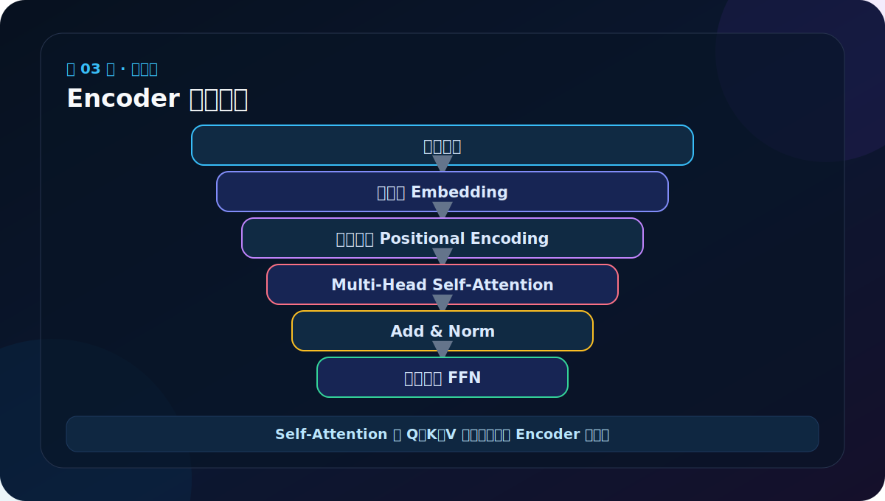
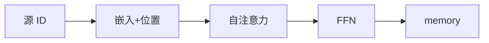
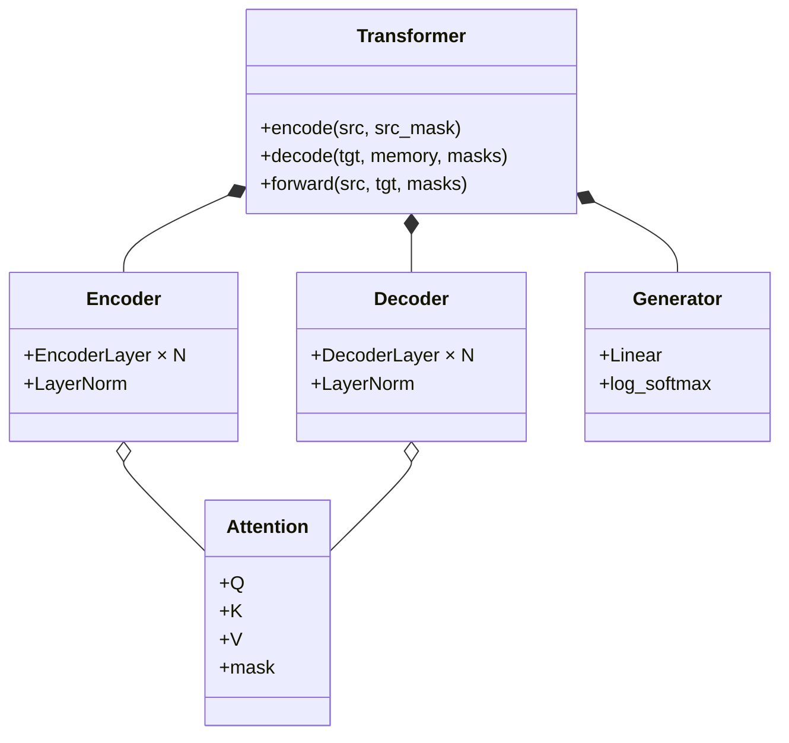

# 第 3 节：架构图上半部分：看懂 Encoder 数据流

> 笔记编号 3/38 · 对应原视频 P108 · [打开这一集](https://www.bilibili.com/video/BV14mdfBDE4Q?p=108)

[← 上一节：2 总体架构文字版：Encoder 理解，Decoder 生成](./02-transformer-architecture-text.md) · [返回总目录](./README.md) · [下一节：4 架构图下半部分：Decoder 为什么有两种注意力 →](./04-transformer-diagram-lower.md)

## 这节解决什么问题

源词 ID 经过词嵌入和位置编码，进入若干相同结构的 EncoderLayer；每层依次做自注意力和前馈网络，并用残差与归一化包住子层。



图要沿箭头或结构层级阅读。先说清楚数据从哪里来、形状怎样变化，再记组件名称。

## 老师原声整理稿（按讲解顺序）

### 0:00–1:40　只看左半边，把 Encoder 单独拆出来

上一节先认了完整架构，这一节老师把图的左半边放大，要求沿着一条数据路线讲清楚 Encoder。源语言句子从底部进入，经过输入处理，再进入一层层 EncoderLayer，顶部得到供 Decoder 使用的 memory。

这里不要急着背类名。先抓住方向：**原始 token → 带词义和位置的向量 → 上下文表示 → 更深的上下文表示**。

### 1:40–4:20　Embedding 和位置编码为什么必须相加

Embedding 把离散词编号变成连续向量；它回答“这是什么词”。但仅有词向量不能可靠表达顺序。老师再次用词序改变句义的例子说明，“我打你”和“你打我”用到相同的三个字，施事与受事却完全交换了。

位置编码回答“这个词站在哪里”。二者形状都是 [B,L,D]，逐元素相加后仍保持统一形状，才能送给下一层。这里的“相加”不是把词义覆盖掉，而是让每个位置同时携带内容信号和坐标信号。

### 4:20–8:30　多头自注意力：让每个词从整句读取信息

EncoderLayer 的第一个核心计算是 Multi-Head Self-Attention。“Self”表示 Q、K、V 都来自当前这份源序列表示。每个词作为 Query，去和全句各位置的 Key 比较，再按权重汇总 Value。

老师用“从多个角度观察”来解释多头：同一句话不能只用一种关系分析。一个头可能关注主谓关系，一个头可能关注动宾关系，另一个头可能关注远距离修饰。类似几名士兵或几组观察员各自侦察，最后把报告合并。以“猫追老鼠”为例，模型不仅要看到三个孤立词，还要学会谁执行动作、动作指向谁。

多头不等于简单复制相同结果。每个头有自己的线性投影参数，因此能进入不同表示子空间。

### 8:30–11:10　Add 与 Norm：旧信息要保留，训练也要稳定

注意力输出后不是直接丢给下一模块，而要经过 Add & Norm：

1. Add 是残差连接，把子层输入与子层输出相加。即使新计算暂时学得不好，旧信息仍有直接通路；深层网络的梯度也更容易传播。
2. Norm 是 Layer Normalization，把每个位置的特征尺度整理得更稳定，减轻层层堆叠时数值漂移。

所以图上的 Add & Norm 不是一个神秘算法，而是“残差相加 + 归一化”的组合外壳。

### 11:10–13:40　FFN：交流之后，每个位置自己加工

注意力解决不同位置之间的信息交换，Position-wise Feed Forward Network 则对每个位置独立做非线性变换。可以理解为先开会交流，再让每个人拿着交流结果独立思考、整理。

FFN 通常先把 d_model 扩大到 d_ff，加入非线性，再投回 d_model。它不直接混合不同位置；所有位置共享同一套参数。FFN 后面再次使用残差连接与归一化，因此一个 EncoderLayer 共有两个子层。

### 13:40–16:20　N× 的真正含义

图中的 N× 表示把整个 EncoderLayer 堆叠 N 次，原论文典型设置为 6。第 1 层输出成为第 2 层输入，如此逐层提炼。老师用“领导分析问题要多想几层”作类比：第一层捕获直接关系，后续层可组合出更抽象的关系。

必须区分：Encoder 是完整编码器；EncoderLayer 是其中可重复的一层；Attention 和 FFN 又是层中的组件。说清这三级，后面写类时才不会把容器和零件混成一件事。

### 本节主线

源 token 先获得词义与位置，经过“自注意力交流 → 残差归一化 → FFN 加工 → 残差归一化”，再把这一整层重复 N 次。Encoder 顶部输出的不是翻译结果，而是携带整句上下文的 memory。

## 辅助流程图



### 组件层级图



## 完整原声逐段记录

[查看本节按时间戳整理的完整音轨转写](./transcripts/p108.md)

这份逐段记录用于核查老师讲过的内容是否遗漏；学习时优先阅读上面的校正文章，遇到想追溯的细节再按时间戳查看原声记录。

## 零基础先记住

- Self-Attention 中 Q=K=V，都来自当前源序列表示
- 注意力混合不同位置的信息
- FFN 独立加工每个位置内部的特征

## 最小可运行代码

下面代码默认从项目根目录运行。涉及模型组件时，使用 [transformer_from_scratch](../../transformer_from_scratch/README.md) 中经过测试的 PyTorch 实现。

```python
flow = ["src ids", "Embedding + PE", "Self-Attention", "FFN", "memory"]
print(" -> ".join(flow))
```

### 输入和输出怎么看

这条主线要能背着图口述。真实模型中 Attention 和 FFN 外面还各有残差、Dropout 与 LayerNorm。

## 最容易踩的坑

Encoder 自注意力不是只看前文；非生成式编码通常允许一个位置同时看左右文，只屏蔽 PAD。

## 本节知识链

`源 ID → 嵌入+位置 → 自注意力 → FFN → memory`

Transformer 学习的主线始终是形状。每经过一个箭头，都问自己：batch、序列长度、特征维、头数和词表维中的哪一个发生了变化？

## 自测

**问题：EncoderLayer 中是谁负责跨位置混合，谁负责特征维变换？**

<details>
<summary>点开核对答案</summary>

Self-Attention 跨位置混合；Position-wise FFN 在每个位置独立变换特征。

</details>

## 学完检查

- [ ] 我能不用术语解释本节组件解决的问题
- [ ] 我能在运行前写出关键张量形状
- [ ] 我能指出 Q、K、V 或 mask 的来源
- [ ] 我知道代码“形状正确但逻辑可能错误”的情况
- [ ] 我能独立回答自测题

[← 上一节：2 总体架构文字版：Encoder 理解，Decoder 生成](./02-transformer-architecture-text.md) · [返回总目录](./README.md) · [下一节：4 架构图下半部分：Decoder 为什么有两种注意力 →](./04-transformer-diagram-lower.md)
