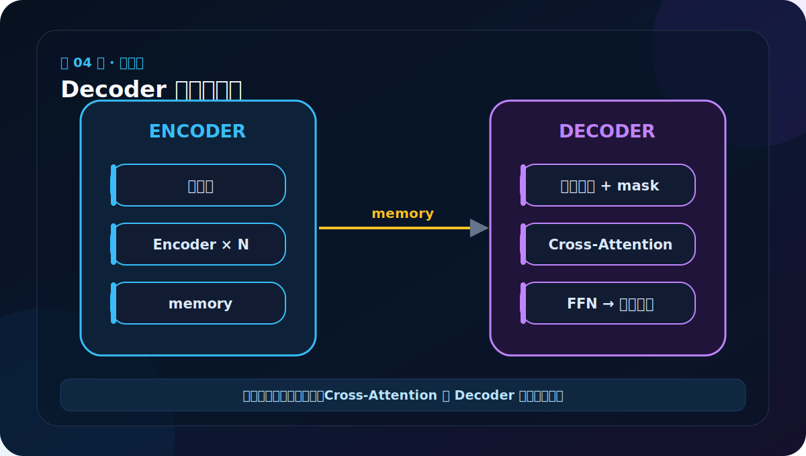
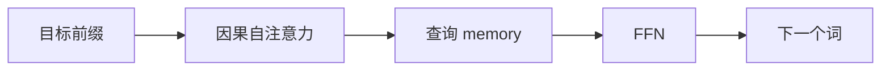
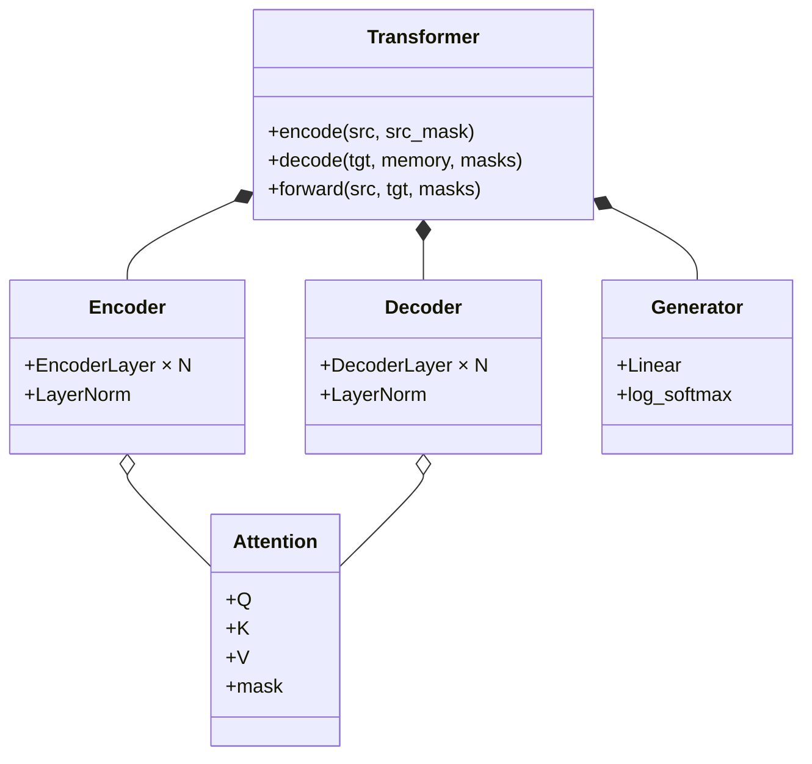

# 第 4 节：架构图下半部分：Decoder 为什么有两种注意力

> 笔记编号 4/38 · 对应原视频 P109 · [打开这一集](https://www.bilibili.com/video/BV14mdfBDE4Q?p=109)

[← 上一节：3 架构图上半部分：看懂 Encoder 数据流](./03-transformer-diagram-upper.md) · [返回总目录](./README.md) · [下一节：5 从零实现路线：先零件，再整机 →](./05-transformer-learning-roadmap.md)

## 这节解决什么问题

Decoder 先对目标前缀做带因果掩码的自注意力，再用目标状态作 Q、Encoder memory 作 K/V 做交叉注意力。



图要沿箭头或结构层级阅读。先说清楚数据从哪里来、形状怎样变化，再记组件名称。

## 老师原声整理稿（按讲解顺序）

### 0:00–1:50　沿右半边追踪 Decoder

老师接着画完整架构的右半边。Decoder 的底部接收目标侧序列，先经过目标词 Embedding 与位置编码；中间由多层 DecoderLayer 处理；顶部再交给 Linear 和 Softmax 产生词表预测。

训练时目标句会右移一位作为输入。例如希望模型输出“我爱你”，输入可能从起始符开始，让模型依次预测“我”“爱”“你”。因此底部的目标输入和顶部的目标预测不是同一个概念。

### 1:50–5:20　第一个子层必须 Mask：不许偷看答案

DecoderLayer 的第一种注意力是 Masked Multi-Head Self-Attention。它仍是目标序列内部的自注意力，但每个位置只能读取自己和过去，不能读取未来。

老师用“预测第三个词”解释：训练数据中完整目标句已经装进张量，如果不加 mask，当前位置会直接看到第三个词甚至后面的词，相当于考试时翻答案。训练损失可能看起来很低，真正生成时却没有未来答案可看，模型就会失效。

因果 mask 通常是下三角允许矩阵。第 i 行只开放第 0 到第 i 列。这里要一直记住矩阵约定：行对应 Query 位置，列对应 Key 位置。

### 5:20–9:10　第二个子层是交叉注意力：去源句里找依据

Decoder 的第二种注意力是 Encoder–Decoder Attention，也叫 Cross-Attention。它连接左右两半：

- Query 来自 Decoder 当前目标状态；
- Key 和 Value 来自 Encoder 顶部输出的 memory。

可以把它想成目标侧带着问题去英文源句中检索。例如准备生成法语中的某个词时，Query 表达“我现在缺什么信息”，Key 帮助判断源句哪些位置相关，Value 提供实际读取的源语义。这样 Decoder 才能建立源词与目标词之间并不总是一一对应的对齐关系。

### 9:10–11:50　FFN、残差和归一化继续复用

交叉注意力后还有 Position-wise FFN；三个核心计算外面都配有残差连接和归一化。一个 DecoderLayer 因此包含三个子层：

1. masked target self-attention；
2. source–target cross-attention；
3. position-wise FFN。

完整 Decoder 再把 DecoderLayer 堆叠 N 次。这里大量结构都能复用 Encoder 阶段已经实现的组件，新的关键差异主要是因果 mask 与 Q/K/V 来源。

### 11:50–14:40　Linear 与 Softmax 把隐藏向量变成词

Decoder 顶部输出仍是 [B,Lt,d_model] 隐藏表示。Linear 将最后一维从 d_model 投影到目标词表大小 V，得到每个候选词的 logits；Softmax 再把 logits 变成概率分布。

若目标词表有 10,000 个 token，每个目标位置就会得到 10,000 个分数。最大概率项可作为简单预测，实际生成还可能使用采样或 beam search。

### 14:40–结束　两类注意力的形状不要混

目标自注意力的 Query 和 Key 都有 Lt 个位置，权重矩阵最后两维为 Lt×Lt；交叉注意力中 Query 长度是 Lt，Key 长度是源句 Ls，因此为 Lt×Ls。源句和目标句长度不同完全正常。

读 Decoder 图时，先问“这一块 Q、K、V 分别从哪来”，再问“是否需要 mask”。能回答这两个问题，就已经抓住右半边最关键的逻辑。

## 辅助流程图



### 组件层级图



## 完整原声逐段记录

[查看本节按时间戳整理的完整音轨转写](./transcripts/p109.md)

这份逐段记录用于核查老师讲过的内容是否遗漏；学习时优先阅读上面的校正文章，遇到想追溯的细节再按时间戳查看原声记录。

## 零基础先记住

- Masked Self-Attention 防止训练时偷看未来目标词
- Cross-Attention 让目标侧查询源句信息
- Decoder 比 Encoder 多一个注意力子层

## 最小可运行代码

下面代码默认从项目根目录运行。涉及模型组件时，使用 [transformer_from_scratch](../../transformer_from_scratch/README.md) 中经过测试的 PyTorch 实现。

```python
roles = {
    "decoder self-attn": "Q=tgt, K=tgt, V=tgt",
    "cross-attn": "Q=tgt, K=memory, V=memory",
}
for name, value in roles.items():
    print(name, ":", value)
```

### 输入和输出怎么看

两行输出必须形成肌肉记忆。出错时首先检查 Q/K/V 来源和对应 mask。

## 最容易踩的坑

交叉注意力的 Q 长度是 Lt，K/V 长度是 Ls，所以注意力分数是 [B,h,Lt,Ls]，两种长度不必相同。

## 本节知识链

`目标前缀 → 因果自注意力 → 查询 memory → FFN → 下一个词`

Transformer 学习的主线始终是形状。每经过一个箭头，都问自己：batch、序列长度、特征维、头数和词表维中的哪一个发生了变化？

## 自测

**问题：为什么 Cross-Attention 的 K 和 V 都来自 memory？**

<details>
<summary>点开核对答案</summary>

Decoder 用目标状态提出查询，去源序列表示中匹配位置并读取对应信息。

</details>

## 学完检查

- [ ] 我能不用术语解释本节组件解决的问题
- [ ] 我能在运行前写出关键张量形状
- [ ] 我能指出 Q、K、V 或 mask 的来源
- [ ] 我知道代码“形状正确但逻辑可能错误”的情况
- [ ] 我能独立回答自测题

[← 上一节：3 架构图上半部分：看懂 Encoder 数据流](./03-transformer-diagram-upper.md) · [返回总目录](./README.md) · [下一节：5 从零实现路线：先零件，再整机 →](./05-transformer-learning-roadmap.md)
