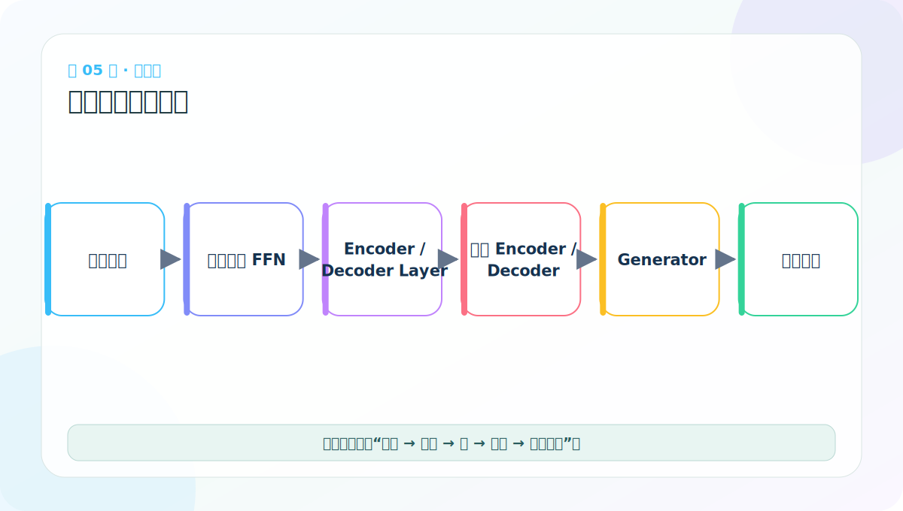
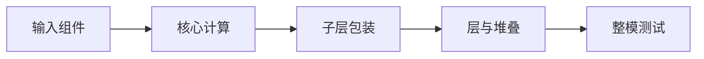

# 第 5 节：从零实现路线：先零件，再整机

> 笔记编号 5/38 · 对应原视频 P110 · [打开这一集](https://www.bilibili.com/video/BV14mdfBDE4Q?p=110)

[← 上一节：4 架构图下半部分：Decoder 为什么有两种注意力](./04-transformer-diagram-lower.md) · [返回总目录](./README.md) · [下一节：6 Token Embedding：把 ID 查成向量 →](./06-token-embedding-code.md)

## 这节解决什么问题

Transformer 代码看起来大，是因为许多小组件嵌套。按输入组件、注意力、子层、层、堆叠、整模逐级实现，每次只验证一个接口。



图要沿箭头或结构层级阅读。先说清楚数据从哪里来、形状怎样变化，再记组件名称。

## 老师原声整理稿（按讲解顺序）

### 0:00–2:30　为什么不直接从完整模型代码开始

老师这一节先安排实现顺序。完整 Transformer 包含许多类，如果一上来复制几百行代码，报错时很难知道是哪一层出了问题。正确方法是按依赖关系，从不会再拆的小零件开始，每完成一个组件就做最小测试。

这也对应前面学过的层级：组件先正确，才能包装成子层；子层先正确，才能组合成 EncoderLayer 与 DecoderLayer；Layer 正确后才能堆叠为 Encoder 和 Decoder。

### 2:30–5:10　第一组：输入组件

首先实现 Embeddings 和 PositionalEncoding。需要验证：

- token ID 的 [B,L] 是否变成 [B,L,D]；
- 位置表切片能否广播到 batch；
- 两者相加后形状是否不变；
- dropout 在训练与测试模式下行为是否符合预期。

输入端错误会污染后面所有计算，所以先用很小的张量把形状和数值打印清楚。

### 5:10–8:50　第二组：Attention 与 FFN 基础件

接着实现 subsequent_mask、scaled dot-product attention、多头注意力和 position-wise FFN。顺序不能颠倒：多头注意力内部依赖单头 attention，而 Decoder 的自注意力又依赖 mask。

老师强调每一步都要验证性质，而不只是“代码能运行”：mask 上三角是否真的禁止；注意力沿 Key 维的权重和是否为 1；被屏蔽位置权重是否为 0；拆头和合头前后元素总量是否一致。

### 8:50–11:40　第三组：通用包装件与层

然后实现 LayerNorm、SublayerConnection 和 clones。SublayerConnection 把 LayerNorm、具体子层、Dropout、残差相加组织成统一流程；EncoderLayer 和 DecoderLayer 都会复用它。

有了这些基础件，再组合 EncoderLayer，堆叠为 Encoder；组合 DecoderLayer，堆叠为 Decoder。代码结构应与架构图一一对应，类名也应表达语义。

### 11:40–14:10　文件名和模块组织也属于学习内容

老师提醒不要把 Python 文件只命名为 1.py、2.py。数字文件名既不表达用途，也不便于正常 import。更合适的是 embedding.py、attention.py、encoder.py、decoder.py 等语义化名称。

为了教学可以按组件拆文件；真正项目也可按模块组织，但原则一样：名字让人一眼知道职责，依赖方向清楚，底层模块不应反过来导入整模。

### 14:10–结束　最后再组装输出与整模

Encoder 和 Decoder 都通过测试后，增加 Generator：Linear 把 d_model 投影到目标词表，log_softmax 给出对数概率。最后用 make_model 创建所需组件、深拷贝独立层、统一初始化参数并返回完整 EncoderDecoder。

整条实现路线可以口述为：

> 输入组件 → mask/attention/FFN → norm/残差外壳 → EncoderLayer/DecoderLayer → Encoder/Decoder → Generator → 完整模型。

每走一步都先检查形状，再检查数值性质，最后才做整模前向。这是老师安排代码顺序的真正目的：让错误被限制在刚写完的最小范围内。

## 辅助流程图




## 完整原声逐段记录

[查看本节按时间戳整理的完整音轨转写](./transcripts/p110.md)

这份逐段记录用于核查老师讲过的内容是否遗漏；学习时优先阅读上面的校正文章，遇到想追溯的细节再按时间戳查看原声记录。

## 零基础先记住

- 每一步先写形状契约，再写计算
- 组件测试通过后再组装，定位错误更容易
- 不要一上来照抄整份模型代码

## 最小可运行代码

下面代码默认从项目根目录运行。涉及模型组件时，使用 [transformer_from_scratch](../../transformer_from_scratch/README.md) 中经过测试的 PyTorch 实现。

```python
roadmap = ["Embedding/PE", "Mask/Attention", "MHA/FFN", "Norm/Residual",
           "Encoder/Decoder", "Generator/Full model"]
for step, name in enumerate(roadmap, 1):
    print(step, name)
```

### 输入和输出怎么看

输出六个实现阶段。配套代码正是按这个依赖顺序组织。

## 最容易踩的坑

能跑通整模不等于理解。初学时必须能说出每层输入输出形状，以及哪个维度被改变。

## 本节知识链

`输入组件 → 核心计算 → 子层包装 → 层与堆叠 → 整模测试`

Transformer 学习的主线始终是形状。每经过一个箭头，都问自己：batch、序列长度、特征维、头数和词表维中的哪一个发生了变化？

## 自测

**问题：为什么应先测试 subsequent_mask，再测试完整 Decoder？**

<details>
<summary>点开核对答案</summary>

Decoder 依赖 mask；先隔离验证能避免最终出错时无法区分是掩码还是层连接问题。

</details>

## 学完检查

- [ ] 我能不用术语解释本节组件解决的问题
- [ ] 我能在运行前写出关键张量形状
- [ ] 我能指出 Q、K、V 或 mask 的来源
- [ ] 我知道代码“形状正确但逻辑可能错误”的情况
- [ ] 我能独立回答自测题

[← 上一节：4 架构图下半部分：Decoder 为什么有两种注意力](./04-transformer-diagram-lower.md) · [返回总目录](./README.md) · [下一节：6 Token Embedding：把 ID 查成向量 →](./06-token-embedding-code.md)
