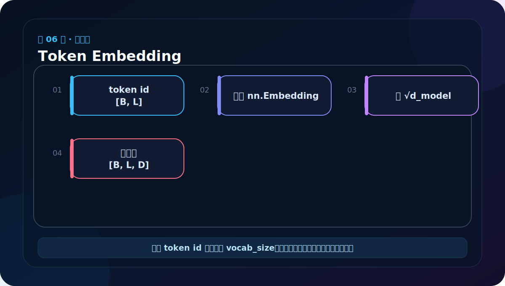
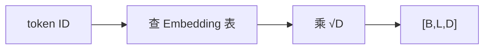

# 第 6 节：Token Embedding：把 ID 查成向量

> 笔记编号 6/38 · 对应原视频 P111 · [打开这一集](https://www.bilibili.com/video/BV14mdfBDE4Q?p=111)

[← 上一节：5 从零实现路线：先零件，再整机](./05-transformer-learning-roadmap.md) · [返回总目录](./README.md) · [下一节：7 正弦位置编码原理：让模型知道先后顺序 →](./07-positional-encoding-principle.md)

## 这节解决什么问题

Embedding 是一张 V×D 的可训练表。每个 token ID 是行号，查表后得到 D 维向量，再乘 √D 平衡与位置编码相加时的量级。



图要沿箭头或结构层级阅读。先说清楚数据从哪里来、形状怎样变化，再记组件名称。

## 老师原声整理稿（按讲解顺序）

### 0:00–1:47　输入部分有源端和目标端两路

老师先回到完整架构：左下方 Input Embedding 接收源语言，右下方 Output Embedding 接收训练时右移后的目标语言。以英法翻译为例，一行数据同时包含已知英语句和已知法语句；英语走 Encoder 输入端，法语前缀走 Decoder 输入端。

两路都由“词嵌入 + 位置编码”组成。词嵌入负责把 token ID 变成向量，位置编码再补充顺序。模型不能直接对字符串做矩阵运算，所以必须先数值化。

### 1:47–5:28　先整理文件和命名，后面才能被正常复用

课程接下来要分多个 Python 文件实现 Transformer。老师反复提醒类名、参数名和文件名保持一致，因为后面的 Encoder、Decoder 和整模文件都会导入这些组件。

Python 模块最好不要用纯数字开头的 01.py、02.py；语义化文件名更容易 import，也让人知道职责。教学代码用 dm01_input 一类名称区分顺序，实际项目可直接使用 embedding.py、position.py 等。类名也不要故意与 nn.Embedding 完全相同，以免阅读时分不清自定义包装和框架类。

### 5:28–9:09　自定义 Embeddings 类需要保存什么

类继承 nn.Module，构造函数接收两个参数：

- vocab_size：词表行数，也就是可用 token 的数量；
- d_model：每个 token 用多少维向量表示。

构造函数先调用 super().__init__()，再创建 nn.Embedding(vocab_size, d_model)。老师用“挂羊头卖狗肉”作口语类比：表面上调用自己的 Embeddings 类，内部真正完成查表的是 PyTorch 提供的 nn.Embedding；自定义类负责统一接口和额外缩放。

### 9:09–13:49　从文字到 ID，再从 ID 查向量

老师再次串起词表流程。假设句子中有“欢迎、来、武汉”，先建立 word_to_index，例如欢迎→0、来→1、武汉→2；送入 Embedding 的是 [0,1,2]，不是三个字符串。

nn.Embedding 本质是一张可训练矩阵，形状 [vocab_size,d_model]。ID 是行号，查到的那一行就是该 token 当前的向量。训练反向传播时，相关行会随损失更新。

课程回顾了 One-Hot、Word2Vec 与 Embedding。One-Hot 直接表示词表位置但十分稀疏；预训练 Word2Vec 可提供已有稠密向量；nn.Embedding 则通常在当前任务中把 ID 查成可学习参数。它们都离不开“词 ↔ ID”的映射。

### 13:49–17:44　前向为什么乘 √d_model

forward 只有一条主线：

```python
return self.lut(x) * math.sqrt(self.d_model)
```

x 的形状是 [B,L]，查表后成为 [B,L,D]。原始 Transformer 将 embedding 乘以 √d_model，再与位置编码相加。更准确的解释是调整词嵌入与位置编码的相对数值尺度；它不是一个通用的“防止梯度爆炸/消失”公式。缩放让高维模型中的 token 表示在相加时保持合适量级。

### 17:44–21:22　用小张量预测输出形状

老师设置词表大小 1000、d_model=512，创建两个句子，每句四个 token ID，所以输入是 [2,4]。每个 ID 被替换为 512 维向量，输出自然是 [2,4,512]。

读形状时逐维翻译：

- 2：batch 中有两个句子；
- 4：每句四个 token；
- 512：每个 token 的特征维。

数值会很多，不需要逐个理解；先确认形状与 dtype。ID 必须是整型张量，Embedding 输出则是浮点张量。

### 21:22–24:00　课堂报错揭示 vocab_size 的边界

测试中曾放入 3060、5090 一类编号，而 Embedding 只有 1000 行，于是出现 index out of range。若 vocab_size=1000，合法 ID 是 0–999，1000 本身也已经越界。

老师随后把编号改回范围内，模型得到 [2,4,512] 输出。这个现场修正很重要：遇到 Embedding 越界，先检查词表映射、UNK/PAD 编号和输入最大值，不要去改网络后半部分。

最后使用 `if __name__ == "__main__":` 包住测试。这样直接运行文件时会执行测试，被其他模块 import 时不会自动打印和构造示例数据。

## 辅助流程图




## 完整原声逐段记录

[查看本节按时间戳整理的完整音轨转写](./transcripts/p111.md)

这份逐段记录用于核查老师讲过的内容是否遗漏；学习时优先阅读上面的校正文章，遇到想追溯的细节再按时间戳查看原声记录。

## 零基础先记住

- 输入 [B,L]，输出 [B,L,D]
- ID 必须是整数且范围在 0 到 vocab_size-1
- 缩放不改变形状，只改变数值大小

## 最小可运行代码

下面代码默认从项目根目录运行。涉及模型组件时，使用 [transformer_from_scratch](../../transformer_from_scratch/README.md) 中经过测试的 PyTorch 实现。

```python
import torch
from transformer_from_scratch.model import Embeddings
layer = Embeddings(vocab_size=20, d_model=8)
ids = torch.tensor([[1, 5, 3], [2, 4, 0]])
print(layer(ids).shape)
```

### 输入和输出怎么看

输出 torch.Size([2, 3, 8])：2 个样本、每个 3 个词、每词 8 维。

## 最容易踩的坑

vocab_size=20 时 ID 20 已越界；最大合法 ID 是 19。

## 本节知识链

`token ID → 查 Embedding 表 → 乘 √D → [B,L,D]`

Transformer 学习的主线始终是形状。每经过一个箭头，都问自己：batch、序列长度、特征维、头数和词表维中的哪一个发生了变化？

## 自测

**问题：输入形状 [32,50]、d_model=512，输出形状是什么？**

<details>
<summary>点开核对答案</summary>

[32,50,512]，Embedding 在末尾新增特征维。

</details>

## 学完检查

- [ ] 我能不用术语解释本节组件解决的问题
- [ ] 我能在运行前写出关键张量形状
- [ ] 我能指出 Q、K、V 或 mask 的来源
- [ ] 我知道代码“形状正确但逻辑可能错误”的情况
- [ ] 我能独立回答自测题

[← 上一节：5 从零实现路线：先零件，再整机](./05-transformer-learning-roadmap.md) · [返回总目录](./README.md) · [下一节：7 正弦位置编码原理：让模型知道先后顺序 →](./07-positional-encoding-principle.md)
