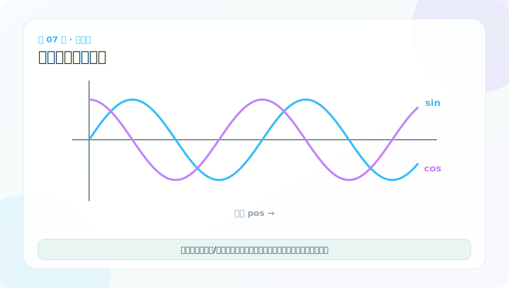

# 第 7 节：正弦位置编码原理：让模型知道先后顺序

> 笔记编号 7/38 · 对应原视频 P112 · [打开这一集](https://www.bilibili.com/video/BV14mdfBDE4Q?p=112)

[← 上一节：6 Token Embedding：把 ID 查成向量](./06-token-embedding-code.md) · [返回总目录](./README.md) · [下一节：8 位置编码总结：内容回答“是什么”，位置回答“在哪儿” →](./08-positional-encoding-summary.md)

## 这节解决什么问题

自注意力本身只比较内容，不天然知道第几个词。位置编码给每个位置一组不同频率的正弦和余弦值，再与词向量相加。



图要沿箭头或结构层级阅读。先说清楚数据从哪里来、形状怎样变化，再记组件名称。

## 老师原声整理稿（按讲解顺序）

### 0:00–2:50　为什么注意力看得到所有词，却不知道先后

老师用多组语序例子引出问题：“我爱你”和“你爱我”、“你欠我 100 元”和“我欠你 100 元”拥有高度相似的词，顺序一换，角色和意义就改变。中文绕口句还会让同一个字在不同位置承担不同词性和含义。

Encoder 自注意力通常允许每个非 PAD 位置读取整句，并不像 RNN 那样按时间步逐个前进。若只把词向量交给它，注意力运算本身对位置置换没有天然的先后概念：处理“爱”时可以同时看到“我”和“你”，却缺少谁在前、谁在后的坐标。

老师用军训排队作类比：你不一定记得所有人的完整信息，但需要知道自己站在哪、前后是谁。位置编码就像给每个位置发一个不会混淆的号，再把这个号所表达的信息加入词向量。

### 2:50–5:44　公式先只认四个量

原始 Transformer 使用固定的正弦/余弦位置编码：

```text
PE(pos, 2i)   = sin(pos / 10000^(2i/d_model))
PE(pos, 2i+1) = cos(pos / 10000^(2i/d_model))
```

先认参数，不必整式死背：

- PE：位置编码表中的一个数；
- pos：token 在序列中的位置，代码通常从 0 开始；
- 2i 与 2i+1：成对的偶数、奇数特征列；
- d_model：词向量和位置向量共同的维度。

每个 pos 最终产生 d_model 个数，才能与同位置的词向量逐元素相加。

### 5:44–9:24　为什么一半用 sin、一半用 cos

偶数列使用 sin，奇数列使用 cos。sin/cos 成对提供相位不同的周期信号；不同 i 又带来不同波长。低维部分变化较快，适合区分邻近位置；高维部分变化较慢，给出更长尺度的坐标。多种频率合起来像一组“位置指纹”。

老师还用三角恒等式说明相对位移关系。对于固定偏移 k，sin(pos+k) 和 cos(pos+k) 可以由 sin(pos)、cos(pos) 的线性组合表达。这使模型有机会通过线性运算学习相对位置模式。

需要校正一个容易误解的说法：标准实现通常直接预先计算或按公式生成位置表，不会在推理时把“位置 5”写成“位置 2 + 位置 3”来节省一次计算。恒等式的主要意义是展示相对位移可线性表达，而预计算表才是避免重复三角函数计算的工程手段。

### 9:24–12:20　大白话：给词向量贴顺序标签

老师用饭店排号继续解释：服务员不必认识每个客人，只需根据号码知道先来后到。位置编码给每个序列位置一个独特标签；Embedding 表示词的内容，PE 表示它所处的坐标，两者相加后成为同时含“谁”和“在哪”的新表示。

位置编码不是在向量末尾追加一个普通整数。若直接追加 pos，数值范围会随长度扩大，结构也很单一；正弦/余弦在所有维度提供连续、多尺度信号，并保持最终接口仍是 [B,L,D]。

### 12:20–17:56　pos、i、d_model 怎样对应下标

以“我爱吃西瓜”为例，从 0 计数时“爱”的 pos=1。假设 d_model=512，特征列下标是 0–511。i 取 0–255：每个 i 同时控制偶数列 2i 和奇数列 2i+1，所以刚好覆盖 512 列。

i=0 对应列 0、1；i=1 对应列 2、3；……；i=255 对应列 510、511。代码中常先构造只含偶数指数的 div_term，再分别填入两组切片。

### 17:56–20:56　10000 指数项控制变化尺度

分母 10000^(2i/d_model) 是频率缩放因子。随着 i 增大，分母变大，pos/分母变化更慢，因此对应 sin/cos 的波长更长。老师把它概括为“i 越大，周期越长”。

数字 10000 是原论文选定的超参数，不是词表大小，也不是最大句长。真正限制可用长度的是实现中准备的位置表 max_len，或动态生成策略。

### 20:56–30:04　用 d_model=4 手算一个位置

为了手算，老师把真实常见的 512 维缩成 d_model=4，并取 pos=2。此时 i 只能取 0、1：

- i=0 生成第 0、1 列：sin(2) 与 cos(2)；
- i=1 生成第 2、3 列：sin(2/100) 与 cos(2/100)。

于是 pos=2 得到一个四维位置向量，大致为 [0.9093,-0.4161,0.0200,0.9998]。再把它与该 token 的四维词向量逐元素相加，得到送入下一层的新向量。

手算的目标不是记住小数，而是看清：一个位置生成 D 个数；偶数列填 sin，奇数列填 cos；不同列使用不同频率；最终与 Embedding 同形相加。

## 辅助流程图


## 完整原声逐段记录

[查看本节按时间戳整理的完整音轨转写](./transcripts/p112.md)

这份逐段记录用于核查老师讲过的内容是否遗漏；学习时优先阅读上面的校正文章，遇到想追溯的细节再按时间戳查看原声记录。

## 零基础先记住

- 偶数特征维用 sin，奇数特征维用 cos
- 低维变化较快，高维变化较慢，形成多尺度位置指纹
- 固定编码不训练，也能外推到训练时未见的较长位置

## 最小可运行代码

下面代码默认从项目根目录运行。涉及模型组件时，使用 [transformer_from_scratch](../../transformer_from_scratch/README.md) 中经过测试的 PyTorch 实现。

```python
import math
for pos in range(3):
    sin0 = math.sin(pos / (10000 ** (0 / 8)))
    cos1 = math.cos(pos / (10000 ** (0 / 8)))
    print(pos, round(sin0, 3), round(cos1, 3))
```

### 输入和输出怎么看

位置 0 得到 sin=0、cos=1；后续位置值逐渐变化。完整编码会在多组频率上重复这种配对。

## 最容易踩的坑

位置编码不是把位置编号直接加到每个维度；那会让所有特征同幅度漂移，难以表达多尺度关系。

## 本节知识链

`位置 pos → 多频率 sin/cos → 位置向量 → 加到词向量`

Transformer 学习的主线始终是形状。每经过一个箭头，都问自己：batch、序列长度、特征维、头数和词表维中的哪一个发生了变化？

## 自测

**问题：为什么没有位置编码时，注意力难区分“狗咬人”和“人咬狗”？**

<details>
<summary>点开核对答案</summary>

相同词集合仅改变排列，而纯注意力没有额外顺序信号来区分位置。

</details>

## 学完检查

- [ ] 我能不用术语解释本节组件解决的问题
- [ ] 我能在运行前写出关键张量形状
- [ ] 我能指出 Q、K、V 或 mask 的来源
- [ ] 我知道代码“形状正确但逻辑可能错误”的情况
- [ ] 我能独立回答自测题

[← 上一节：6 Token Embedding：把 ID 查成向量](./06-token-embedding-code.md) · [返回总目录](./README.md) · [下一节：8 位置编码总结：内容回答“是什么”，位置回答“在哪儿” →](./08-positional-encoding-summary.md)
