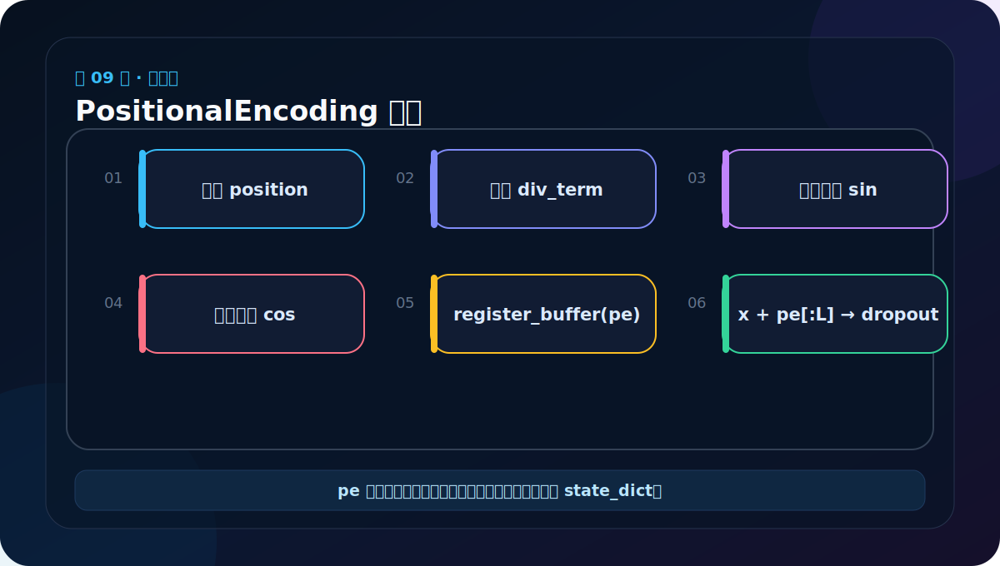

# 第 9 节：PositionalEncoding 代码：预计算并注册 buffer

> 笔记编号 9/38 · 对应原视频 P114 · [打开这一集](https://www.bilibili.com/video/BV14mdfBDE4Q?p=114)

[← 上一节：8 位置编码总结：内容回答“是什么”，位置回答“在哪儿”](./08-positional-encoding-summary.md) · [返回总目录](./README.md) · [下一节：10 位置编码测试：重点检查形状、广播和确定性 →](./10-positional-encoding-test.md)

## 这节解决什么问题

初始化时一次算好最大长度的位置表；前向传播只截取当前 L 行，加到输入上，再做 Dropout。



图要沿箭头或结构层级阅读。先说清楚数据从哪里来、形状怎样变化，再记组件名称。

## 老师原声整理稿（按讲解顺序）

### 0:00–2:49　PositionEncoding 类的三个参数

位置编码继续写在输入模块文件中，因为它和 Embeddings 一起构成 Transformer 输入端。类继承 nn.Module，初始化接收：

- d_model：每个 token 的特征维；
- dropout：相加后的随机失活概率；
- max_len：预先准备多少个位置。

老师示例使用 d_model=512、max_len=60。max_len 不是当前每句话都必须有 60 个词，而是位置表容量上限；当前句长 L 只取前 L 行。

### 2:49–5:45　先准备 Dropout、全零 PE 表和位置列

构造函数先创建 nn.Dropout(p=dropout)，再建立全零矩阵：

```python
pe = torch.zeros(max_len, d_model)       # [60, 512]
position = torch.arange(0, max_len).unsqueeze(1)  # [60, 1]
```

position 的每一行保存 0、1、2……的序列位置。unsqueeze(1) 把一维 [60] 变成列向量 [60,1]，这样后面与多种频率 [256] 相乘时能广播成 [60,256]。

### 5:45–12:41　div_term 是公式分母的向量化写法

老师把论文中的 10000 指数项改写成便于 PyTorch 向量计算的形式：

```python
div_term = torch.exp(
    torch.arange(0, d_model, 2) *
    -(math.log(10000.0) / d_model)
)
```

当 d_model=512，arange(0,512,2) 产生 0,2,…,510，共 256 个数，所以 div_term 形状是 [256]。它等价于 1 / 10000^(2i/d_model)。使用 exp 与 log 只是代数变形，不改变公式。

这里最容易看晕的是负号。因为目标是分母的倒数，所以指数必须是负的；若漏掉负号，高维频率会向相反方向变化。

### 12:41–18:37　一次算出所有位置、所有偶奇列

position [max_len,1] 与 div_term [d_model/2] 广播相乘，得到 [max_len,d_model/2]。然后分别填表：

```python
pe[:, 0::2] = torch.sin(position * div_term)
pe[:, 1::2] = torch.cos(position * div_term)
```

0::2 表示第 0、2、4…列；1::2 表示第 1、3、5…列。相同的 [max_len,256] 角度矩阵，一份取 sin 写入偶数列，一份取 cos 写入奇数列，最终 pe 仍是 [max_len,512]。

随后 `pe.unsqueeze(0)` 增加 batch 广播维，成为 [1,max_len,d_model]。这里的 1 不是 batch 真的固定为 1，而是表示所有样本共享同一套位置规则。

### 18:37–20:35　为什么使用 register_buffer

位置表不是通过梯度学习的权重，因此不应设成 nn.Parameter；但它又属于模型状态，需要保存到 state_dict，并在 model.to("cuda") 时一起迁移设备。老师用：

```python
self.register_buffer("pe", pe)
```

注册缓冲区同时满足这两点。若只把 pe 保存成普通属性，某些设备迁移或序列化流程中就需要手工处理。

### 20:35–23:35　forward 只做切片、相加和 Dropout

输入 x 已是词向量 [B,L,D]。前向根据 L 截取：

```python
x = x + self.pe[:, :x.size(1)]
return self.dropout(x)
```

self.pe 切片是 [1,L,D]，batch 维自动广播到 B，因此输出仍为 [B,L,D]。它融合了内容和位置，但不改变模型接口。

部分旧代码会写 Variable(..., requires_grad=False)。现代 PyTorch 不再需要显式 Variable；register_buffer 已明确位置表不参与梯度。

### 23:35–24:44　本节结束时输入端已经完整

到这里，token ID 先经过 Embeddings 变成缩放词向量，再经过 PositionalEncoding 加入坐标并 Dropout。这个 [B,L,D] 结果才会送入 Encoder 或 Decoder 的第一层。

代码虽短，必须能写出每个中间形状：[max_len,D]、[max_len,1]、[D/2]、[max_len,D/2]、[1,max_len,D]。形状路线说清楚，公式实现就不再神秘。

## 辅助流程图


## 完整原声逐段记录

[查看本节按时间戳整理的完整音轨转写](./transcripts/p114.md)

这份逐段记录用于核查老师讲过的内容是否遗漏；学习时优先阅读上面的校正文章，遇到想追溯的细节再按时间戳查看原声记录。

## 零基础先记住

- register_buffer 让 pe 随模型迁移设备并进入 state_dict
- buffer 不是可训练 Parameter，不接收梯度更新
- 切片 self.pe[:,:L] 必须与输入长度一致

## 最小可运行代码

下面代码默认从项目根目录运行。涉及模型组件时，使用 [transformer_from_scratch](../../transformer_from_scratch/README.md) 中经过测试的 PyTorch 实现。

```python
import torch
from transformer_from_scratch.model import PositionalEncoding
layer = PositionalEncoding(d_model=8, dropout=0.0, max_len=16)
x = torch.zeros(2, 5, 8)
y = layer(x)
print(y.shape, "pe是否是参数：", "pe" in dict(layer.named_parameters()))
```

### 输入和输出怎么看

形状保持 [2,5,8]，pe是否是参数为 False；但它能在 named_buffers 中找到。

## 最容易踩的坑

把 pe 写成普通属性张量，model.to('cuda') 时它不会自动迁移，前向会产生设备不一致错误。

## 本节知识链

`预计算位置表 → register_buffer → 按 L 切片 → 相加+Dropout`

Transformer 学习的主线始终是形状。每经过一个箭头，都问自己：batch、序列长度、特征维、头数和词表维中的哪一个发生了变化？

## 自测

**问题：buffer 和 Parameter 最关键的训练差异是什么？**

<details>
<summary>点开核对答案</summary>

Parameter 参与梯度优化；buffer 保存模型状态并随设备迁移，但默认不被优化器更新。

</details>

## 学完检查

- [ ] 我能不用术语解释本节组件解决的问题
- [ ] 我能在运行前写出关键张量形状
- [ ] 我能指出 Q、K、V 或 mask 的来源
- [ ] 我知道代码“形状正确但逻辑可能错误”的情况
- [ ] 我能独立回答自测题

[← 上一节：8 位置编码总结：内容回答“是什么”，位置回答“在哪儿”](./08-positional-encoding-summary.md) · [返回总目录](./README.md) · [下一节：10 位置编码测试：重点检查形状、广播和确定性 →](./10-positional-encoding-test.md)
