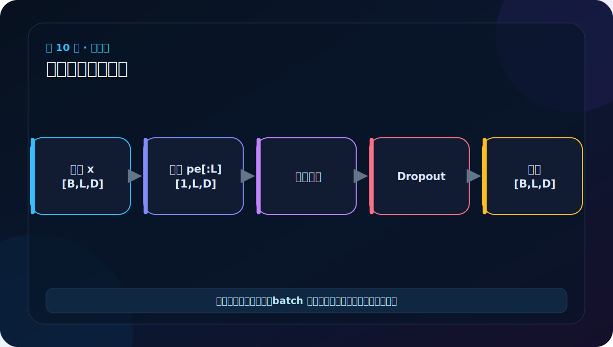

# 第 10 节：位置编码测试：重点检查形状、广播和确定性

> 笔记编号 10/38 · 对应原视频 P115 · [打开这一集](https://www.bilibili.com/video/BV14mdfBDE4Q?p=115)

[← 上一节：9 PositionalEncoding 代码：预计算并注册 buffer](./09-positional-encoding-code.md) · [返回总目录](./README.md) · [下一节：11 上三角矩阵：标记当前位置之后的未来 →](./11-upper-triangular-matrix.md)

## 这节解决什么问题

测试不仅是“没有报错”，还要证明输出形状不变、同位置编码跨 batch 一致，并在 dropout=0 时结果可重复。



图要沿箭头或结构层级阅读。先说清楚数据从哪里来、形状怎样变化，再记组件名称。

## 老师原声整理稿（按讲解顺序）

### 0:00–3:54　搭建完整测试路线

老师沿用上一节的词表大小 1000 和 d_model=512，创建自定义 Embeddings，并构造两个句子、每句四个 token ID，输入形状 [2,4]。

测试步骤是：

1. ID 经 Embeddings 得到词向量 [2,4,512]；
2. 创建 PositionalEncoding(d_model=512, dropout=...)；
3. 把词向量送入位置编码层；
4. 打印结果与 shape。

最终仍是 [2,4,512]。形状不变不代表什么都没做；数值已经加入不同位置的 PE，并可能经过 Dropout。

### 3:54–7:51　max_len=60 与实际 L=4 不冲突

老师专门追问：明明句子只有四个词，为什么位置表准备了 60 行？因为 60 是“最多支持的长度”，本批只需前四行。PE 缓冲区形状是 [1,60,512]，实际切片为 [1,4,512]。

位置编号从 0 到 59；当前四个 token 使用 0、1、2、3。若将来输入 61 个位置，当前表就不够，代码应报错、扩表或动态生成，而不是静默重复位置。

### 7:51–11:51　逐个打印中间形状来反推

老师在源码中临时加入打印，追踪：

- position：[60,1]；
- div_term：[256]；
- position * div_term：[60,256]；
- pe 填完偶奇列：[60,512]；
- unsqueeze 后：[1,60,512]。

这是一种很实用的调试办法：不懂广播时不要盯着整段公式，先打印参与相乘的两个 shape，再按“60×1 与 256 → 60×256”解释。看懂后应删掉库组件中的临时打印，避免训练时每个 batch 都刷屏。

### 11:51–14:51　数值很长，测试应关注结构和性质

老师尝试打印完整 PE，发现大量小数不适合逐个阅读。更有意义的是检查：

- PE 是否是浮点张量；
- 同一位置的 D 个数是否成对来自 sin/cos；
- pos=0 时偶数列 sin(0)=0，奇数列 cos(0)=1；
- 没有 Dropout 时，同位置在不同 batch 中编码相同。

只打印最终大矩阵容易“看到了很多数，却不知道对不对”。形状断言和上述数值性质更可靠。

### 14:51–17:50　广播相加的完整解释

Embedding 结果是 [2,4,512]；从 PE [1,60,512] 截出 [1,4,512]。相加时第一维 1 广播成 2，相同的位置表被加到 batch 中两句话的对应位置，结果仍为 [2,4,512]。

这里共享的是位置规则，不是词向量。第一个样本位置 2 和第二个样本位置 2 加上相同 PE，但二者原始 token embedding 可以完全不同。

### 17:50–18:49　测试完成后数据将进入 Encoder

老师最后重新口述：先建立 PE 全零矩阵，计算偶数和奇数列，注册缓冲区；前向按句长切片，与词向量相加并 Dropout。融合后的张量就可传给 Encoder。

为了可复现地检查“相加是否正确”，测试时应将 dropout=0 或调用 eval()；否则随机失活会让重复前向的具体数值不同。

## 辅助流程图


## 完整原声逐段记录

[查看本节按时间戳整理的完整音轨转写](./transcripts/p115.md)

这份逐段记录用于核查老师讲过的内容是否遗漏；学习时优先阅读上面的校正文章，遇到想追溯的细节再按时间戳查看原声记录。

## 零基础先记住

- 输入 [B,L,D]，输出必须同形
- 零输入能直接观察位置编码
- 测试时关闭 Dropout，避免随机性干扰断言

## 最小可运行代码

下面代码默认从项目根目录运行。涉及模型组件时，使用 [transformer_from_scratch](../../transformer_from_scratch/README.md) 中经过测试的 PyTorch 实现。

```python
import torch
from transformer_from_scratch.model import PositionalEncoding
torch.manual_seed(0)
layer = PositionalEncoding(8, dropout=0.0, max_len=10)
y = layer(torch.zeros(2, 4, 8))
print(y.shape)
print(torch.allclose(y[0], y[1]))
```

### 输入和输出怎么看

输出 [2,4,8] 和 True，说明同一位置表被广播给两个 batch。

## 最容易踩的坑

训练模式下 dropout>0 时两个 batch 的随机丢弃可能不同，不能据此说位置编码计算错了。

## 本节知识链

`构造零输入 → 关闭 Dropout → 前向 → 检查形状与批次一致`

Transformer 学习的主线始终是形状。每经过一个箭头，都问自己：batch、序列长度、特征维、头数和词表维中的哪一个发生了变化？

## 自测

**问题：为什么用全零输入测试位置编码很直观？**

<details>
<summary>点开核对答案</summary>

输出就等于位置编码本身（若 dropout=0），不受词向量数值干扰。

</details>

## 学完检查

- [ ] 我能不用术语解释本节组件解决的问题
- [ ] 我能在运行前写出关键张量形状
- [ ] 我能指出 Q、K、V 或 mask 的来源
- [ ] 我知道代码“形状正确但逻辑可能错误”的情况
- [ ] 我能独立回答自测题

[← 上一节：9 PositionalEncoding 代码：预计算并注册 buffer](./09-positional-encoding-code.md) · [返回总目录](./README.md) · [下一节：11 上三角矩阵：标记当前位置之后的未来 →](./11-upper-triangular-matrix.md)
