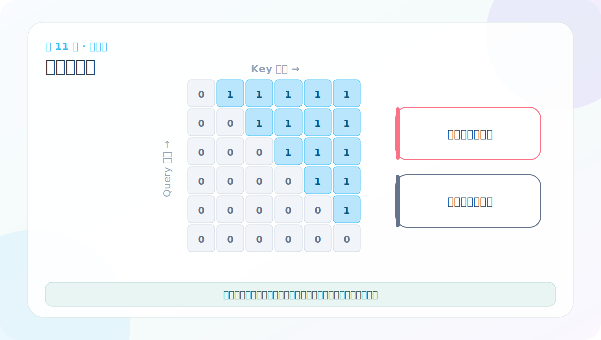
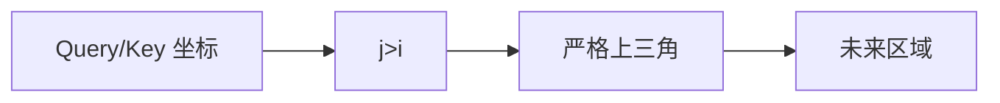

# 第 11 节：上三角矩阵：标记当前位置之后的未来

> 笔记编号 11/38 · 对应原视频 P116 · [打开这一集](https://www.bilibili.com/video/BV14mdfBDE4Q?p=116)

[← 上一节：10 位置编码测试：重点检查形状、广播和确定性](./10-positional-encoding-test.md) · [返回总目录](./README.md) · [下一节：12 下三角可见区：只看自己和过去 →](./12-lower-triangular-matrix.md)

## 这节解决什么问题

因果生成中，第 i 个位置不能看 i 后面的词。矩阵第 i 行、第 j 列表示 Query i 是否能看 Key j；j>i 正好是对角线上方。



图要沿箭头或结构层级阅读。先说清楚数据从哪里来、形状怎样变化，再记组件名称。

## 老师原声整理稿（按讲解顺序）

### 0:00–1:47　写 Encoder 前先补矩阵基础

老师准备进入编码器代码，但注意力中的 mask 会用到三角矩阵，所以先单独讲上三角和下三角。方阵的主对角线从左上走到右下；主对角线上方保留数值、下方为 0，称为上三角；反过来则是下三角。

三角矩阵不是只有 0 和 1，定义看的是哪些区域必须为 0。课程用全 1 矩阵演示，是为了让允许区和禁止区一眼可见。

### 1:47–4:34　因果生成为什么需要遮住未来

老师用“今天不能知道明天下午发生什么”类比 Decoder 生成。预测第 1 个 token 时，未来全部未知；预测第 2 个时，只能使用第 1 个和当前位置的目标输入；越往后，已知前缀逐步增长。

训练时完整目标句已经装在张量中，若不主动遮住右侧未来位置，模型会从答案中抄信息。因果 mask 的任务就是让第 i 个 Query 只访问 j≤i 的 Key。

### 4:34–8:24　用 np.triu 观察上三角及 diagonal

老师先记忆“上三角：主对角线下方为 0”。NumPy 的 `np.triu(m, k)` 保留指定对角线及其上方：

- k=0：保留主对角线；
- k=1：从主对角线上方第一条线开始；
- k>1：继续上移；
- k<0：向下移动，允许保留部分下方区域。

课程反复改变 k 并打印矩阵，目的不是背 API，而是看懂“对角线偏移决定哪一格开始保留”。

### 8:24–13:05　代码文件与后续注意力的关系

这一部分写在 Encoder/Attention 相关模块中，并导入前面已经实现的输入组件。老师再次提醒文件名不能只用纯数字，后面的文件还需要正常 import。

实际注意力公式包含 QKᵀ/√d_k，mask 会作用在这个分数矩阵上。此刻只演示三角矩阵，还没有做 Softmax，也没有真正得到注意力权重。

### 13:05–18:30　diagonal 正负方向的课堂调试

老师用小矩阵依次打印默认 k=0、上移和下移后的结果。现场口述容易把“上移/下移”说反，最安全的办法是直接记坐标：

> 对 scores[i,j]，j>i 是未来；若要标记严格未来区，就使用主对角线上方。

生成“未来禁止区”通常用 `torch.triu(torch.ones(L,L), diagonal=1)`；之所以从 1 开始，是当前位置 i 可以看自己。若从 0 开始并把保留区当禁止区，主对角线也会被遮掉。

本节得到的只是区域模板。下一节还要决定 True/False 到底代表允许还是禁止，并增加广播维度。

## 辅助流程图




## 完整原声逐段记录

[查看本节按时间戳整理的完整音轨转写](./transcripts/p116.md)

这份逐段记录用于核查老师讲过的内容是否遗漏；学习时优先阅读上面的校正文章，遇到想追溯的细节再按时间戳查看原声记录。

## 零基础先记住

- torch.triu(..., diagonal=1) 取严格上三角
- diagonal=0 会连当前位置也选中
- 这一步通常先标出“要屏蔽”的未来区域

## 最小可运行代码

下面代码默认从项目根目录运行。涉及模型组件时，使用 [transformer_from_scratch](../../transformer_from_scratch/README.md) 中经过测试的 PyTorch 实现。

```python
import torch
future = torch.triu(torch.ones(4, 4, dtype=torch.int), diagonal=1)
print(future)
```

### 输入和输出怎么看

对角线上方为 1，其余为 0；这些 1 代表未来位置。

## 最容易踩的坑

不要只背上三角或下三角。先明确行是 Query、列是 Key，否则坐标定义一换就会判断反。

## 本节知识链

`Query/Key 坐标 → j>i → 严格上三角 → 未来区域`

Transformer 学习的主线始终是形状。每经过一个箭头，都问自己：batch、序列长度、特征维、头数和词表维中的哪一个发生了变化？

## 自测

**问题：为什么 diagonal=1 而不是 0？**

<details>
<summary>点开核对答案</summary>

当前位置可以看自己；只应从右上方的下一个位置开始屏蔽。

</details>

## 学完检查

- [ ] 我能不用术语解释本节组件解决的问题
- [ ] 我能在运行前写出关键张量形状
- [ ] 我能指出 Q、K、V 或 mask 的来源
- [ ] 我知道代码“形状正确但逻辑可能错误”的情况
- [ ] 我能独立回答自测题

[← 上一节：10 位置编码测试：重点检查形状、广播和确定性](./10-positional-encoding-test.md) · [返回总目录](./README.md) · [下一节：12 下三角可见区：只看自己和过去 →](./12-lower-triangular-matrix.md)
