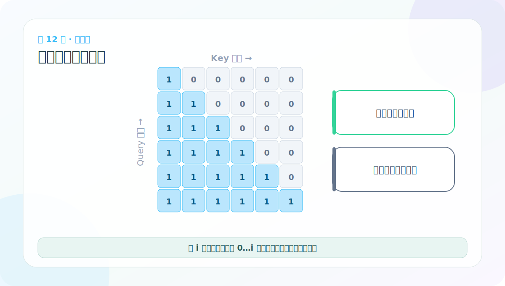
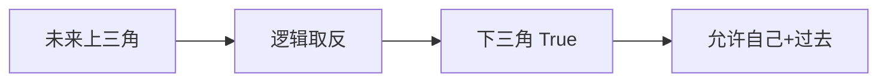

# 第 12 节：下三角可见区：只看自己和过去

> 笔记编号 12/38 · 对应原视频 P117 · [打开这一集](https://www.bilibili.com/video/BV14mdfBDE4Q?p=117)

[← 上一节：11 上三角矩阵：标记当前位置之后的未来](./11-upper-triangular-matrix.md) · [返回总目录](./README.md) · [下一节：13 因果 Mask 可视化：学会读横纵轴 →](./13-mask-visualization.md)

## 这节解决什么问题

把未来区域逻辑取反，就得到允许注意的位置：第 i 行只有第 0 到 i 列为 True，形状像下三角。



图要沿箭头或结构层级阅读。先说清楚数据从哪里来、形状怎样变化，再记组件名称。

## 老师原声整理稿（按讲解顺序）

### 0:00–1:56　subsequent_mask 从全 1 方阵开始

老师把“不能看未来”封装成函数，输入 size=L，先建立 [1,L,L] 的全 1 数组。最前面的 1 是预留广播维，不是句长，也不是注意力头数。

接着用 `np.triu(..., k=1)` 取严格上三角。这里得到的是未来区域：第 i 行中 j>i 的格子为 1，其他位置为 0。

### 1:56–4:52　为什么还要做一次逻辑取反

课程后面的约定是 mask=True/1 表示允许，False/0 表示禁止。但 triu(k=1) 刚好把未来标成 1，语义相反，所以需要比较 `== 0` 或逻辑取反：

```python
future = np.triu(np.ones((1, L, L)), k=1).astype("uint8")
allowed = torch.from_numpy(future) == 0
```

结果是下三角可见区：当前位置和左侧过去为 True，右侧未来为 False。老师在现场先打印上三角，再修改返回值，这段纠正展示了为什么必须先定义 mask 语义。

### 4:52–6:50　函数没有 return，会出现“打印有结果、调用却是 None”

课堂调试中，上三角矩阵在函数内部能打印，但外部拿不到下三角结果，原因是函数忘记 return。补上返回后，测试又同时出现函数内部打印与外部打印，导致看起来输出两次。

这是很典型的 Python 调试现象：

- print 只显示临时信息；
- return 才把张量交给调用者；
- 若两处都 print，就会重复显示。

完成验证后，应删除函数内部的调试打印，让 subsequent_mask 只负责产生 mask。

### 6:50–8:31　三维 mask 与二维切片

函数返回 [1,L,L]。老师用 `mask[0]` 取出第一个切片，得到 [L,L]，便于打印和画图。方括号数量对应维度层级：三维张量索引一次，少一维。

真实注意力一般保留广播维。进入多头模块时还可能再 unsqueeze 成 [B,1,L,L]，从而对 h 个头共享。

### 本节最终约定

第 i 行代表当前 Query，第 j 列代表要读取的 Key：

- j≤i：True，允许读取自己和过去；
- j>i：False，禁止读取未来。

不同库可能用相反布尔语义，因此不能只凭“三角形朝哪边”抄代码；必须同时检查后面 masked_fill 使用的是 `mask==0`、`~mask` 还是直接 mask。

## 辅助流程图




## 完整原声逐段记录

[查看本节按时间戳整理的完整音轨转写](./transcripts/p117.md)

这份逐段记录用于核查老师讲过的内容是否遗漏；学习时优先阅读上面的校正文章，遇到想追溯的细节再按时间戳查看原声记录。

## 零基础先记住

- 项目约定 True=允许、False=屏蔽
- subsequent_mask 返回 [1,L,L] 便于 batch 广播
- 不同库可能采用相反布尔语义，必须看接口约定

## 最小可运行代码

下面代码默认从项目根目录运行。涉及模型组件时，使用 [transformer_from_scratch](../../transformer_from_scratch/README.md) 中经过测试的 PyTorch 实现。

```python
from transformer_from_scratch.model import subsequent_mask
print(subsequent_mask(4)[0].int())
```

### 输入和输出怎么看

第一行只有第 0 列为 1，最后一行四列全为 1。

## 最容易踩的坑

Mask 语义最常见的坑是 1/0 反了。本项目在 attention 中用 mask==0 的位置填极小值。

## 本节知识链

`未来上三角 → 逻辑取反 → 下三角 True → 允许自己+过去`

Transformer 学习的主线始终是形状。每经过一个箭头，都问自己：batch、序列长度、特征维、头数和词表维中的哪一个发生了变化？

## 自测

**问题：长度 4 时，第 2 个位置（从 0 开始）能看哪些列？**

<details>
<summary>点开核对答案</summary>

第 0、1、2 列；不能看第 3 列。

</details>

## 学完检查

- [ ] 我能不用术语解释本节组件解决的问题
- [ ] 我能在运行前写出关键张量形状
- [ ] 我能指出 Q、K、V 或 mask 的来源
- [ ] 我知道代码“形状正确但逻辑可能错误”的情况
- [ ] 我能独立回答自测题

[← 上一节：11 上三角矩阵：标记当前位置之后的未来](./11-upper-triangular-matrix.md) · [返回总目录](./README.md) · [下一节：13 因果 Mask 可视化：学会读横纵轴 →](./13-mask-visualization.md)
