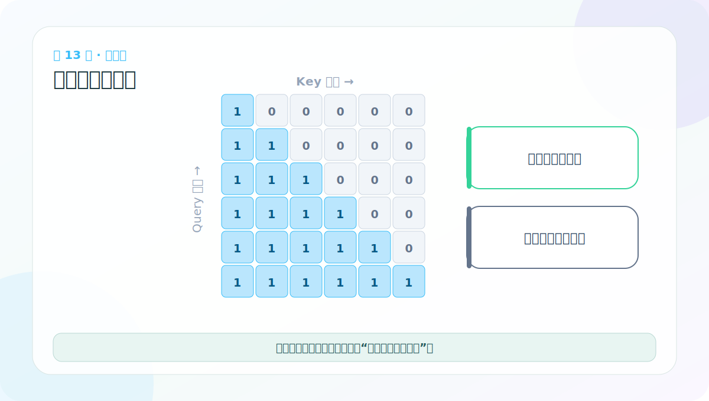

# 第 13 节：因果 Mask 可视化：学会读横纵轴

> 笔记编号 13/38 · 对应原视频 P118 · [打开这一集](https://www.bilibili.com/video/BV14mdfBDE4Q?p=118)

[← 上一节：12 下三角可见区：只看自己和过去](./12-lower-triangular-matrix.md) · [返回总目录](./README.md) · [下一节：14 masked_fill：在 Softmax 前把未来分数压到极小 →](./14-masked-fill.md)

## 这节解决什么问题

热力图的每个格子都是一个 Query-Key 配对。逐行读：某行亮起的列，就是该目标位置能读取的信息。



图要沿箭头或结构层级阅读。先说清楚数据从哪里来、形状怎样变化，再记组件名称。

## 老师原声整理稿（按讲解顺序）

### 0:00–1:56　先约定颜色代表什么

老师把 subsequent_mask 画成热力图。课堂图中黄色/亮色代表允许读取，暗色代表被遮住。读任何热力图前要先看图例，因为有些实现会专门画“禁止区”，颜色含义正好相反。

mask 本体为 [1,L,L]，可视化时取第 0 个切片变成 [L,L]。横纵轴应标成 Key 位置和 Query 位置，而不是笼统写“词编号”。

### 1:56–3:55　imshow 只是把布尔矩阵画出来

老师用 Matplotlib 的 imshow 显示 5×5 mask，设置 figure size 后调用 show。若图太小，先调整画布，而不是改 mask 数值。

更适合学习的图应同时显示网格和 0/1 数字。颜色帮助看整体三角形，数字帮助检查具体格子。例如 mask[1,2] 必须为 False，因为第 2 个 Query（从 0 计）之前，索引 2 对它仍是未来。

### 3:55–5:49　逐行读“当前可见前缀”

按“行是 Query、列是 Key”读取：

- 第 0 行：只允许第 0 列；
- 第 1 行：允许第 0、1 列；
- 第 2 行：允许第 0、1、2 列；
- 最后一行：整行都允许，因为已经没有更晚位置。

老师口头用“竖着看”帮助学生观察，但矩阵语义最终必须落实到行列约定。若转置了热力图，三角方向会翻转，肉眼仍像三角形，却会遮错对象。

### 可视化之后还要做的两项断言

热力图只能说明 mask 本身看起来合理。完整验证还需检查：

1. mask 形状能广播到注意力 scores；
2. Softmax 后，被遮住的严格上三角权重确实为 0。

若某一行全被遮住，Softmax 没有合法 Key，可能产生 NaN 或异常分布。因果 mask 保留主对角线，正好保证每行至少能看自己。

## 辅助流程图


## 完整原声逐段记录

[查看本节按时间戳整理的完整音轨转写](./transcripts/p118.md)

这份逐段记录用于核查老师讲过的内容是否遗漏；学习时优先阅读上面的校正文章，遇到想追溯的细节再按时间戳查看原声记录。

## 零基础先记住

- 行对应输出/Query 位置
- 列对应被查询的 Key 位置
- 理想因果 mask 的可见区域逐行增加一个

## 最小可运行代码

下面代码默认从项目根目录运行。涉及模型组件时，使用 [transformer_from_scratch](../../transformer_from_scratch/README.md) 中经过测试的 PyTorch 实现。

```python
from transformer_from_scratch.model import subsequent_mask
mask = subsequent_mask(5)[0]
for row in mask:
    print(" ".join("■" if x else "·" for x in row.tolist()))
```

### 输入和输出怎么看

终端会画出一个由 ■ 组成的下三角；· 是不可见的未来。

## 最容易踩的坑

只画 mask 不验证 attention 权重仍不够；还应确认被屏蔽位置经过 softmax 后概率确实为 0。

## 本节知识链

`布尔矩阵 → 行=Query → 列=Key → 下三角可见区`

Transformer 学习的主线始终是形状。每经过一个箭头，都问自己：batch、序列长度、特征维、头数和词表维中的哪一个发生了变化？

## 自测

**问题：热力图第一行为什么通常只有一个可见格？**

<details>
<summary>点开核对答案</summary>

生成第一个目标位置时只能看当前位置/起始标记，不能读取任何未来目标词。

</details>

## 学完检查

- [ ] 我能不用术语解释本节组件解决的问题
- [ ] 我能在运行前写出关键张量形状
- [ ] 我能指出 Q、K、V 或 mask 的来源
- [ ] 我知道代码“形状正确但逻辑可能错误”的情况
- [ ] 我能独立回答自测题

[← 上一节：12 下三角可见区：只看自己和过去](./12-lower-triangular-matrix.md) · [返回总目录](./README.md) · [下一节：14 masked_fill：在 Softmax 前把未来分数压到极小 →](./14-masked-fill.md)
