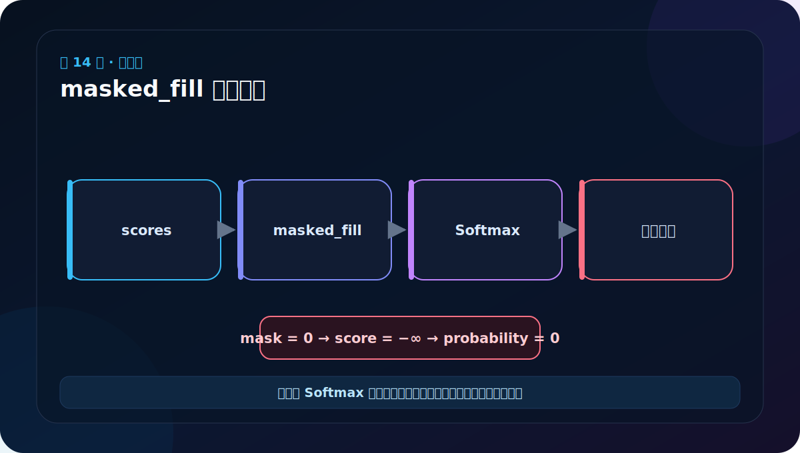
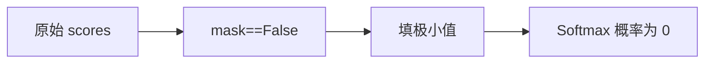

# 第 14 节：masked_fill：在 Softmax 前把未来分数压到极小

> 笔记编号 14/38 · 对应原视频 P119 · [打开这一集](https://www.bilibili.com/video/BV14mdfBDE4Q?p=119)

[← 上一节：13 因果 Mask 可视化：学会读横纵轴](./13-mask-visualization.md) · [返回总目录](./README.md) · [下一节：15 缩放点积注意力：Q 找谁，V 提供什么 →](./15-scaled-dot-product-attention.md)

## 这节解决什么问题

注意力先得到匹配分数。对不允许的位置填入负无穷附近的极小值，Softmax 后这些位置的概率就趋近 0。



图要沿箭头或结构层级阅读。先说清楚数据从哪里来、形状怎样变化，再记组件名称。

## 老师原声整理稿（按讲解顺序）

### 0:00–2:54　写注意力前先单独练 masked_fill

老师准备实现自注意力，但先把遮盖动作拆成最小实验。Self-Attention 中 Q、K、V 来自同一份序列；真正计算权重前，需要知道怎样把不允许的位置从 scores 中排除。

测试代码仍放在语义化文件中，避免纯数字文件无法正常 import。把 masked_fill 单独验证后，后面 attention 函数只需复用这条已知正确的操作。

### 2:54–6:24　准备同形 input 与 mask

老师创建一个 3×5 浮点 input，并建立同形 mask。mask 中可能含 0、1 或其他非零数；先通过 `mask != 0` 转成布尔张量：

- 非零 → True；
- 0 → False。

这一步明确后续条件语义。实际 attention 的 mask 可能通过广播扩展，不一定与 scores 完全同形，但最后必须能对应每个要替换的格子。

### 6:24–9:38　masked_fill 的三个参数角色

核心调用可读成：

```python
result = input.masked_fill(mask == 0, -1e9)
```

逐项解释：

1. input：谁要被修改；
2. mask==0：哪些位置满足条件；
3. -1e9：满足条件的位置替换成什么。

老师把 mask==0 的格子换成极小负数，其余 input 元素保持原值。它不是删除元素，所以 shape 不变。

### 9:38–12:39　为什么是极小负数，而不是 0

masked_fill 发生在 Softmax 之前。Softmax 内部包含指数运算：极小负数的 exp 接近 0，于是被禁止位置最终权重接近 0。

若填 0，exp(0)=1，被遮位置仍可能获得明显概率。若先 Softmax 再把概率乘 0，剩余权重之和不再等于 1，除非再次归一化。因此标准顺序是：

> scores → masked_fill(极小负数) → Softmax。

### 12:39–13:51　数值和布尔约定都不是固定写死的

老师演示 -1e9、-1e10 等值，表达的都是“近似负无穷”。更稳健的实现可使用 `torch.finfo(scores.dtype).min`，尤其在 float16、bfloat16 等精度下避免常数不合适。

同样，mask 是 0 禁止还是 1 禁止取决于项目约定。本课程使用 0/False 表示遮盖，所以条件写 `mask == 0`。换一个库时必须先读接口说明，不能盲抄取反。

## 辅助流程图




## 完整原声逐段记录

[查看本节按时间戳整理的完整音轨转写](./transcripts/p119.md)

这份逐段记录用于核查老师讲过的内容是否遗漏；学习时优先阅读上面的校正文章，遇到想追溯的细节再按时间戳查看原声记录。

## 零基础先记住

- 屏蔽必须发生在 Softmax 之前
- 浮点实现常用 torch.finfo(dtype).min
- 最终每行未屏蔽位置的概率仍应和为 1

## 最小可运行代码

下面代码默认从项目根目录运行。涉及模型组件时，使用 [transformer_from_scratch](../../transformer_from_scratch/README.md) 中经过测试的 PyTorch 实现。

```python
import torch
scores = torch.tensor([[1.0, 2.0, 3.0]])
mask = torch.tensor([[True, True, False]])
masked = scores.masked_fill(~mask, torch.finfo(scores.dtype).min)
print(masked)
print(torch.softmax(masked, dim=-1))
```

### 输入和输出怎么看

第三个分数变为极小值，对应概率为 0；前两个位置重新归一化。

## 最容易踩的坑

Softmax 后再把概率乘 0 会让整行概率和小于 1，除非再次归一化；标准做法是先改分数。

## 本节知识链

`原始 scores → mask==False → 填极小值 → Softmax 概率为 0`

Transformer 学习的主线始终是形状。每经过一个箭头，都问自己：batch、序列长度、特征维、头数和词表维中的哪一个发生了变化？

## 自测

**问题：为什么不能把被屏蔽分数简单填成 0？**

<details>
<summary>点开核对答案</summary>

0 经过指数仍是 1，可能获得非零概率；必须填足够小的负值。

</details>

## 学完检查

- [ ] 我能不用术语解释本节组件解决的问题
- [ ] 我能在运行前写出关键张量形状
- [ ] 我能指出 Q、K、V 或 mask 的来源
- [ ] 我知道代码“形状正确但逻辑可能错误”的情况
- [ ] 我能独立回答自测题

[← 上一节：13 因果 Mask 可视化：学会读横纵轴](./13-mask-visualization.md) · [返回总目录](./README.md) · [下一节：15 缩放点积注意力：Q 找谁，V 提供什么 →](./15-scaled-dot-product-attention.md)
