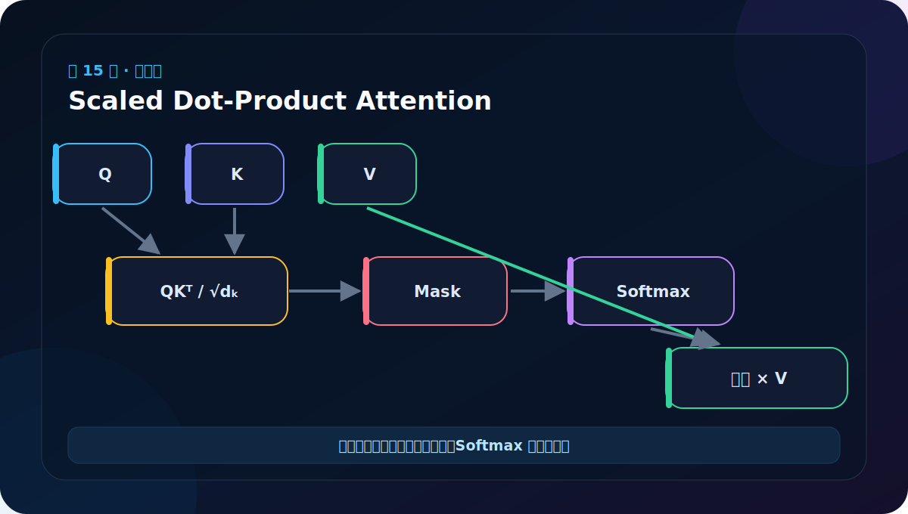
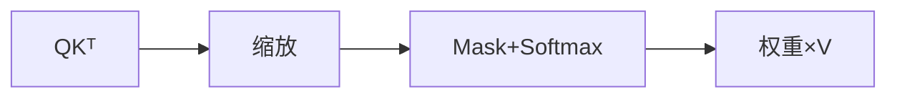
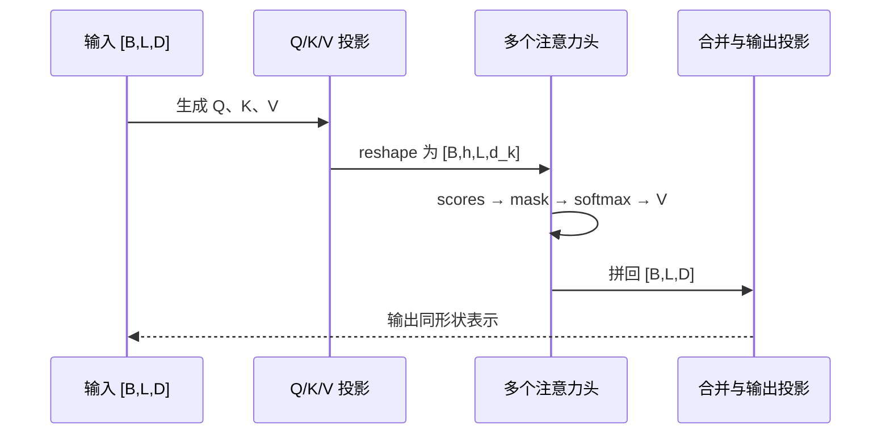

# 第 15 节：缩放点积注意力：Q 找谁，V 提供什么

> 笔记编号 15/38 · 对应原视频 P120 · [打开这一集](https://www.bilibili.com/video/BV14mdfBDE4Q?p=120)

[← 上一节：14 masked_fill：在 Softmax 前把未来分数压到极小](./14-masked-fill.md) · [返回总目录](./README.md) · [下一节：16 多头注意力原理上：把特征空间分给多个头 →](./16-multi-head-attention-principle-upper.md)

## 这节解决什么问题

Q 与 K 点积得到匹配程度，除以 √dₖ 稳定数值，经过 mask 和 Softmax 得到权重，最后对 V 加权求和。



图要沿箭头或结构层级阅读。先说清楚数据从哪里来、形状怎样变化，再记组件名称。

## 老师原声整理稿（按讲解顺序）

### 0:00–3:45　attention 函数的输入和形状

老师开始把前面的零件组成缩放点积注意力。函数接收 query、key、value、可选 mask 和可选 dropout。

在单头教学示例中，Q、K、V 可是 [B,L,D]；多头模块调用时则通常是 [B,h,L,d_k]。不要把 d_model 与 d_k 混用：单头时两者可能恰好相同，多头拆分后 d_k=d_model/h。

mask 可以为 None，是为了让同一函数同时服务不需要因果遮盖的 Encoder 自注意力、需要 PAD mask 的注意力，以及 Decoder 因果注意力。

### 3:45–7:26　第一步：QKᵀ/√d_k

先取 `d_k = query.size(-1)`，再计算：

```python
scores = torch.matmul(query, key.transpose(-2, -1))
scores = scores / math.sqrt(d_k)
```

transpose(-2,-1) 交换最后两个轴，不把 batch、head 等前导维写死，因此三维和四维张量都适用。若 Q=[B,Lq,d_k]、K=[B,Lk,d_k]，scores=[B,Lq,Lk]。

每个 scores[...,i,j] 表示第 i 个 Query 与第 j 个 Key 的匹配程度。

### 7:26–12:09　第二步：有 mask 才遮盖

老师使用 `if mask is not None` 让函数通用。如果提供 mask，就把 mask==0 的 scores 替换为极小负数。Encoder 不需要因果 mask，但通常仍需 PAD mask；Decoder 目标自注意力需要把 PAD 与未来遮盖组合起来。

课堂重点追问“为什么 0 位置要替换成极小值”。答案不是直接让分数等于权重 0，而是让下一步 Softmax 后的指数贡献接近 0。

### 12:09–15:03　第三步：Softmax、Dropout 和 Value 汇总

沿 scores 最后一维，也就是 Key 维做 Softmax：

```python
p_attn = torch.softmax(scores, dim=-1)
```

对固定 Query，它分配给所有 Key 的权重和为 1。若传入 dropout，就对权重做随机失活。最后：

```python
output = torch.matmul(p_attn, value)
```

权重 [B,Lq,Lk] 乘 V [B,Lk,d_v]，得到 [B,Lq,d_v]。输出位置数由 Query 决定；“读什么内容”来自 Value。

### 15:03–18:47　函数为什么返回两个结果

attention 返回 `output, p_attn`。output 继续传给网络；p_attn 既可用于多头模块保存，也可可视化每个词关注了哪些位置。

老师提醒不要重复手工构造前面已经完成的 Embedding 与位置编码结果，可以从已写模块导入。组件化的意义正是让测试数据和函数能复用。

### 18:47–23:27　自注意力测试：Q=K=V

课程把输入端结果作为 Q、K、V，因此三者 shape 相同，内容也相同。若输入 [2,4,512]，单头注意力输出仍是 [2,4,512]；权重矩阵是 [2,4,4]。

“输出 shape 与输入相同”不表示计算没有效果。每个输出位置已经按权重混合了四个 Value。应同时打印权重 shape，并检查沿最后一维求和约等于 1。

### 23:27–30:44　老师用“我爱武汉中国”解释 4×4 权重

对长度为 4 的句子，每个词都要和四个词比较：第一个 Query 产生 1×4 权重，四个 Query 叠成 4×4；batch 中两句话再叠成 [2,4,4]。

例如“爱”这一行分别表示它对“我、爱、武汉、中国”的依赖程度。若有因果 mask，右侧未来格子为 0；若是 Encoder 双向自注意力，非 PAD 位置通常都可参与。

本节完整口述路线是：

> 匹配 Q 与 K → 缩放 → 遮盖非法位置 → Softmax 得权重 → Dropout → 加权读取 V。

调试时优先检查四个性质：scores 末两维 Lq×Lk、权重和为 1、mask 区权重为 0、output 长度等于 Lq。

## 辅助流程图



### 注意力张量时序图



## 完整原声逐段记录

[查看本节按时间戳整理的完整音轨转写](./transcripts/p120.md)

这份逐段记录用于核查老师讲过的内容是否遗漏；学习时优先阅读上面的校正文章，遇到想追溯的细节再按时间戳查看原声记录。

## 零基础先记住

- scores=QKᵀ/√dₖ，形状 [...,Lq,Lk]
- Softmax 沿 Key 维进行
- 输出长度跟 Q 一致，特征来自 V

## 最小可运行代码

下面代码默认从项目根目录运行。涉及模型组件时，使用 [transformer_from_scratch](../../transformer_from_scratch/README.md) 中经过测试的 PyTorch 实现。

```python
import torch
from transformer_from_scratch.model import attention
q = k = v = torch.randn(1, 3, 4)
out, weights = attention(q, k, v)
print(out.shape, weights.shape)
print(weights.sum(dim=-1))
```

### 输入和输出怎么看

输出 [1,3,4]，权重 [1,3,3]；每个 Query 对所有 Key 的权重和约为 1。

## 最容易踩的坑

忘记除 √dₖ 时，高维点积容易变大，让 Softmax 极端饱和、梯度变小。

## 本节知识链

`QKᵀ → 缩放 → Mask+Softmax → 权重×V`

Transformer 学习的主线始终是形状。每经过一个箭头，都问自己：batch、序列长度、特征维、头数和词表维中的哪一个发生了变化？

## 自测

**问题：若 Q 长度 5、K/V 长度 7，权重矩阵最后两维是什么？**

<details>
<summary>点开核对答案</summary>

[5,7]，每个 Query 位置对 7 个 Key 分配权重。

</details>

## 学完检查

- [ ] 我能不用术语解释本节组件解决的问题
- [ ] 我能在运行前写出关键张量形状
- [ ] 我能指出 Q、K、V 或 mask 的来源
- [ ] 我知道代码“形状正确但逻辑可能错误”的情况
- [ ] 我能独立回答自测题

[← 上一节：14 masked_fill：在 Softmax 前把未来分数压到极小](./14-masked-fill.md) · [返回总目录](./README.md) · [下一节：16 多头注意力原理上：把特征空间分给多个头 →](./16-multi-head-attention-principle-upper.md)
