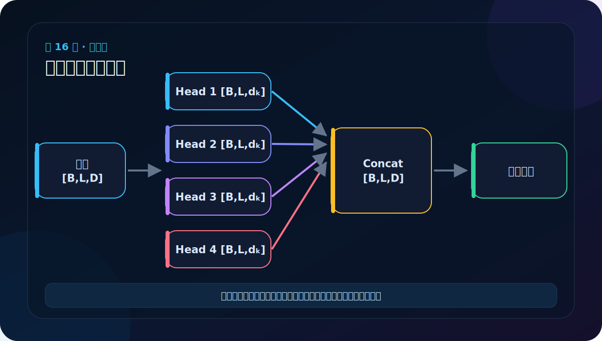
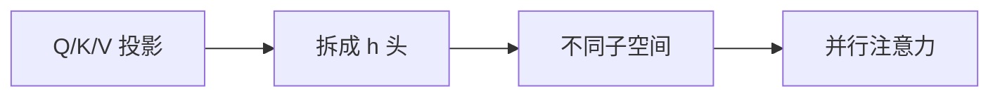
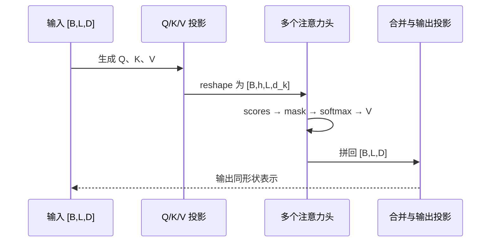

# 第 16 节：多头注意力原理上：把特征空间分给多个头

> 笔记编号 16/38 · 对应原视频 P121 · [打开这一集](https://www.bilibili.com/video/BV14mdfBDE4Q?p=121)

[← 上一节：15 缩放点积注意力：Q 找谁，V 提供什么](./15-scaled-dot-product-attention.md) · [返回总目录](./README.md) · [下一节：17 多头注意力原理下：拆头、计算、再合头 →](./17-multi-head-attention-principle-lower.md)

## 这节解决什么问题

一个注意力头只能形成一套匹配模式。多头先用不同线性投影把表示映射到多个子空间，让各头并行学习不同关系。



图要沿箭头或结构层级阅读。先说清楚数据从哪里来、形状怎样变化，再记组件名称。

## 老师原声整理稿（按讲解顺序）

### 0:00–3:42　为什么一个“头”不够

老师用同学分组作类比：只问一个人，很可能只得到一种观察角度；问多个人，再汇总各自看到的优点、缺点和偏好，信息更丰富。多头注意力让多组投影在不同表示子空间里提取关系，而不是把完全相同的单头结果复制八遍。

一个头可能偏向主谓关系，一个头偏向局部搭配，另一个头可能捕捉远距离指代。具体每个头学什么不是人工硬编码，而由参数和训练目标决定；也不能保证所有头都同样有用。

### 3:42–6:58　投影、分头、独立注意、合并

老师先给出完整动作：

1. Q、K、V 分别经过线性投影；
2. 把 d_model 拆成 h 个头；
3. 每个头独立做 Scaled Dot-Product Attention；
4. Concatenate 拼接各头；
5. 输出线性层再次融合。

课程用火锅分格作类比：同一批食材进入不同格子，因锅底或搭配不同产生不同味道；最后夹回同一个盘子。类比只帮助理解“分开加工再合并”，数学上每个头真正不同来自各自的投影参数。

### 6:58–10:28　从 [2,4,512] 拆成 8 头

假设输入 [B,L,D]=[2,4,512]，头数 h=8，每头维度 d_k=512/8=64。

第一步 reshape：

```text
[2,4,512] → [2,4,8,64]
```

这一步没有增加或删除元素，只把 512 拆成 8×64。随后 transpose 序列轴与头轴：

```text
[2,4,8,64] → [2,8,4,64]
```

现在每个 batch 有 8 个独立头，每头都保留完整 4 个 token，各 token 用 64 维表示。

### 10:28–15:24　为什么头轴必须放在序列轴前

若保持 [B,L,h,d_k]，矩阵乘法的最后两维会把 h 与 d_k 当作配对轴，无法对每个头的整段序列分别计算 L×L 权重。转成 [B,h,L,d_k] 后，最后两维正好是“序列 × 每头特征”，QKᵀ 得到 [B,h,L,L]。

老师反复画格子，是为了说明每个头都要看到四个词，而不是把四个词分别分配给四个头。错误理解会变成“一个头只处理一个词”，这会破坏注意力跨位置比较。

### 15:24–18:20　合头后为什么仍回到 512 维

每头输出 [B,h,L,64]。先 transpose 回 [B,L,h,64]，再把 h×64 合并：

```text
[2,8,4,64] → [2,4,8,64] → [2,4,512]
```

输出形状与输入一致，才能做残差相加并送入后续 FFN。形状没变，但每个位置已经汇总了八种投影视角。

### 18:20–19:19　本节应牢记的约束

d_model 必须能被 h 整除，否则无法让每头拥有相同 d_k。课程常用 512 和 8；真实模型也可使用不同 D、h，但要满足整除或采用专门的非等宽设计。

多头的主线不是背“八个头”，而是能口述：

> 线性投影 → 拆 D → 换轴 → 每头注意力 → 换轴 → 合 D → 输出投影。

## 辅助流程图



### 注意力张量时序图



## 完整原声逐段记录

[查看本节按时间戳整理的完整音轨转写](./transcripts/p121.md)

这份逐段记录用于核查老师讲过的内容是否遗漏；学习时优先阅读上面的校正文章，遇到想追溯的细节再按时间戳查看原声记录。

## 零基础先记住

- d_model 必须能被头数 h 整除
- 每头维度 dₖ=d_model/h
- 拆头不是把同一个向量机械复制 h 份

## 最小可运行代码

下面代码默认从项目根目录运行。涉及模型组件时，使用 [transformer_from_scratch](../../transformer_from_scratch/README.md) 中经过测试的 PyTorch 实现。

```python
d_model, heads = 512, 8
assert d_model % heads == 0
d_k = d_model // heads
print("每头维度：", d_k, "合计：", heads * d_k)
```

### 输入和输出怎么看

每头 64 维，8 个头合计仍为 512 维。

## 最容易踩的坑

头数越多不保证越好；每头太窄会限制表示能力，并增加调参和运行开销。

## 本节知识链

`Q/K/V 投影 → 拆成 h 头 → 不同子空间 → 并行注意力`

Transformer 学习的主线始终是形状。每经过一个箭头，都问自己：batch、序列长度、特征维、头数和词表维中的哪一个发生了变化？

## 自测

**问题：d_model=510、h=8 能直接均匀拆头吗？**

<details>
<summary>点开核对答案</summary>

不能，510 不能被 8 整除；需要修改维度或头数。

</details>

## 学完检查

- [ ] 我能不用术语解释本节组件解决的问题
- [ ] 我能在运行前写出关键张量形状
- [ ] 我能指出 Q、K、V 或 mask 的来源
- [ ] 我知道代码“形状正确但逻辑可能错误”的情况
- [ ] 我能独立回答自测题

[← 上一节：15 缩放点积注意力：Q 找谁，V 提供什么](./15-scaled-dot-product-attention.md) · [返回总目录](./README.md) · [下一节：17 多头注意力原理下：拆头、计算、再合头 →](./17-multi-head-attention-principle-lower.md)
